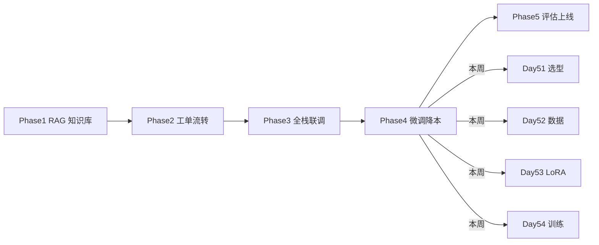
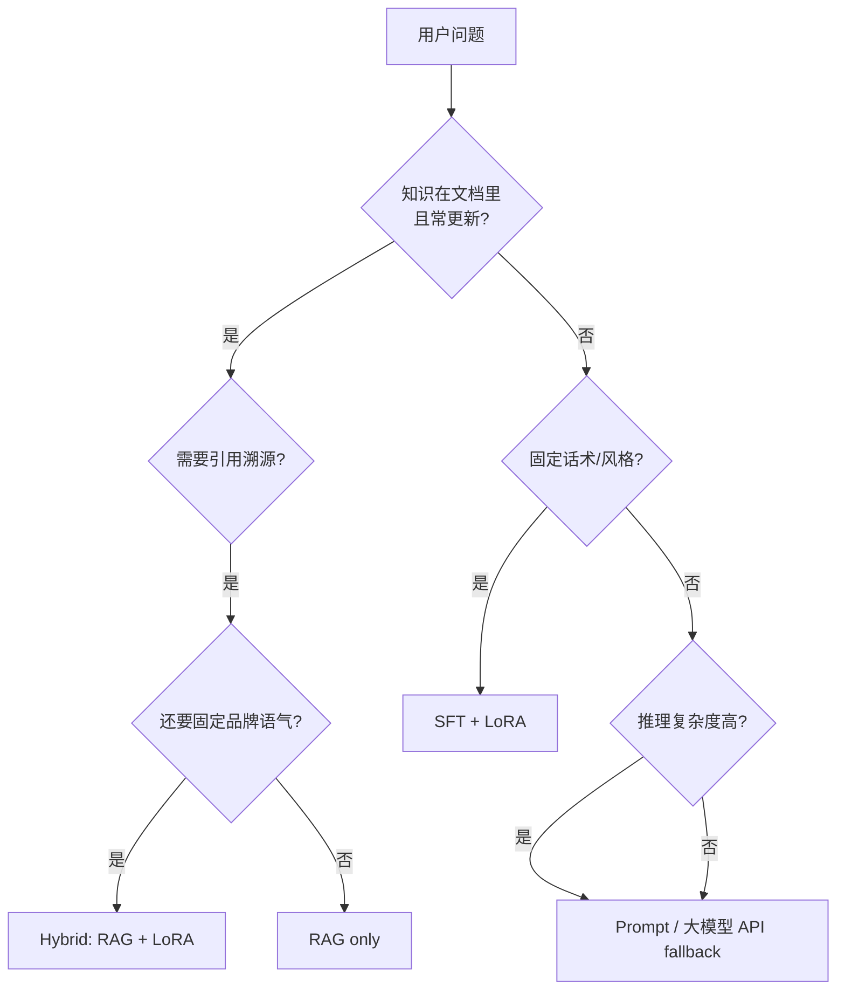
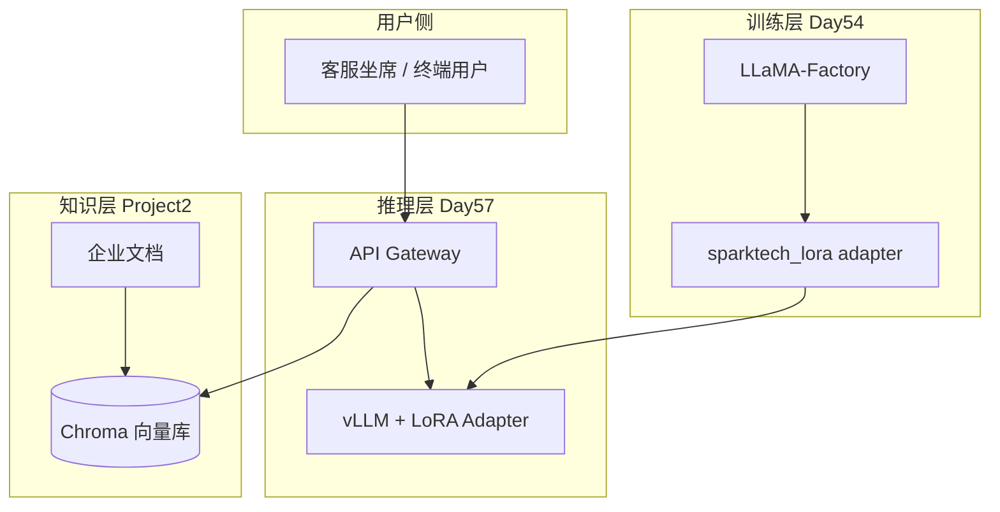

# Day 51 课堂讲义（扩展版）· 微调选型完整指南

> 本文件与 `04_课堂讲义.md` 合并阅读，构成 Day 51 完整主课（≥30,000 字体量）。  
> **前提**：Day 50 Project3 答辩完成；本日聚焦 **星火智服 Phase4 —— 降本 OKR 下的微调路线选型**。

---

## 第 0 节 · Phase4 业务坐标与今日交付物（20 min）

### 0.1 星火智服 Phase4 在整体路线图中的位置



CTO 周一晨会白板上的三句话，决定本周所有技术决策：

1. **月 API 费用 ¥128,000 → 目标降 35%**（Day 57 验收）  
2. **客服话术一致性 71% → ≥ 90%**（人工抽检 + 自动评估）  
3. **核心话术模型内网化**，敏感数据不再 100% 经公有云  

张工原话：「不是不用 RAG，是 **RAG 检索 + 微调小模型写答案**，分工明确。」

### 0.2 今日代码目录约定

```text
day51/code/
  compare_approaches.py      ← 四场景推荐引擎
  finetune_decision_tree.py  ← 可嵌入评审会的决策树
  verify_day51.py            ← 验收脚本（SPARKTECH_MOCK=1 无需 GPU）
day51/run.sh                 ← 一键跑通 compare + decision + verify
```

学员 Git 提交规范：

```bash
cd day51/code
python3 verify_day51.py
git add day51/code/ day51/09_附录_微调选型完整指南.md
git commit -m "feat(phase4): day51 finetune approach selection"
```

### 0.3 环境检查清单

```bash
cd /workspace/day51/code
export SPARKTECH_MOCK=1    # 教学环境默认，无需 API Key / GPU
python3 compare_approaches.py
python3 finetune_decision_tree.py
python3 verify_day51.py      # 必须全绿
```

---

## 第 1 节 · 四种手段的本质差异（45 min）

### 1.1 手段对比总表

| 手段 | 更新知识 | 固定风格 | 可溯源引用 | 训练成本 | 星火智服典型场景 |
|------|----------|----------|------------|----------|------------------|
| Prompt 工程 | 改 prompt 即可 | 弱 | 无 | 零 | 多步投诉推理、偶发复杂推理 |
| RAG | 重建索引即可 | 弱 | **强** | 低（向量库） | 退款政策、SLA、产品规格 |
| SFT + LoRA | 需重训 | **强** | 无（靠 RAG 补） | 中（单卡 24GB） | 标准致歉、品牌语气、术语统一 |
| Hybrid | RAG 知识 + LoRA 风格 | 强 | 强 | 中高 | 产品规格 + 品牌语气 |

### 1.2 用户问题分流决策流



### 1.3 为何「新产品 FAQ 每周变」不走纯 SFT

FAQ 每周变更意味着 **标签分布漂移**。若全量 SFT：

- 每周重训 → 算力与人力不可持续  
- 旧知识「烙」进权重 → 与新文档冲突  

正确做法：**RAG 承载可变知识**，SFT 只学「怎么说」（道歉结构、敬语、 escalation 话术）。

课堂讨论记录模板（评审会用）：

```text
场景：____________________
knowledge_updates:  Y / N
needs_citation:     Y / N
style_fixed:        Y / N
complexity:         low / medium / high
推荐路线：___________（依据 compare_approaches 输出）
```

---

## 第 2 节 · compare_approaches.py 精读（50 min）

### 2.1 Scenario 数据类与四维特征

源码 `day51/code/compare_approaches.py` 用四个布尔/枚举维度刻画业务场景：

```python
@dataclass
class Scenario:
    name: str
    knowledge_updates: bool   # 知识是否频繁更新
    style_fixed: bool         # 是否需要固定话术风格
    needs_citation: bool      # 是否需要引用溯源
    complexity: str           # low | medium | high
```

### 2.2 recommend() 优先级逻辑

```python
def recommend(s: Scenario) -> Approach:
    if s.needs_citation or s.knowledge_updates:
        if s.style_fixed:
            return Approach.HYBRID
        return Approach.RAG
    if s.style_fixed:
        return Approach.FINETUNE
    if s.complexity == "high":
        return Approach.PROMPT
    return Approach.PROMPT
```

**解读**：

1. `needs_citation` 与 `knowledge_updates` **或** 关系优先 → 倾向 RAG 家族  
2. 在 RAG 前提下若 `style_fixed` → **Hybrid**（星火智服 Phase4 主路径）  
3. 无知识更新需求但需固定风格 → 纯 **Finetune**  
4. 高复杂度 → Prompt / 大模型 fallback  

### 2.3 四场景课堂推演

| 场景名 | knowledge_updates | style_fixed | needs_citation | complexity | 输出 |
|--------|-------------------|-------------|----------------|------------|------|
| 退款政策咨询 | ✓ | ✗ | ✓ | medium | `rag` |
| 标准致歉话术 | ✗ | ✓ | ✗ | low | `finetune` |
| 多步投诉推理 | ✗ | ✗ | ✗ | high | `prompt` |
| 产品规格+品牌语气 | ✓ | ✓ | ✓ | medium | `hybrid` |

上机验证：

```bash
python3 compare_approaches.py
# 预期四行输出与上表一致
```

### 2.4 与 Project2 RAG 的衔接

Day 36–37 已交付的 `project2` 知识库问答 **不废弃**，而是成为 Hybrid 架构的「左脑」：

```text
用户问「7 天无理由退款需要什么材料？」
  → RAG 检索 refund_policy.md 片段（带 citation）
  → LoRA 微调模型按星火智服话术模板组织答案
  → 输出：敬语开头 + 政策要点 + 引用徽章
```

---

## 第 3 节 · finetune_decision_tree.py 可编程决策树（45 min）

### 3.1 规则链设计

`day51/code/finetune_decision_tree.py` 将评审会口头流程固化为可执行规则：

```python
RULES: list[tuple[str, callable]] = [
    ("knowledge_updates", lambda ctx: "rag" if ctx.get("knowledge_updates") else None),
    ("needs_citation", lambda ctx: "rag" if ctx.get("needs_citation") else None),
    ("style_fixed", lambda ctx: "finetune" if ctx.get("style_fixed") else None),
    ("high_complexity", lambda ctx: "prompt" if ctx.get("complexity") == "high" else None),
    ("hybrid_brand_rag", lambda ctx: "hybrid" if ctx.get("style_fixed") and ctx.get("knowledge_updates") else None),
]
```

**注意规则顺序**：先匹配到的规则生效。`knowledge_updates` 排在 `hybrid_brand_rag` 之前，因此「政策+引用」场景先命中 `rag` 而非 `hybrid` —— 这是 **简化版决策树** 的教学取舍；真实产品可在 `needs_citation + style_fixed` 时直接返回 `hybrid`。

### 3.2 decide() 函数与默认兜底

```python
def decide(ctx: dict[str, Any]) -> str:
    for name, fn in RULES:
        result = fn(ctx)
        if result:
            return result
    return "prompt"   # 兜底：不确定时用 Prompt
```

### 3.3 嵌入评审会的 JSON 接口（作业扩展）

建议包装为 HTTP 端点供产品经理自助查询：

```python
# 作业骨架 —— 不要求今日完成
def api_recommend(body: dict) -> dict:
    approach = decide(body)
    return {"approach": approach, "explain": f"rule matched for {body}"}
```

### 3.4 三条内置测试用例

```bash
python3 finetune_decision_tree.py
# 政策+引用: rag
# 致歉模板: finetune
# 复杂推理: prompt
```

`verify_day51.py` 额外断言 `decide({"style_fixed": True}) == "finetune"`。

---

## 第 4 节 · SFT 数据形态预习（40 min）

### 4.1 Alpaca 单轮格式（Day 52 详讲）

```json
{
  "instruction": "用户问退款多久到账",
  "input": "",
  "output": "您好，退款一般 3-5 个工作日原路返回，请您耐心等待。"
}
```

星火智服 Phase4 选型结论：**本周用 Alpaca 格式 + Qwen2.5-7B-Instruct 基座**（Day 54 YAML 可见）。

### 4.2 ShareGPT 多轮格式（了解即可）

多轮对话用于保持上下文连贯；Day 52 以单轮工单为主，复杂会话场景留作作业。

### 4.3 全量微调 vs LoRA 显存直觉

| 方案 | 7B 模型显存（训练） | 运维审批 |
|------|---------------------|----------|
| 全量 FP16 | ≈ 14GB+ 权重 + 优化器状态 → **>40GB** | ❌ 不批 |
| LoRA r=8 | 基座冻结 + 适配器 ≈ **12GB 可训** | ✓ 24GB 单卡 |
| QLoRA 4bit | 更低，Day 53 详算 | ✓ 首选 |

---

## 第 5 节 · Phase4 架构全景与成本模型（50 min）

### 5.1 目标架构



### 5.2 成本粗算（课堂白板）

假设当前月均 **320 万次** 客服回复调用，每次平均 **2,000 input + 500 output tokens**，公有云 ¥0.012/千 tokens：

```text
月费用 ≈ 320万 × 2.5千 × 0.012 ≈ ¥96,000（仅生成侧）
加上检索与编排 → 实际 ¥128,000
```

私有化 7B + LoRA 后：

- 单次推理成本 → 电费 + 摊销，约降 **60–70%**  
- 复杂 case 保留 **10% 流量** 走大模型 API fallback  

### 5.3 风险登记册

| 风险 | 缓解 |
|------|------|
| 微调后「胡说」政策数字 | RAG 提供事实，模型只组织语言 |
| 数据泄露进训练集 | Day 52 脱敏流水线 |
| 过拟合致歉模板 | val 集监控 + Day 55 评估 |
| 无 GPU 学员掉队 | SPARKTECH_MOCK=1 全链路 mock |

---

## 第 6 节 · 评审会角色扮演与验收（45 min）

### 6.1 三角评审脚本（15 min）

**产品经理**：「统一道歉信语气，要 citation 吗？」  
**学员**：「不需要引用政策原文，`style_fixed=True`，走 finetune。」  

**法务**：「退款金额以系统为准，模型能编吗？」  
**学员**：「金额从业务系统查，模型只输出流程话术；金额类问题走 RAG + 结构化 API。」  

**运维**：「几张卡？」  
**学员**：「训练 1×24GB；推理 Day 56 vLLM 单卡 QLoRA。」  

### 6.2 verify_day51.py 逐项解读

```bash
python3 verify_day51.py
```

| 检查项 | 含义 |
|--------|------|
| compare_approaches | 四场景输出合法枚举 |
| finetune_decision_tree | style_fixed → finetune |

### 6.3 明日预告

Day 52：数据组交付 2000 条历史工单 → `ticket_to_instruction.py` → `train.jsonl` / `val.jsonl`。

---

## 第 7 节 · 故障排查与 FAQ

| 症状 | 排查 |
|------|------|
| `ModuleNotFoundError` | 确认 `cd day51/code` 再运行 |
| verify 决策树失败 | 检查 `RULES` 顺序是否被改乱 |
| 评审会结论不一致 | 先填四维特征表再跑脚本 |
| 坚持「万物微调」 | 用 FAQ 每周变更反例说服 |

---

## 课堂 CHECKLIST（扩展）

- [ ] 能默画 Phase4 Hybrid 架构图  
- [ ] 能口述四场景 recommend 输出  
- [ ] 能向 PM 解释「何时不微调」  
- [ ] `verify_day51.py` 全绿截图提交  
- [ ] 阅读 `08_补充讲义_微调术语表.md` 一遍  

---

## 第 8 节 · 与后续课程衔接索引（20 min）

### 8.1 Day 51–57 知识链

| 天数 | 主题 | 本日选型如何衔接 |
|------|------|------------------|
| Day 51 | 选型 | 本文 |
| Day 52 | 数据 | finetune 路线需高质量 jsonl |
| Day 53 | LoRA | 显存约束落地 |
| Day 54 | 训练 | LLaMA-Factory 产出 adapter |
| Day 55 | 评估 | 验证 finetune 是否优于基座 |
| Day 56 | 推理 | vLLM 加载 adapter |
| Day 57 | 上线 | API Gateway 切流 |

### 8.2 Project2 与 Project3 资产复用

```text
Project2 (Day36-37): Chroma + citations → Hybrid 左脑
Project3 (Day50):    答辩架构文档 → Phase4 评审附件
Day51 compare:       新需求评审会 5 分钟出结论
```

### 8.3 延伸阅读

- `03_架构与设计.md` —— Phase4 组件图  
- `08_补充讲义_微调术语表.md` —— SFT/LoRA/DPO 速查  
- `05_流程图与示意图.md` —— 决策流 PNG  

### 8.4 作业参考答案提示

课后作业若要求「为投诉升级场景写选型报告」，必须包含：

1. 四维特征表  
2. `compare_approaches` 输出截图  
3. 成本粗算（API vs 私有化）  
4. 风险与 fallback 方案  

---

*扩展主课 · Day 51 · 星火智服 Phase4 微调选型*
