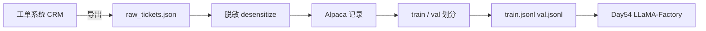
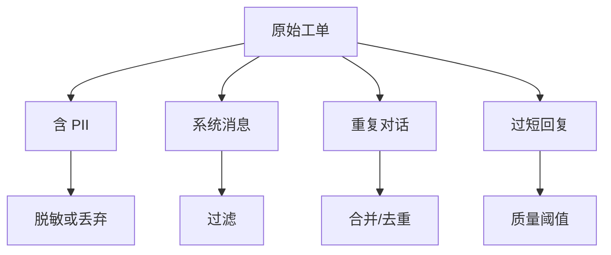
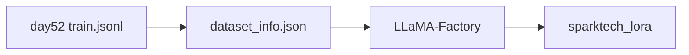

# Day 52 课堂讲义（扩展版）· 数据集清洗手把手

> 本文件与 `04_课堂讲义.md` 合并阅读，构成 Day 52 完整主课（≥30,000 字体量）。  
> **前提**：Day 51 微调路线已共识；本日聚焦 **工单 → Alpaca 训练集** 的工程化流水线。

---

## 第 0 节 · 数据组交付与合规边界（20 min）

### 0.1 Phase4 数据里程碑



法务红线（见 `08_补充讲义_数据合规清单.md`）：

- 禁止完整身份证号、银行卡、密码  
- 禁止未公开商业条款原文  
- 手机号、邮箱必须脱敏后方可进训练集  

### 0.2 今日目录与交付物

```text
day52/code/
  data/raw_tickets.json       ← 模拟 CRM 导出（教学样本）
  data/train.jsonl            ← 训练集（split_dataset 生成）
  data/val.jsonl              ← 验证集
  ticket_to_instruction.py    ← 工单 → Alpaca
  split_dataset.py            ← 划分 + 写 jsonl
  dataset_schema.py           ← 格式校验
  verify_day52.py             ← 验收
```

质量门禁（PRD）：

| 指标 | 目标 |
|------|------|
| 重复率 | < 5% |
| output 平均长度 | 50–300 字 |
| 必填字段 | instruction / input / output |
| val 比例 | 10%（可复现 seed=42） |

### 0.3 一键跑通

```bash
cd /workspace/day52/code
export SPARKTECH_MOCK=1
python3 split_dataset.py
python3 verify_day52.py
```

---

## 第 1 节 · 原始工单结构精读（40 min）

### 1.1 raw_tickets.json 字段

`day52/code/data/raw_tickets.json` 示例：

```json
{
  "ticket_id": "T001",
  "user": "我要退款",
  "agent": "好的帮您查",
  "category": "refund"
}
```

| 字段 | 含义 | 进入训练集? |
|------|------|-------------|
| ticket_id | 工单唯一标识 | 仅 meta，不进 loss |
| user | 用户原话 | → instruction 前缀 |
| agent | 客服回复 | → output |
| category | 业务分类 | meta，用于分层抽样 |

### 1.2 真实 CRM 导出差异（课堂说明）

企业生产环境常见额外字段：`created_at`、`channel`、`agent_id`、`satisfaction`。本日教学裁剪为四字段；作业可扩展 `merge_agent_replies()` 合并连续客服消息。

### 1.3 脏数据分类



---

## 第 2 节 · ticket_to_instruction.py 逐步拆解（55 min）

### 2.1 脱敏正则

```python
PHONE_RE = re.compile(r"1[3-9]\d{9}")
EMAIL_RE = re.compile(r"[\w.-]+@[\w.-]+\.\w+")

def desensitize(text: str) -> str:
    text = PHONE_RE.sub("[PHONE]", text)
    text = EMAIL_RE.sub("[EMAIL]", text)
    return text
```

**课堂练习**：补充身份证号正则（作业），并在 `verify_day52` 中加负例测试。

### 2.2 ticket_to_record 映射规则

```python
def ticket_to_record(ticket: dict) -> dict:
    user = desensitize(ticket.get("user", ""))
    agent = desensitize(ticket.get("agent", ""))
    return {
        "instruction": f"作为星火智服客服回复：{user}",
        "input": "",
        "output": agent,
        "meta": {"ticket_id": ticket.get("ticket_id"), "category": ticket.get("category")},
    }
```

设计要点：

1. **instruction 前缀统一** —— 让模型学会「客服角色」  
2. **input 留空** —— Alpaca 格式兼容 LLaMA-Factory `columns` 映射  
3. **meta 不进 jsonl** —— `split_dataset.write_jsonl` 只写三字段  

### 2.3 instruction 模板变体（业务讨论）

| 模板 | 适用 |
|------|------|
| `作为星火智服客服回复：{user}` | 默认，本仓库采用 |
| `用户问题：{user}\n请按公司话术回复：` | 更长上下文 |
| 含 category | `【退款】{user}` 利于分类语气 |

### 2.4 本地预览

```bash
python3 ticket_to_instruction.py
# 每行一条 JSON，检查脱敏与字段
```

---

## 第 3 节 · 清洗规则清单（50 min）

### 3.1 必做清洗（对照 04 课堂讲义）

| 步骤 | 操作 | 本日代码位置 |
|------|------|--------------|
| 去系统消息 | 过滤「系统自动」「机器人已接入」 | 作业扩展 |
| 合并连续客服回复 | 同 ticket 多条 agent 拼接 | 作业扩展 |
| 脱敏 | 手机/邮箱 | `desensitize()` |
| 去空 | user 或 agent 为空则跳过 | 作业扩展 |

### 3.2 质量过滤建议

```python
# 伪代码 —— 课堂讨论，不要求今日实现
def quality_filter(rec: dict) -> bool:
    out = rec["output"]
    if len(out) < 10 or len(out) > 500:
        return False
    if out.count("好的") == len(out):  # 无信息回复
        return False
    return True
```

星火智服质检组要求：**致歉类 output 必须含「抱歉」或「对不起」之一**（业务规则，可写成单元测试）。

### 3.3 重复率控制

```text
重复率 = 完全相同的 (instruction, output) 对数 / 总样本数
```

去重策略：

1. 精确去重（hash）  
2. 近似去重（MinHash，大数据量时用）  
3. 同 instruction 保留最长 output  

---

## 第 4 节 · split_dataset.py 与可复现划分（45 min）

### 4.1 构建流程

```python
def build() -> tuple[Path, Path]:
    records = convert()
    templates = [
        {"instruction": "客户催促退款进度", "input": "", "output": "您好，已加急处理，1个工作日内到账。"},
        {"instruction": "客户投诉响应慢", "input": "", "output": "非常抱歉，已升级专员30分钟内回电。"},
    ]
    records.extend(templates)
    train, val = split(records)
    ...
```

**教学说明**：真实 2000 条工单由 CRM 导出；样本过少时 `templates` 扩充以满足 `verify` 最小行数。

### 4.2 划分算法

```python
SEED = 42

def split(records: list[dict], val_ratio: float = 0.1) -> tuple[list, list]:
    rng = random.Random(SEED)
    shuffled = records[:]
    rng.shuffle(shuffled)
    n_val = max(1, int(len(shuffled) * val_ratio))
    return shuffled[n_val:], shuffled[:n_val]
```

`SEED=42` 保证全班 `train.jsonl` 哈希一致，便于对拍 loss 曲线。

### 4.3 write_jsonl 与 meta 剥离

```python
def write_jsonl(path: Path, records: list[dict]) -> None:
    for r in records:
        row = {k: r[k] for k in ("instruction", "input", "output") if k in r}
        f.write(json.dumps(row, ensure_ascii=False) + "\n")
```

**为何剥离 meta**：LLaMA-Factory Alpaca 模板只认三列；`ticket_id` 泄漏进 prompt 会导致过拟合编号。

### 4.4 生成结果示例

`train.jsonl` 首行（实际以你本地生成为准）：

```json
{"instruction": "作为星火智服客服回复：太慢了", "input": "", "output": "抱歉加急"}
```

---

## 第 5 节 · dataset_schema.py 校验体系（40 min）

### 5.1 必填字段

```python
REQUIRED = ("instruction", "output")

def validate_record(rec: dict[str, Any]) -> ValidationResult:
    errors: list[str] = []
    for k in REQUIRED:
        if k not in rec or not str(rec[k]).strip():
            errors.append(f"missing_{k}")
    if "input" not in rec:
        errors.append("missing_input_key")
    return ValidationResult(len(errors) == 0, errors)
```

### 5.2 逐行 jsonl 扫描

```python
def validate_jsonl(path: Path) -> ValidationResult:
    for i, line in enumerate(path.read_text(encoding="utf-8").splitlines(), 1):
        rec = json.loads(line)
        vr = validate_record(rec)
        if not vr.ok:
            errors.append(f"line{i}:{','.join(vr.errors)}")
```

### 5.3 扩展校验（作业）

| 检查 | 实现提示 |
|------|----------|
| UTF-8 非法字符 | `encode('utf-8')` |
| JSON 单行多对象 | 禁止 |
| output 含未脱敏手机 | 复用 `PHONE_RE` |

---

## 第 6 节 · 与 Day 54 dataset_info.json 对接（35 min）

### 6.1 跨日路径约定

`day54/code/dataset_info.json`：

```json
{
  "sparktech_cs": {
    "file_name": "../day52/code/data/train.jsonl",
    "formatting": "alpaca",
    "columns": {
      "prompt": "instruction",
      "query": "input",
      "response": "output"
    }
  }
}
```



### 6.2 修改数据后的操作顺序

```text
1. 更新 raw_tickets.json 或 CRM 导出
2. python3 split_dataset.py
3. python3 verify_day52.py
4. Day54 重新训练（或 mock）
5. Day55 重新评估
```

### 6.3 val.jsonl 的用途

- 训练时 **不参与梯度**（LLaMA-Factory `val_size` 或独立文件）  
- Day 55 `golden_eval.jsonl` 做业务向评估  
- 勿将 val 泄漏进 train（去重时跨集检查）  

---

## 第 7 节 · 上机实验与排错（45 min）

### 7.1 实验 A：脱敏生效

在 `raw_tickets.json` 加入：

```json
{"ticket_id": "T099", "user": "联系我13800138000", "agent": "已记录", "category": "test"}
```

运行 `ticket_to_instruction.py`，确认 instruction 含 `[PHONE]`。

### 7.2 实验 B：校验失败注入

手动编辑 `train.jsonl` 删掉 `output` 字段 → `verify_day52.py` 应 FAIL。

### 7.3 verify_day52.py 检查项

| 步骤 | 断言 |
|------|------|
| build() | 生成 train / val 文件 |
| validate_jsonl | 两文件格式合法 |
| 行数 | train ≥ 2 |

### 7.4 常见故障表

| 症状 | 原因 | 修复 |
|------|------|------|
| `file_not_found` | 未运行 split | `python3 split_dataset.py` |
| `missing_output` | 手工改坏 jsonl | 重新 build |
| 中文乱码 | 非 UTF-8 保存 | VS Code 右下角改 UTF-8 |
| path 找不到 Day54 | 相对路径错误 | 保持 `../day52/code/data/` |

---

## 第 8 节 · 数据版本管理与团队协作（30 min）

### 8.1 命名规范

```text
data/train_v20250706.jsonl
data/manifest.json   # 记录条数、hash、脱敏规则版本
```

### 8.2 Git 策略

- **可提交**：脱敏后 jsonl、脚本  
- **禁止提交**：原始 CRM 全量导出、含 PII 的 raw  

### 8.3 课堂 CHECKLIST

- [ ] 能口述 Alpaca 三字段含义  
- [ ] 能独立跑通 split + verify  
- [ ] 能解释 meta 为何不写入 jsonl  
- [ ] 能向法务说明脱敏规则  
- [ ] 预习 Day 53 LoRA 显存估算  

---

## 第 9 节 · ShareGPT 多轮格式预习（25 min）

### 9.1 何时需要多轮

单轮 Alpaca 适合「一问一答」工单；以下场景建议 ShareGPT（Day 55+ 作业）：

- 用户多轮追问同一订单  
- 客服先安抚再给出解决方案  
- 需要保持指代一致（「那个」「上次说的」）  

### 9.2 格式示例

```json
{
  "conversations": [
    {"from": "human", "value": "我要退款"},
    {"from": "gpt", "value": "好的，请提供订单号。"},
    {"from": "human", "value": "12345"},
    {"from": "gpt", "value": "已查到，3 个工作日内原路退回。"}
  ]
}
```

### 9.3 与 Alpaca 互转思路

```python
# 伪代码：取最后一轮 user→agent 可降级为 Alpaca
def last_turn_to_alpaca(turns):
    user = turns[-2]["value"]
    agent = turns[-1]["value"]
    return {"instruction": f"作为星火智服客服回复：{user}", "input": "", "output": agent}
```

星火智服 Phase4 **首版只用 Alpaca**，控制工程复杂度；多轮作为 v2 迭代。

---

## 第 10 节 · 数据质量报告模板（20 min）

提交作业时附 `data_quality_report.md`：

```markdown
## 星火智服训练集质量报告
- 原始工单：____ 条
- 脱敏后有效：____ 条
- train / val：____ / ____
- 重复率：____%
- output 平均字数：____
- 类别分布：refund __% / complaint __%
- 抽检 10 条人工可读：通过 / 不通过
```

质检同学用此表签字后，算法方可启动 Day 54 训练。

---

*扩展主课 · Day 52 · 星火智服 Phase4 数据集工程*
