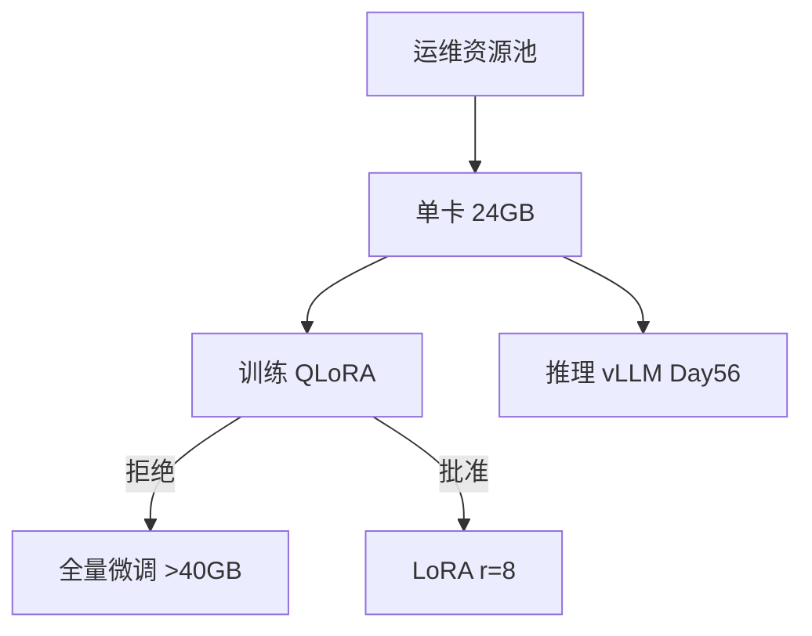
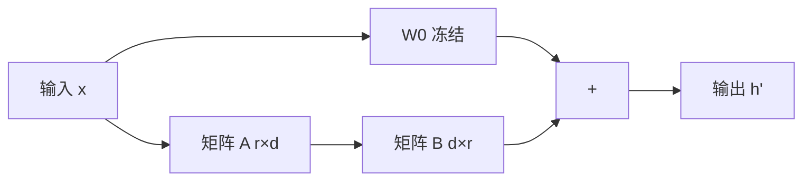
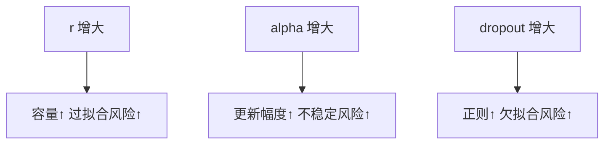
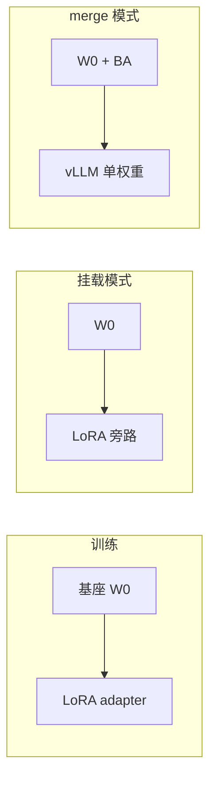

# Day 53 课堂讲义（扩展版）· LoRA 原理与显存估算

> 本文件与 `04_课堂讲义.md` 合并阅读，构成 Day 53 完整主课（≥30,000 字体量）。  
> **前提**：Day 52 `train.jsonl` 已就绪；本日聚焦 **24GB 单卡约束下的 LoRA 数学直觉与超参落地**。

---

## 第 0 节 · 运维显存预算与今日目标（20 min）

### 0.1 Phase4 硬件现实



Day 53 业务背景原文：「运维只批 24GB 单卡；全量微调不可行，**LoRA r=8 为默认方案**。」

### 0.2 代码地图

```text
day53/code/
  lora_math_demo.py          ← 参数量对比（纯 Python）
  lora_config_explainer.py   ← 超参解释 + 写 JSON
  configs/lora_sparktech.json← 星火智服默认 LoRA 配置
  lora_mock_train.py         ← 无 GPU 模拟 loss 曲线
  verify_day53.py
```

```bash
cd /workspace/day53/code
export SPARKTECH_MOCK=1
python3 lora_math_demo.py
python3 lora_config_explainer.py
python3 lora_mock_train.py
python3 verify_day53.py
```

---

## 第 1 节 · LoRA 数学原理（50 min）

### 1.1 全量微调回顾

预训练权重 $W_0 \in \mathbb{R}^{d \times d}$（如 attention 的 $q$ 投影）。全量微调直接学习 $\Delta W$，参数量 $d^2$。

对 7B 模型，$d$  often 4096 量级 → 单层 $W$ 即 **16M+** 参数，全部层更新不可承受。

### 1.2 低秩分解直觉

LoRA 假设：任务适配是 **低秩** 的，令

$$\Delta W = B A,\quad B \in \mathbb{R}^{d \times r},\; A \in \mathbb{R}^{r \times d},\; r \ll d$$

前向：$h' = W_0 x + \frac{\alpha}{r} B A x$



### 1.3 lora_math_demo.py 参数量对比

```python
def lora_delta_demo(d: int = 64, r: int = 4) -> dict:
    full_params = d * d
    lora_params = d * r + r * d   # A 与 B
    return {
        "full_params": full_params,
        "lora_params": lora_params,
        "ratio": round(lora_params / full_params, 4),
    }
```

运行：

```bash
python3 lora_math_demo.py
# r=4  params_ratio=0.125
# r=8  params_ratio=0.25
# r=16 params_ratio=0.5
```

**课堂结论**：即使 $r=16$，可训练参数仍为全量的 **50% 单层**；但 LoRA 只挂在 **少数 target_modules**，总可训参数通常 **<1% 全模型**。

### 1.4 参数量速查表（d=4096，单层）

| r | LoRA 参数 d×r×2 | 占全量 d²=16M 比例 |
|---|-----------------|---------------------|
| 4 | 32,768 | 0.2% |
| 8 | 65,536 | 0.4% |
| 16 | 131,072 | 0.8% |
| 64 | 524,288 | 3.3% |

---

## 第 2 节 · QLoRA 与显存估算（55 min）

### 2.1 显存组成（训练时）

```text
总显存 ≈ 模型权重 + 优化器状态 + 梯度 + 激活值 + LoRA 适配器
```

| 组件 | 全量 FP16 7B | QLoRA 4bit + LoRA |
|------|--------------|-------------------|
| 基座权重 | ~14 GB | ~4 GB（4bit） |
| 优化器 (Adam) | ~28 GB | 仅 LoRA 部分 ~数百 MB |
| 梯度 | ~14 GB | 极小 |
| 激活 (batch=1, len=1024) | ~2–6 GB | ~2–4 GB |
| **合计** | **>40 GB** | **~12–18 GB** ✓ |

### 2.2 估算公式（白板推导）

**权重显存（FP16）**：

$$\text{GB}_{w} \approx \frac{\text{参数量} \times 2 \text{ bytes}}{1024^3}$$

7B → $7 \times 10^9 \times 2 / 1024^3 \approx 13.4 \text{ GB}$

**QLoRA 4bit**：

$$\text{GB}_{w4} \approx \frac{7 \times 10^9 \times 0.5}{1024^3} \approx 3.3 \text{ GB}$$

**LoRA 可训参数**（Qwen2.5-7B，target q_proj+v_proj，r=8，层数约 28）：

$$\text{params}_{lora} \approx 2 \times 28 \times 2 \times d \times r$$

代入 $d=3584, r=8$ → 约 **3.2M** 参数 → 权重 + 优化器 < **100 MB**。

### 2.3 batch 与 cutoff_len 的影响

Day 54 YAML：`cutoff_len: 1024`，`per_device_train_batch_size: 1`

| 调参 | 显存影响 | 建议 |
|------|----------|------|
| cutoff_len 2048 | ↑ 明显 | 客服话术 512–1024 够用 |
| batch_size 4 | ↑↑ | 24GB 先保持 1 |
| gradient_accumulation 8 | 等效大 batch，显存↑ 小 | 可替代 batch |
| r 16 → 64 | LoRA 部分 ↑ | 先 r=8 收敛再试 |

### 2.4 与 08_补充讲义对照

单卡 24GB：**QLoRA 首选**；多卡时 Day 56+ 用 DeepSpeed ZeRO-2（本日了解）。

---

## 第 3 节 · 超参数详解与 lora_sparktech.json（45 min）

### 3.1 配置文件全文

`day53/code/configs/lora_sparktech.json`：

```json
{
  "r": 8,
  "lora_alpha": 16,
  "lora_dropout": 0.05,
  "target_modules": ["q_proj", "v_proj"],
  "bias": "none"
}
```

### 3.2 各字段含义

| 字段 | 值 | 说明 |
|------|-----|------|
| r | 8 | 低秩维度；越大表达能力越强，显存略增 |
| lora_alpha | 16 | 缩放系数；有效 scale = alpha/r = **2** |
| lora_dropout | 0.05 | 防止适配器过拟合致歉模板 |
| target_modules | q_proj, v_proj | 只改注意力 Q/V；全层 LoRA 收益递减 |
| bias | none | 不训练 bias，省参数 |

### 3.3 lora_config_explainer.py

```python
@dataclass
class LoRAConfig:
    r: int = 8
    lora_alpha: int = 16
    lora_dropout: float = 0.05
    target_modules: tuple[str, ...] = ("q_proj", "v_proj")
    bias: str = "none"

    def explain(self) -> str:
        return (
            f"rank={self.r}, alpha={self.lora_alpha} (scale={self.lora_alpha/self.r}), "
            f"targets={list(self.target_modules)}"
        )
```

运行 `python3 lora_config_explainer.py` 会重写 JSON 并打印解释行。

### 3.4 alpha 与 r 的关系

经验法则：**alpha = 2r**（本配置 16 = 2×8）。scale 过大 → 破坏基座；过小 → 学不动。



### 3.5 target_modules 选型

| 组合 | 场景 |
|------|------|
| q_proj, v_proj | 默认，性价比最高 |
| + k_proj, o_proj | 风格迁移更强，显存略增 |
| MLP 层 | 知识密集型任务 |

星火智服客服话术：**q+v 足够**；若 Day 55 评估风格分不足再扩。

---

## 第 4 节 · lora_mock_train.py 与 loss 曲线（40 min）

### 4.1 模拟训练逻辑

```python
def mock_train(*, epochs: int = 3, steps_per_epoch: int = 5) -> list[TrainLog]:
    loss = 2.5
    for ep in range(1, epochs + 1):
        for step in range(1, steps_per_epoch + 1):
            loss = max(0.3, loss * 0.85 + 0.05 * math.sin(step))
            logs.append(TrainLog(ep, step, round(loss, 4)))
```

输出写入 `output/mock_train_log.json`。

### 4.2 真机 loss 应有形态

```text
step 0–50:   loss 快速下降
step 50–200: 缓慢下降
step 200+:   持平或轻微震荡
```

异常信号（Day 54 排错表详列）：

- loss **不降** → 学习率 / 数据 / 模板错误  
- loss **骤降后爆炸** → lr 过大  
- train loss 低、val loss 高 → 过拟合，加 dropout 或减 r  

### 4.3 verify 断言

```python
logs = mock_train(epochs=2, steps_per_epoch=3)
if logs[-1].loss >= logs[0].loss:
    fail("loss should decrease in mock")
```

---

## 第 5 节 · LoRA 与全量 / Adapter 家族对比（35 min）

### 5.1 PEFT 方法横向表

| 方法 | 可训参数 | 推理开销 | 星火智服 |
|------|----------|----------|----------|
| Full FT | 100% | 无额外 | ❌ |
| LoRA | <1% | 可 merge 为零开销 | ✓ 主选 |
| Prefix Tuning | 很小 | 前缀占 context | 不推荐 |
| IA³ | 极小 | 低 | 实验性 |

### 5.2 推理时 merge vs 挂载



Day 56 vLLM 支持 **动态 LoRA 挂载**；生产可先 merge 简化部署。

---

## 第 6 节 · 从 Day 53 配置到 Day 54 YAML（40 min）

### 6.1 字段映射

| lora_sparktech.json | sparktech_qwen_lora.yaml |
|---------------------|--------------------------|
| r | lora_rank: 8 |
| lora_alpha | lora_alpha: 16 |
| target_modules | lora_target: q_proj,v_proj |
| — | finetuning_type: lora |

### 6.2 数据与模型衔接

```text
Day52 train.jsonl
  → Day54 dataset_info.json (sparktech_cs)
  → LLaMA-Factory SFT
  → output/sparktech_lora/adapter_*
```

### 6.3 课堂计算题

**题**：24GB 卡，QLoRA 4bit 7B，cutoff_len=1024，batch=1，r=8，估算能否训？  
**答**：权重 ~4GB + 激活 ~3GB + 杂项 ~2GB ≈ 9–12GB → **可以**，留余量给 CUDA cache。

---

## 第 7 节 · 实验与验收（40 min）

### 7.1 实验：扫描 r

修改 `lora_math_demo.py` 中 `d=4096`，打印 r=4,8,16,32,64 的 ratio，绘制折线图（作业）。

### 7.2 实验：改 alpha

将 `lora_alpha` 改为 8（scale=1）与 32（scale=4），Day 54 真机对比 loss（有 GPU 同学）。

### 7.3 verify_day53.py 三项

| 项 | 含义 |
|----|------|
| lora_math_demo | lora_params < full_params |
| lora_config | JSON 落盘 |
| lora_mock_train | loss 单调下降趋势（mock） |

### 7.4 故障排查

| 症状 | 排查 |
|------|------|
| OOM | 降 cutoff_len；开 gradient_checkpointing |
| 学不动 | 提 lr 或 alpha；查数据 |
| 话术像基座 | r 太小或 epoch 不足 |
| config JSON 格式错 | 用 `lora_config_explainer` 重写 |

---

## 课堂 CHECKLIST（扩展）

- [ ] 能写出 ΔW=BA 并解释 r≪d  
- [ ] 能估算 7B QLoRA 显存数量级  
- [ ] 能解释 alpha/r 缩放含义  
- [ ] 能对照 JSON 与 YAML 超参  
- [ ] verify_day53 全绿  

---

## 第 8 节 · 梯度与优化器只更新 LoRA（30 min）

### 8.1 冻结基座的实现原理

训练框架对 $W_0$ 设 `requires_grad=False$，仅 $A,B$ 参与反向传播：

```text
forward:  y = W0·x + (alpha/r)·B·A·x
backward: 只有 A、B 收到梯度
optimizer: Adam 状态只存 LoRA 参数 → 显存远小于全量
```

### 8.2 与 Day 54 日志对照

真机训练日志中 `Trainable params: 3.2M || all params: 7.6B` 即本节直觉的数值化。若 trainable% >10%，检查是否误开全量微调。

### 8.3 学习率与 LoRA 缩放联动

有效更新幅度 $\propto lr \times (\alpha/r)$。同时调大 `learning_rate` 与 `lora_alpha` 容易不稳定；**一次只动一个旋钮**。

### 8.4 课堂白板练习题

已知：28 层，每层 q_proj+v_proj，d=3584，r=8，FP16 LoRA 权重 + Adam 状态约 8 字节/参数，估算 LoRA 优化器显存：

$$\text{params} \approx 28 \times 2 \times 2 \times 3584 \times 8 \approx 3.2\text{M}$$
$$\text{GB} \approx 3.2 \times 10^6 \times 8 / 1024^3 \approx 0.024\text{ GB}$$

可见 LoRA 优化器相对 4bit 基座可忽略。

---

## 第 9 节 · 08_补充讲义超参速查扩展

| 超参 | 保守 | 默认(星火) | 激进 | 备注 |
|------|------|------------|------|------|
| r | 4 | 8 | 16–32 | 先默认再 ablation |
| alpha | r | 2r | 4r | 与 r 联动 |
| dropout | 0 | 0.05 | 0.1 | 小数据集可加大 |
| lr | 5e-5 | 1e-4 | 2e-4 | 见 loss 曲线 |
| epochs | 1 | 1–2 | 3+ | 防过拟合 |

---

*扩展主课 · Day 53 · 星火智服 Phase4 LoRA 原理与显存*
