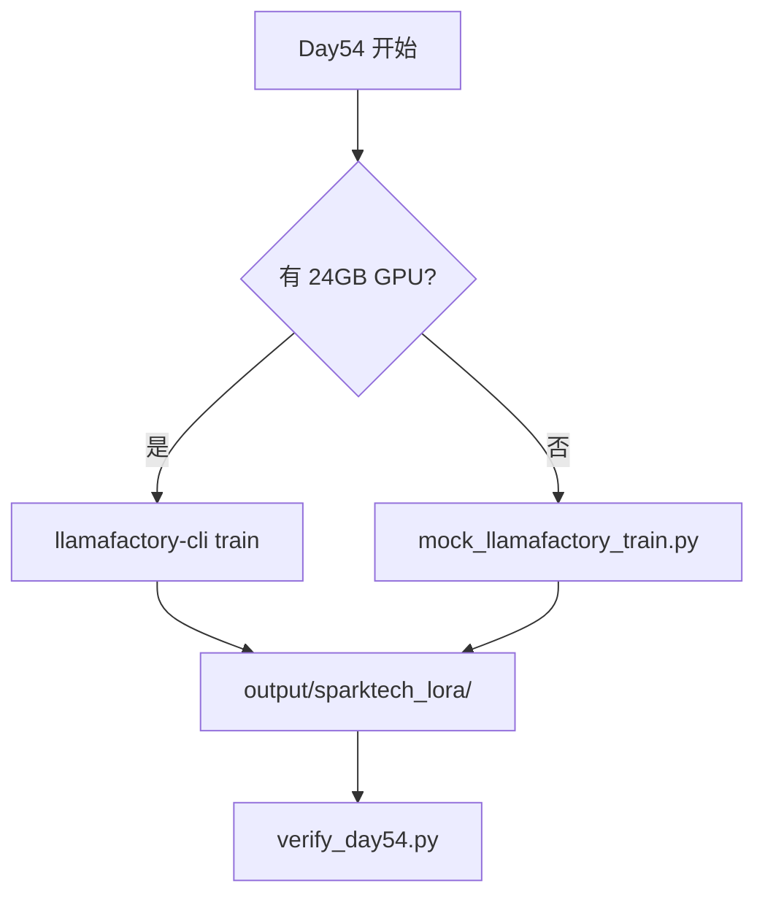
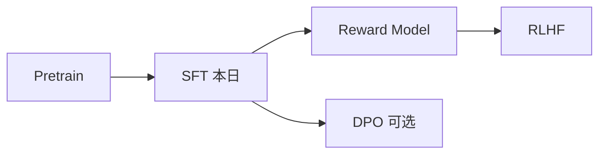
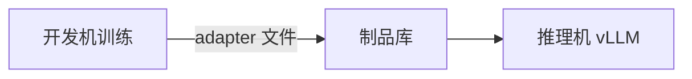

# Day 54 课堂讲义（扩展版）· LLaMAFactory 真机手册

> 本文件与 `04_课堂讲义.md` 合并阅读，构成 Day 54 完整主课（≥30,000 字体量）。  
> **前提**：Day 52 数据 + Day 53 LoRA 配置已就绪；本日聚焦 **LLaMA-Factory 训练流水线真机 / Mock 双路径**。

---

## 第 0 节 · 训练跑通定义与双轨策略（20 min）

### 0.1 张工交付标准

Day 54 业务背景：「有 GPU 的同学按 YAML 真训；**无 GPU 用 mock 走通流水线**。」



### 0.2 目录一览

```text
day54/code/
  llamafactory_configs/sparktech_qwen_lora.yaml
  dataset_info.json
  mock_llamafactory_train.py
  output/sparktech_lora/          ← 训练产物（mock 或真机）
    adapter_config.json
    adapter_model.bin
    trainer_log.jsonl
    README.txt
  verify_day54.py
day54/run.sh
```

```bash
cd /workspace/day54/code
export SPARKTECH_MOCK=1
python3 mock_llamafactory_train.py
python3 verify_day54.py
```

---

## 第 1 节 · 环境安装与依赖（45 min）

### 1.1 推荐安装（有 GPU 真机）

```bash
# CUDA 11.8+ 环境示例
pip install "llamafactory[torch,metrics]" -U
pip install bitsandbytes accelerate  # QLoRA 需要
```

验证：

```bash
llamafactory-cli version
python3 -c "import torch; print(torch.cuda.is_available())"
```

### 1.2 教学环境（无 GPU）

```bash
export SPARKTECH_MOCK=1
# 不安装 torch CUDA；只跑 mock + verify
python3 mock_llamafactory_train.py
```

### 1.3 常见环境问题

| 问题 | 处理 |
|------|------|
| CUDA OOM | 见 Day53 显存表；减 batch / len |
| bnb 报错 | `pip install bitsandbytes` 对应 CUDA 版本 |
| 模型下载慢 | `export HF_ENDPOINT=https://hf-mirror.com` |
| 权限 | `huggingface-cli login` |

---

## 第 2 节 · sparktech_qwen_lora.yaml 逐段精读（55 min）

### 2.1 完整配置

路径：`day54/code/llamafactory_configs/sparktech_qwen_lora.yaml`

```yaml
### model
model_name_or_path: Qwen/Qwen2.5-7B-Instruct
trust_remote_code: true

### method
stage: sft
do_train: true
finetuning_type: lora
lora_rank: 8
lora_alpha: 16
lora_target: q_proj,v_proj

### dataset
dataset: sparktech_cs
template: qwen
cutoff_len: 1024

### output
output_dir: output/sparktech_lora
logging_steps: 10
save_steps: 100
num_train_epochs: 1
per_device_train_batch_size: 1
learning_rate: 1.0e-4
```

### 2.2 字段说明表

| 区块 | 关键字段 | 星火智服取值理由 |
|------|----------|------------------|
| model | Qwen2.5-7B-Instruct | 中文客服友好；与运维 24GB 匹配 |
| method | finetuning_type: lora | Phase4 既定路线 |
| method | lora_rank: 8 | 对齐 day53 configs |
| dataset | template: qwen | 必须与基座 chat 模板一致 |
| dataset | cutoff_len: 1024 | 覆盖 95% 工单回复长度 |
| output | lr 1e-4 | LoRA 常用起点 |
| output | epochs: 1 | 小数据集防过拟合；可调 2–3 |

### 2.3 stage: sft 含义



星火智服 Phase4 **只做 SFT**；偏好对齐留作进阶。

### 2.4 QLoRA 真机扩展（作业）

在 yaml 增加（有 GPU 且 OOM 时）：

```yaml
quantization_bit: 4
```

与 Day 53 估算一致，权重降至 ~4GB。

---

## 第 3 节 · dataset_info.json 与数据路径（40 min）

### 3.1 注册数据集

```json
{
  "sparktech_cs": {
    "file_name": "../day52/code/data/train.jsonl",
    "formatting": "alpaca",
    "columns": {
      "prompt": "instruction",
      "query": "input",
      "response": "output"
    }
  }
}
```

**路径规则**：相对 `day54/code/` 目录；移动仓库时保持 `day52` 与 `day54` 兄弟关系。

### 3.2 训练前数据检查清单

```bash
# 1. 确认 train 存在
wc -l ../day52/code/data/train.jsonl

# 2. Day52 验收
cd ../day52/code && python3 verify_day52.py

# 3. 预览一条
head -1 ../day52/code/data/train.jsonl | python3 -m json.tool
```

### 3.3 template: qwen 格式化效果（概念）

Alpaca 三字段经 Qwen 模板转为：

```text
<|im_start|>system
You are a helpful assistant.
<|im_start|>user
{instruction}
<|im_start|>assistant
{output}
```

**截断发生在 cutoff_len**；超长 output 会被裁切 —— 清洗阶段控制长度。

---

## 第 4 节 · 真机训练命令与日志（50 min）

### 4.1 标准启动

```bash
cd /workspace/day54/code
llamafactory-cli train llamafactory_configs/sparktech_qwen_lora.yaml
```

或（部分版本）：

```bash
CUDA_VISIBLE_DEVICES=0 llamafactory-cli train llamafactory_configs/sparktech_qwen_lora.yaml
```

### 4.2 训练过程观察

```text
[INFO] Loading dataset sparktech_cs ...
[INFO] Trainable params: 3.2M || all params: 7.6B || trainable%: 0.04%
{'loss': 1.85, 'learning_rate': 0.0001, 'epoch': 0.12}
...
```

关注指标：

| 指标 | 健康范围 |
|------|----------|
| loss | 逐步下降，终值 0.5–1.5（视数据量） |
| learning_rate | warmup 后衰减 |
| trainable% | <5% 说明 LoRA 生效 |

### 4.3 产物目录结构

真机与 mock 对齐：

```text
output/sparktech_lora/
  adapter_config.json    # PEFT 元数据
  adapter_model.bin      # LoRA 权重（或 safetensors）
  trainer_log.jsonl      # 逐步 loss
  README.txt             # 说明
```

---

## 第 5 节 · mock_llamafactory_train.py 流水线（45 min）

### 5.1 源码 walkthrough

```python
OUTPUT = Path(__file__).parent / "output" / "sparktech_lora"

def run_mock_train() -> Path:
    OUTPUT.mkdir(parents=True, exist_ok=True)
    adapter = {
        "peft_type": "LORA",
        "r": 8,
        "lora_alpha": 16,
        "target_modules": ["q_proj", "v_proj"],
        "base_model": "Qwen/Qwen2.5-7B-Instruct",
    }
    (OUTPUT / "adapter_config.json").write_text(...)
    (OUTPUT / "adapter_model.bin").write_bytes(b"MOCK_LORA_WEIGHTS_SPARKTECH")
    (OUTPUT / "trainer_log.jsonl").write_text(
        '{"loss": 1.2, "step": 10}\n{"loss": 0.8, "step": 20}\n',
    )
```

### 5.2 Mock 与真机差异

| 维度 | Mock | 真机 |
|------|------|------|
| 权重 | 固定字节占位 | 真实梯度更新 |
| loss | 硬编码 jsonl | 实时计算 |
| 用途 | CI / 无 GPU 学员 | 效果验证 |
| verify | 可通过 | 可通过 + 需人工评话术 |

### 5.3 接入 CI

```bash
export SPARKTECH_MOCK=1
python3 verify_day54.py && echo "day54 pipeline ok"
```

---

## 第 6 节 · 训练后冒烟推理（40 min）

### 6.1 llamafactory-cli chat（有 GPU）

```bash
llamafactory-cli chat \
  --model_name_or_path Qwen/Qwen2.5-7B-Instruct \
  --adapter_name_or_path output/sparktech_lora \
  --template qwen
```

测试 prompt：`客户催促退款进度`  
期望：敬语 + 与 train 分布接近的措辞。

### 6.2 与基座对比

| 输入 | 基座可能 | LoRA 后期望 |
|------|----------|-------------|
| 投诉响应慢 | 通用道歉 | 「非常抱歉，已升级专员30分钟内回电」 |
| 退款进度 | 泛泛而谈 | 「1–3 个工作日」等公司口径 |

### 6.3 衔接 Day 55 评估

```text
adapter 产物 → evaluate_responses.py（Day55）
             → ab_test_runner.py
             → golden_eval.jsonl
```

---

## 第 7 节 · run.sh 与团队协作（30 min）

### 7.1 run.sh 预期行为

```bash
bash /workspace/day54/run.sh
# 通常：mock 训练 + verify
```

### 7.2 分工建议

| 角色 | 任务 |
|------|------|
| 数据 | 维护 day52 jsonl |
| 算法 | 调 yaml 超参 |
| 运维 | GPU 队列、镜像 |
| 测试 | verify + Day55 指标 |

### 7.3 Git 提交

```bash
git add day54/code/output/sparktech_lora/adapter_config.json
# adapter_model.bin 教学 mock 可提交；真机大文件用 git-lfs 或不提交
git commit -m "feat(phase4): day54 llamafactory sparktech lora pipeline"
```

---

## 第 8 节 · verify_day54.py 与故障速查（35 min）

### 8.1 验收逻辑

```python
yaml = Path(...) / "sparktech_qwen_lora.yaml"
if "lora_rank" not in yaml.read_text():
    fail("yaml missing lora_rank")

out = run_mock_train()
data = json.loads((out / "adapter_config.json").read_text())
if data.get("peft_type") != "LORA":
    fail("not LORA")
```

### 8.2 真机 FAQ

| 症状 | 排查 |
|------|------|
| Dataset not found | dataset_info 路径；dataset 名与 yaml 一致 |
| template 报错 | 必须 qwen 对 Qwen 模型 |
| loss NaN | 降 lr；查脏数据 |
| 无 adapter 输出 | 看 save_steps；磁盘权限 |
| 下载 403 | HF token / 镜像 |

详见 `10_附录_训练排错表.md`。

---

## 课堂 CHECKLIST（扩展）

- [ ] 能逐段解释 yaml 七大块  
- [ ] 能说明 dataset_info 列映射  
- [ ] 无 GPU 跑通 mock + verify  
- [ ] 有 GPU 同学提交 trainer_log 截图  
- [ ] 预习 Day 55 评估与 A/B  

---

## 第 9 节 · 多卡与 DeepSpeed（了解，30 min）

### 9.1 何时需要多卡

单卡 24GB + QLoRA 足够 Phase4 教学与试点；**生产全量数据重训**可考虑 2×24GB + ZeRO-2：

```yaml
# 进阶片段，非本日必配
deepspeed: ds_z2_config.json
```

### 9.2 与 08_补充讲义_GPU真机备忘 对照

- 单卡：QLoRA + batch=1  
- 多卡：DeepSpeed ZeRO-2 分片优化器  
- 推理：Day 56 单卡 vLLM 即可  

### 9.3 训练—推理环境分离



adapter 仅数十 MB，适合走制品库而非整机镜像同步。

---

## 第 10 节 · 完整一日时间表（参考）

| 时段 | 内容 | 产出 |
|------|------|------|
| 09:00–10:00 | 精读 yaml + dataset_info | 能口述各字段 |
| 10:00–12:00 | 有 GPU：真训；无 GPU：mock | output 目录 |
| 14:00–15:00 | verify + 冒烟 chat | 全绿日志 |
| 15:00–17:00 | 与 Day55 评估对接预习 | 测试 prompt 列表 |

---

## 第 11 节 · 评委 / 运维常问 5 题

1. **为何选 Qwen2.5-7B 而非 14B？** —— 24GB 约束与延迟 OKR。  
2. **训练数据多少条够？** —— 试点 500+ 可见效；生产 2000+；质量 > 数量。  
3. **adapter 如何回滚？** —— 制品库保留上一版本；Gateway 切权重名。  
4. **mock 产物能否上生产？** —— 否；仅 CI 流水线验证。  
5. **与公有云 API 如何共存？** —— 路由层按复杂度分流 fallback。  

---

*扩展主课 · Day 54 · 星火智服 Phase4 LLaMA-Factory 训练*
