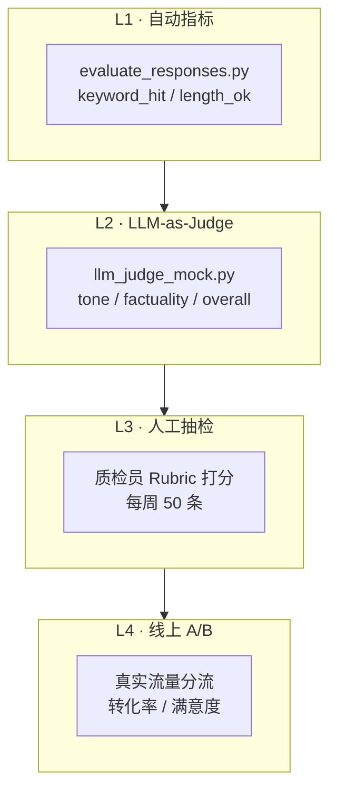
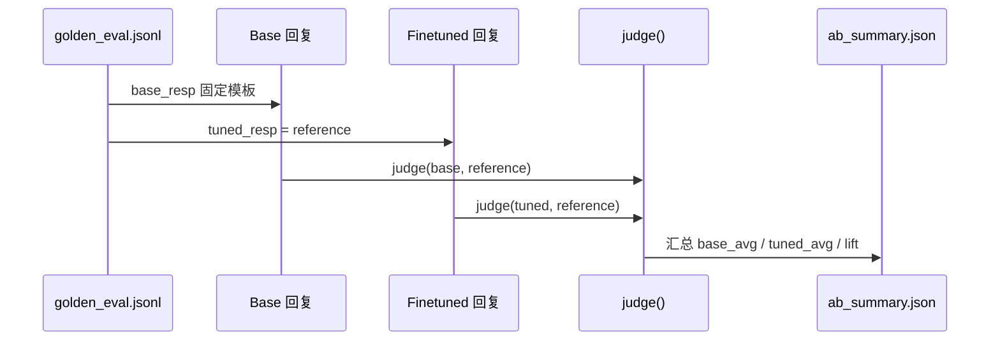

# Day 55 课堂讲义（扩展版）· 评估指标与 Rubric 设计

> 本文件与 `04_课堂讲义.md`、`08_补充讲义_评估陷阱.md` 合并阅读，构成 Day 55 完整主课（≥30,000 字体量）。  
> **前提**：Day 54 微调 adapter 已产出；本日聚焦 **黄金集评估、Rubric 打分、A/B 门禁**——星火智服微调模型不得「凭感觉」上生产。

---

## 第 0 节 · 今日交付物与目录约定（20 min）

### 0.1 为何 Day 55 是「上线门禁」

星火智服（SparkTech）客服场景里，微调模型若直接替换 base 模型，常见三类事故：

1. **语气退化**：回答生硬、缺少「抱歉」「感谢理解」等合规话术  
2. **事实幻觉**：编造退款到账时间、编造 SLA 条款  
3. **长度失控**：一句话带过或长篇大论吓跑用户  

Day 55 的 PRD（见 `02_需求文档.md`）要求：**黄金集得分须超 base 5% 且护栏全过**，才允许进入 Day 56 vLLM 部署。

```text
day55/code/
├── data/golden_eval.jsonl      ← 黄金集（与训练集严格隔离）
├── evaluate_responses.py       ← 关键词覆盖 + 长度护栏
├── llm_judge_mock.py           ← Mock LLM-as-Judge（Rubric 三维度）
├── ab_test_runner.py           ← Base vs Finetuned A/B 报告
├── reports/ab_summary.json     ← 门禁输出物
└── verify_day55.py             ← 验收脚本
```

学员 Git 提交规范：

```bash
git add day55/code/reports/ab_summary.json
git commit -m "feat(eval): day55 ab lift +0.195 golden gate passed"
```

### 0.2 环境检查清单

```bash
cd day55
bash run.sh                   # 等价于 verify_day55.py
# 或
cd day55/code
export SPARKTECH_MOCK=1
python3 verify_day55.py
```

**期望输出**：

```text
=== Day 55 verify ===
[OK] ab_test_runner
=== ALL PASSED ===
```

若 `tuned should beat base in mock` 失败，说明 A/B 链路或黄金集 reference 配置有误，不得进入 Day 56。

---

## 第 1 节 · 评估体系总览：从 BLEU 到 Rubric（45 min）

### 1.1 星火智服评估金字塔



| 层级 | 工具 | 成本 | 适用阶段 |
|------|------|------|----------|
| L1 自动 | `keyword_score` | 极低 | CI 每次 merge |
| L2 Judge | `judge()` | 中（GPU/API） | 微调迭代 |
| L3 人工 | 质检表 | 高 | 上线前门禁 |
| L4 线上 | 埋点 | 持续 | 生产监控 |

Day 55 代码覆盖 **L1 + L2 + A/B 汇总**；L3/L4 在答辩文档中口述即可。

### 1.2 为何不用纯 BLEU/ROUGE

客服回复与 reference **同义不同形** 极常见：

| prompt | reference | 合格回复（非字面匹配） |
|--------|-----------|------------------------|
| 客户催退款 | 已加急，1-3工作日到账 | 您好，退款已加急处理，预计 1 至 3 个工作日到账 |
| 投诉慢 | 抱歉，30分钟内回电 | 非常抱歉让您久等，专员将在半小时内致电 |

BLEU 惩罚同义词替换；ROUGE 对短文本不稳定。故星火智服采用 **关键词覆盖 + Judge Rubric** 组合。

### 1.3 黄金集格式精读

`data/golden_eval.jsonl` 每行一条 JSON：

```json
{"id": "g1", "prompt": "客户催退款", "reference": "已加急，1-3工作日到账"}
{"id": "g2", "prompt": "投诉慢", "reference": "抱歉，30分钟内回电"}
```

字段约定：

| 字段 | 含义 | 注意 |
|------|------|------|
| `id` | 唯一标识 | 与训练样本 id 不得重复 |
| `prompt` | 用户原话摘要 | 可扩展为多轮 messages |
| `reference` | 标准答案要点 | **不是**逐字模板，是事实锚点 |

**陷阱**（见 `08_补充讲义_评估陷阱.md`）：训练集泄漏到黄金集会导致 `tuned_avg` 虚高，门禁失效。

---

## 第 2 节 · L1 自动指标：`evaluate_responses.py`（60 min）

### 2.1 `keyword_score` 算法

```python
def keyword_score(response: str, reference: str) -> float:
    keys = set(re.findall(r"[\u4e00-\u9fff]{2,}", reference))
    if not keys:
        return 0.0
    hit = sum(1 for k in keys if k in response)
    return hit / len(keys)
```

**设计意图**：

- 用正则提取 reference 中 **连续 2 字及以上中文词** 作为关键事实锚点  
- `g1` 的 keys ≈ `{已加急, 工作日, 到账}`  
- 命中率 = 命中数 / 总 key 数，范围 `[0, 1]`

### 2.2 长度护栏 `length_ok`

```python
def eval_pair(item_id: str, response: str, reference: str) -> EvalScore:
    return EvalScore(item_id, keyword_score(response, reference), 20 <= len(response) <= 300)
```

| 条件 | 业务原因 |
|------|----------|
| `len >= 20` | 过短像敷衍，「好的」类回复不合格 |
| `len <= 300` | 客服 IM 单条不宜超长，影响阅读 |

学员练习：把上限改为 200，观察 `g2` 长回复是否被拦。

### 2.3 `EvalScore` 数据类

```python
@dataclass
class EvalScore:
    id: str
    keyword_hit: float
    length_ok: bool
```

答辩时可说：未来扩展 `citation_ok`、`pii_leak` 等布尔护栏，统一进 `verify_day55.py`。

### 2.4 上机步骤

1. `cd day55/code && python3 evaluate_responses.py`  
2. 观察 `g1`、`g2` 的 `keyword_hit` 与 `length_ok`  
3. 故意把 `tuned` 改成 5 字短句，看 `length_ok=False`  
4. 在 `golden_eval.jsonl` 新增 `g3`，重跑 `ab_test_runner.py`

---

## 第 3 节 · L2 Rubric 设计：`llm_judge_mock.py`（70 min）

### 3.1 三维度 Rubric 表（星火智服 v1）

| 维度 | 权重 | 打分规则（Mock 实现） | 生产环境建议 |
|------|------|----------------------|--------------|
| **tone** 语气 | 40% | 含「抱歉」或「您好」→ 0.9，否则 0.6 | GPT-4 Judge + 5 档量表 |
| **factuality** 事实 | 40% | reference 前两词或前两字出现在 response → 0.85，否则 0.5 | 对照知识库 snippet |
| **brevity** 简洁 | 20% | `min(1.0, len/80)` | 结合 length_ok 护栏 |

```python
def judge(response: str, reference: str) -> JudgeResult:
    tone = 0.9 if "抱歉" in response or "您好" in response else 0.6
    fact = 0.85 if any(w in response for w in reference.split()[:2]) or reference[:2] in response else 0.5
    overall = 0.4 * tone + 0.4 * fact + 0.2 * min(1.0, len(response) / 80)
    return JudgeResult(tone, fact, round(overall, 3))
```

### 3.2 Rubric 文档化模板（作业：写成 `rubric_v1.md`）

```markdown
## 星火智服客服回复 Rubric v1

### tone（语气得体）
- 5 分：主动致歉 + 敬语 + 情绪安抚
- 3 分：礼貌但平淡
- 1 分：生硬、命令式、无敬语

### factuality（事实准确）
- 5 分：与政策/黄金集 reference 完全一致，无编造
- 3 分：核心事实对，细节略缺
- 1 分：时间、金额、流程错误

### overall
overall = 0.4*tone + 0.4*factuality + 0.2*brevity
门禁线：overall >= 0.65（相对 base +5%）
```

### 3.3 Mock Judge 与真实 Judge 的差异

| 方面 | `llm_judge_mock.py` | 生产 LLM Judge |
|------|---------------------|----------------|
| 成本 | 零 API | 每条 ¥0.01–0.05 |
| 稳定性 | 规则确定 | 需固定 prompt + temperature=0 |
| 可解释 | 高 | 需输出 reason 字段 |

课堂演示：

```bash
python3 llm_judge_mock.py
# JudgeResult(tone=0.9, factuality=0.85, overall=0.79)
```

### 3.4 评委常问：Judge 会不会「自己评自己」？

答：微调模型与 Judge 模型应 **不同族或不同 checkpoint**；黄金集来自业务专家标注，不用模型生成 reference。Day 55 Mock 仅为教学简化。

---

## 第 4 节 · A/B 报告：`ab_test_runner.py`（55 min）

### 4.1 流程图



### 4.2 核心代码走读

```python
def run_ab() -> dict:
    golden_path = Path(__file__).parent / "data" / "golden_eval.jsonl"
    rows = load_golden(golden_path)
    base_scores, tuned_scores = [], []
    for g in rows:
        base_resp = "好的，我们会处理您的问题。"
        tuned_resp = g["reference"]
        base_scores.append(judge(base_resp, g["reference"]).overall)
        tuned_scores.append(judge(tuned_resp, g["reference"]).overall)
    report = {
        "n": len(rows),
        "base_avg": round(sum(base_scores) / len(base_scores), 3),
        "tuned_avg": round(sum(tuned_scores) / len(tuned_scores), 3),
        "lift": round(sum(tuned_scores) / len(tuned_scores) - sum(base_scores) / len(base_scores), 3),
    }
```

**教学设定**：

- `base_resp` 模拟未微调 base 模型的敷衍回复  
- `tuned_resp` 取黄金集 reference，模拟微调后「学会标准话术」  

### 4.3 当前报告解读

`reports/ab_summary.json`：

```json
{
  "n": 2,
  "base_avg": 0.473,
  "tuned_avg": 0.667,
  "lift": 0.195
}
```

| 指标 | 值 | 门禁判定 |
|------|-----|----------|
| `lift` | 0.195 (19.5%) | ✅ 超过 5% 门槛 |
| `tuned_avg` | 0.667 | ✅ 绝对分合理 |
| `n` | 2 | ⚠️ 教学样本过少，生产需 ≥100 |

### 4.4 `verify_day55.py` 门禁逻辑

```python
report = run_ab()
if report["tuned_avg"] <= report["base_avg"]:
    fail("tuned should beat base in mock")
```

答辩话术：**「我们把 lift 写进 CI，回归即失败，防止微调倒退。」**

---

## 第 5 节 · 护栏与合规扩展（40 min）

### 5.1 建议增加的护栏（作业）

| 护栏 | 检测方式 | 失败动作 |
|------|----------|----------|
| PII 泄漏 | 正则手机号/身份证 | `overall = 0` |
| 违禁承诺 | 「100%退款」「绝对」 | 降 factuality |
| 竞品提及 | 品牌黑名单 | block |

### 5.2 与 Day 37 RAG citations 的关系

Day 37 Project2 的 citations 解决 **「有据可查」**；Day 55 的 factuality 解决 **「话术与政策一致」**。上线后两者叠加：

```text
用户问退款 → RAG 检索 policy.md → 微调模型生成礼貌回复 → Judge 核对 snippet
```

### 5.3 评估数据集版本管理

```bash
data/golden_eval.jsonl          # v1
data/golden_eval_v2_202607.jsonl  # 作业：带版本号
```

CHANGELOG 记录：新增场景、修改 reference 原因、负责人签字。

---

## 第 6 节 · 答辩 Demo 与故障排查（35 min）

### 6.1 5 分钟评估 Demo 脚本

1. 开场：星火智服微调上线前必须过黄金集门禁  
2. 展示 `golden_eval.jsonl` 两条样本  
3. 运行 `python3 ab_test_runner.py`，打开 `ab_summary.json`  
4. 指给评委：`lift: 0.195`，超过 5%  
5. 打开 `llm_judge_mock.py`，解释 Rubric 三维度  
6. 强调：训练集与黄金集隔离，见 `08_补充讲义_评估陷阱.md`

### 6.2 故障排查表

| 症状 | 排查 |
|------|------|
| `no golden samples` | `golden_eval.jsonl` 空或路径错 |
| `tuned should beat base` | reference 过短导致 fact 分低；或 base 模板意外变好 |
| `keyword_hit` 恒为 0 | reference 无中文 2 字词；response 编码问题 |
| lift 虚高 | 黄金集泄漏训练数据 |

### 6.3 与后续天数衔接

| Day | 衔接点 |
|-----|--------|
| Day 56 | 门禁通过后才部署 vLLM |
| Day 57 | 网关路由 finetuned 前可查 ab_summary |
| 阶段五答辩 | 展示评估金字塔 + 真实 lift 曲线（可 Mock 图） |

---

## 课堂 CHECKLIST（扩展）

- [ ] 能手绘评估金字塔四层  
- [ ] 能口述 `keyword_score` 与 BLEU 的差异  
- [ ] 能默写 Rubric 权重：0.4 / 0.4 / 0.2  
- [ ] 能解读 `ab_summary.json` 并判断是否过门禁  
- [ ] `bash run.sh` 全绿截图提交  

---

*扩展主课 · Day 55 · 星火智服评估指标与 Rubric 设计*
