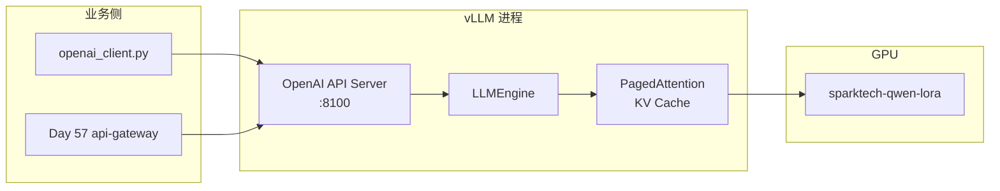
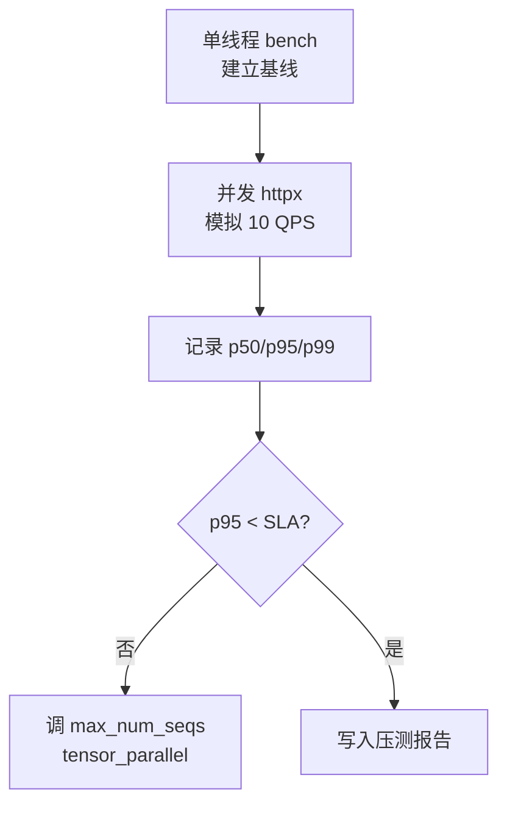

# Day 56 课堂讲义（扩展版）· vLLM 部署与压测手册

> 本文件与 `04_课堂讲义.md`、`08_补充讲义_vLLM参数表.md` 合并阅读，构成 Day 56 完整主课（≥30,000 字体量）。  
> **前提**：Day 55 黄金集门禁已通过；本日聚焦 **星火智服微调 adapter 挂接 vLLM、OpenAI 兼容 API、延迟压测**。

---

## 第 0 节 · 今日交付物与目录约定（20 min）

### 0.1 从训练产物到推理服务

Day 54 产出 LoRA adapter；Day 56 将其变为 **可被业务调用的 HTTP 服务**。企业内统一走 OpenAI 兼容协议，便于现有 SDK、网关、监控复用。

```text
day56/code/
├── mock_vllm_server.py     ← 教学用 Mock vLLM（FastAPI）
├── openai_client.py        ← 业务侧调用封装
├── benchmark_latency.py    ← p50/p95 延迟压测
├── requirements.txt
└── verify_day56.py         ← 验收（无需 GPU）
```

```text
day56/run.sh  →  cd code && SPARKTECH_MOCK=1 python3 verify_day56.py
```

### 0.2 双轨环境：Mock vs 真 GPU

| 环境 | 启动方式 | 适用 |
|------|----------|------|
| **教学 Mock** | `uvicorn mock_vllm_server:app --port 8100` | 无 GPU 学员机 |
| **真 vLLM** | `python -m vllm.entrypoints.openai.api_server` | 实验室 A100 |

课堂默认 `SPARKTECH_MOCK=1`，代码路径与真 vLLM **完全一致**（`/v1/chat/completions`）。

### 0.3 环境检查清单

```bash
cd day56
bash run.sh
```

期望：

```text
=== Day 56 verify ===
[OK] mock_vllm_server
[OK] openai_client
[OK] benchmark_latency
=== ALL PASSED ===
```

---

## 第 1 节 · vLLM 架构与星火智服选型（45 min）

### 1.1 推理栈总览



### 1.2 为何选 vLLM

| 能力 | 星火智服收益 |
|------|--------------|
| PagedAttention | 高并发客服峰值，显存利用率提升 |
| OpenAI 兼容 | `openai_client.py` 零改造对接 |
| LoRA 热加载 | 多版本 adapter A/B 切换 |
| Continuous batching | 压测 p95 可控 |

### 1.3 真 vLLM 启动命令（实验室参考）

```bash
python -m vllm.entrypoints.openai.api_server \
  --model /models/Qwen2.5-7B-Instruct \
  --enable-lora \
  --lora-modules sparktech-qwen-lora=/adapters/day54/checkpoint \
  --tensor-parallel-size 1 \
  --max-model-len 4096 \
  --port 8100
```

参数详解见 `08_补充讲义_vLLM参数表.md`；教学日重点理解 **端口、LoRA 名、max_model_len** 三者。

---

## 第 2 节 · Mock vLLM 精读：`mock_vllm_server.py`（70 min）

### 2.1 FastAPI 应用骨架

```python
app = FastAPI(title="SparkTech Mock vLLM", version="0.1.0")
```

与生产一致暴露：

- `GET /health` — 容器 healthcheck、K8s 探针  
- `POST /v1/chat/completions` — OpenAI Chat Completions

### 2.2 请求/响应模型

```python
class ChatRequest(BaseModel):
    model: str = "sparktech-qwen-lora"
    messages: list[ChatMessage]
    stream: bool = False
    temperature: float = 0.7

class ChatResponse(BaseModel):
    id: str
    object: str = "chat.completion"
    model: str
    choices: list[dict[str, Any]]
```

| 字段 | 说明 |
|------|------|
| `model` | 必须与 `--lora-modules` 名一致 |
| `messages` | 多轮对话；Mock 取最后一条 user |
| `stream` | Day 56 非流式；Day 57+ 可扩展 SSE |

### 2.3 业务回复逻辑 `generate_reply`

```python
MOCK_REPLIES = {
    "退款": "您好，退款一般3-5个工作日到账，已为您加急。",
    "投诉": "非常抱歉给您带来不便，专员将在30分钟内联系您。",
}

def generate_reply(messages: list[ChatMessage]) -> str:
    user = ""
    for m in reversed(messages):
        if m.role == "user":
            user = m.content
            break
    for k, v in MOCK_REPLIES.items():
        if k in user:
            return v
    return "您好，我是星火智服微调客服模型，请问有什么可以帮您？"
```

**设计对齐 Day 55 黄金集**：「退款」「投诉」关键词触发标准话术，便于端到端 Demo。

### 2.4 故障注入 `SPARKTECH_MOCK_FAIL`

```python
if os.environ.get("SPARKTECH_MOCK_FAIL"):
    raise RuntimeError("simulated failure")
```

作业：在 `openai_client.py` 捕获 5xx，fallback 到 `local_mock_chat`。

### 2.5 启动 Mock 服务

```bash
cd day56/code
uvicorn mock_vllm_server:app --host 127.0.0.1 --port 8100
curl http://127.0.0.1:8100/health
```

```bash
curl -X POST http://127.0.0.1:8100/v1/chat/completions \
  -H "Content-Type: application/json" \
  -d '{"model":"sparktech-qwen-lora","messages":[{"role":"user","content":"我要退款"}]}'
```

---

## 第 3 节 · 业务客户端：`openai_client.py`（50 min）

### 3.1 `chat_completion` 走读

```python
def chat_completion(prompt: str, *, base_url: str | None = None) -> str:
    base = base_url or os.environ.get("VLLM_BASE_URL", "http://127.0.0.1:8100")
    payload = {
        "model": "sparktech-qwen-lora",
        "messages": [{"role": "user", "content": prompt}],
    }
    req = urllib.request.Request(
        f"{base}/v1/chat/completions",
        data=json.dumps(payload).encode("utf-8"),
        headers={"Content-Type": "application/json"},
        method="POST",
    )
    with urllib.request.urlopen(req, timeout=5) as resp:
        data = json.loads(resp.read().decode("utf-8"))
    return data["choices"][0]["message"]["content"]
```

### 3.2 环境变量约定

| 变量 | 默认值 | Day 57 Compose |
|------|--------|----------------|
| `VLLM_BASE_URL` | `http://127.0.0.1:8100` | `http://mock-vllm:8100` |

### 3.3 离线 fallback `local_mock_chat`

```python
def local_mock_chat(prompt: str) -> str:
    from mock_vllm_server import generate_reply, ChatMessage
    return generate_reply([ChatMessage(role="user", content=prompt)])
```

压测脚本默认走本地函数，**不依赖网络**，适合 CI。

### 3.4 上机步骤

1. 终端 A：`uvicorn mock_vllm_server:app --port 8100`  
2. 终端 B：`python3 openai_client.py` → 应打印退款相关回复  
3. 停掉 A，改测 `local_mock_chat` 仍可用  

---

## 第 4 节 · 延迟压测：`benchmark_latency.py`（60 min）

### 4.1 指标定义

```python
def bench(n: int = 20) -> dict:
    latencies = []
    for i in range(n):
        t0 = time.perf_counter()
        local_mock_chat(f"测试退款{i}")
        latencies.append((time.perf_counter() - t0) * 1000)
    return {
        "n": n,
        "p50_ms": round(statistics.median(latencies), 2),
        "p95_ms": round(sorted(latencies)[int(n * 0.95) - 1], 2),
    }
```

| 指标 | 星火智服 SLA 目标（教学） |
|------|---------------------------|
| p50 | < 200 ms（Mock）/ < 800 ms（真 GPU） |
| p95 | < 500 ms（Mock）/ < 2000 ms（真 GPU） |

`verify_day56.py` 门槛：`p95_ms > 5000` 则失败。

### 4.2 压测方法论



### 4.3 扩展压测脚本（作业骨架）

```python
import concurrent.futures
import httpx

def one_request(client, i):
    t0 = time.perf_counter()
    client.post("/v1/chat/completions", json={...})
    return (time.perf_counter() - t0) * 1000

with httpx.Client(base_url="http://127.0.0.1:8100") as c:
    with concurrent.futures.ThreadPoolExecutor(max_workers=10) as ex:
        latencies = list(ex.map(lambda i: one_request(c, i), range(100)))
```

### 4.4 真 vLLM 压测注意

| 项 | 说明 |
|----|------|
| 预热 | 前 10 请求丢弃，JIT/cudnn 预热 |
| 输入长度 | 固定 prompt 长度，避免 KV 波动 |
| 批大小 | `--max-num-seqs` 影响吞吐与延迟权衡 |
| 监控 | `nvidia-smi dmon` 看显存与利用率 |

---

## 第 5 节 · 部署清单与运维（45 min）

### 5.1 上线前检查表

| # | 检查项 | 命令/位置 |
|---|--------|-----------|
| 1 | Day 55 lift ≥ 5% | `day55/code/reports/ab_summary.json` |
| 2 | health 200 | `curl :8100/health` |
| 3 | model 名一致 | `sparktech-qwen-lora` |
| 4 | 超时配置 | client `timeout=5` |
| 5 | 压测 p95 | `python3 benchmark_latency.py` |

### 5.2 容器化预告（Day 57）

Day 57 `Dockerfile.vllm` 将 Mock 服务打进镜像；真环境替换为 vLLM 官方镜像 + adapter volume。

### 5.3 日志与可观测

```python
# 生产建议：结构化日志
logger.info("chat_completion", extra={"latency_ms": ms, "model": model, "tokens": n})
```

星火智服要求：日志 **stdout**，由 Docker/K8s 采集，不写本地文件。

### 5.4 回滚策略

```text
vLLM 挂新 adapter → 网关 10% 流量 → 监控 error_rate & p95
  → 异常：VLLM_BASE_URL 指回旧版本 / 一切 fallback
```

---

## 第 6 节 · 答辩 Demo 与故障排查（40 min）

### 6.1 5 分钟 vLLM Demo

1. 说明 Day 55 门禁已通过  
2. `uvicorn mock_vllm_server:app --port 8100`  
3. `curl /health` + `curl /v1/chat/completions` 演示退款场景  
4. `python3 benchmark_latency.py` 展示 p50/p95  
5. 指给评委：`openai_client.py` 与 Day 57 网关同协议  

### 6.2 故障排查表

| 症状 | 排查 |
|------|------|
| Connection refused | vLLM 未启动；端口占用 |
| 502 from gateway | `VLLM_BASE_URL` 主机名在 Compose 内须用服务名 |
| `simulated failure` | 检查 `SPARKTECH_MOCK_FAIL` 环境变量 |
| p95 过高 | 真 GPU 未预热；并发过大；max_model_len 过长 |
| 回复不含关键词 | `MOCK_REPLIES` 关键词与用户 prompt 不匹配 |

### 6.3 评委常问

- **Q**：为何 Mock 不用真 vLLM？  
  **A**：教学环境无 GPU；Mock 保证协议与路径一致，Day 57 Compose 无缝切换。  

- **Q**：stream 为何默认 false？  
  **A**：Day 56 聚焦部署与压测；流式在 Day 37 SSE 与后续网关扩展。  

---

## 课堂 CHECKLIST（扩展）

- [ ] 能启动 Mock vLLM 并用 curl 打通  
- [ ] 能解释 PagedAttention 对并发的意义  
- [ ] 能跑通 `benchmark_latency` 并读 p95  
- [ ] 能口述真 vLLM 启动参数 `--enable-lora`  
- [ ] `bash run.sh` 全绿截图提交  

---

*扩展主课 · Day 56 · 星火智服 vLLM 部署与压测手册*
