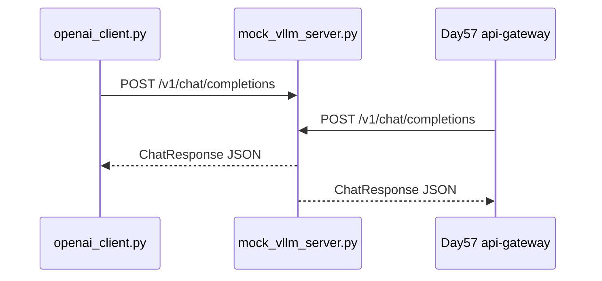

# Day 56 课堂讲义（扩展版）· OpenAI 兼容 API 契约

> 本文件与 `09_附录_vLLM部署与压测手册.md` 合并阅读。  
> **目标**：统一星火智服各服务对 `/v1/chat/completions` 的请求/响应理解，避免 Day 57 网关联调时出现「字段对不上」。

---

## 第 0 节 · 契约在链路中的位置（15 min）



**原则**：业务网关（Day 57）与直连客户端（Day 56）对 vLLM 使用 **同一 JSON 契约**，仅 URL 与超时配置不同。

---

## 第 1 节 · 端点一览

| 方法 | 路径 | 用途 | 实现文件 |
|------|------|------|----------|
| GET | `/health` | 存活探针 | `mock_vllm_server.py` L54 |
| POST | `/v1/chat/completions` | 对话补全 | `mock_vllm_server.py` L59 |

Base URL 示例：

- 本机：`http://127.0.0.1:8100`  
- Compose：`http://mock-vllm:8100`（见 `day57/.../docker-compose.yml`）

---

## 第 2 节 · 请求体 `ChatRequest`

### 2.1 最小可用请求

```json
{
  "model": "sparktech-qwen-lora",
  "messages": [
    {"role": "user", "content": "我要退款"}
  ]
}
```

### 2.2 完整字段（Day 56 实现）

| 字段 | 类型 | 必填 | 默认 | 说明 |
|------|------|------|------|------|
| `model` | string | 是 | `sparktech-qwen-lora` | 与 LoRA 模块名一致 |
| `messages` | array | 是 | — | `{role, content}` 列表 |
| `stream` | bool | 否 | `false` | `true` 时响应为 SSE（未实现） |
| `temperature` | float | 否 | `0.7` | Mock 忽略；真 vLLM 生效 |

### 2.3 `messages` 角色约定

| role | 含义 | Mock 行为 |
|------|------|-----------|
| `system` | 系统提示 | 忽略 |
| `user` | 用户输入 | **取最后一条** 做关键词匹配 |
| `assistant` | 历史助手 | 忽略 |

代码依据：

```python
for m in reversed(messages):
    if m.role == "user":
        user = m.content
        break
```

---

## 第 3 节 · 响应体 `ChatResponse`

### 3.1 成功响应示例

```json
{
  "id": "chatcmpl-a1b2c3d4e5f6",
  "object": "chat.completion",
  "model": "sparktech-qwen-lora",
  "choices": [
    {
      "index": 0,
      "message": {
        "role": "assistant",
        "content": "您好，退款一般3-5个工作日到账，已为您加急。"
      },
      "finish_reason": "stop"
    }
  ]
}
```

### 3.2 字段说明

| 字段 | 类型 | 说明 |
|------|------|------|
| `id` | string | `chatcmpl-{uuid12}` |
| `object` | string | 固定 `chat.completion` |
| `model` | string | 回显请求 model |
| `choices[].message.content` | string | **业务只读此字段** |
| `choices[].finish_reason` | string | `stop` / `length` |

### 3.3 客户端解析（契约关键路径）

```python
data = json.loads(resp.read().decode("utf-8"))
return data["choices"][0]["message"]["content"]
```

Day 57 网关同等逻辑（`api_gateway/main.py` L49-50）。

---

## 第 4 节 · 错误与超时

| 场景 | HTTP | 行为 |
|------|------|------|
| 正常 | 200 | 返回 ChatResponse |
| `SPARKTECH_MOCK_FAIL=1` | 500 | `RuntimeError: simulated failure` |
| 客户端超时 | — | `urllib` 5s；网关 `httpx` 10s |

网关降级（Day 57）：

```python
except Exception as e:
    if os.environ.get("SPARKTECH_MOCK") == "1":
        text = f"[mock-gateway] {req.message}"
```

---

## 第 5 节 · 与 OpenAI 官方差异（答辩速查）

| 项 | OpenAI 官方 | 星火智服 Day 56 Mock |
|----|-------------|----------------------|
| 认证 | `Authorization: Bearer` | 教学省略 |
| `usage` 字段 | 有 token 计数 | 无 |
| `stream` | SSE `data: {...}` | 未实现 |
| `tools` / `function_call` | 支持 | 不支持 |

生产 vLLM 可配置 API Key；契约以 **messages + choices** 为准。

---

## 课堂 CHECKLIST

- [ ] 能写出最小 POST body  
- [ ] 能指出解析路径 `choices[0].message.content`  
- [ ] 能说明 `model` 名与 LoRA 模块一致  

---

*扩展主课 · Day 56 · OpenAI 兼容 API 契约*
