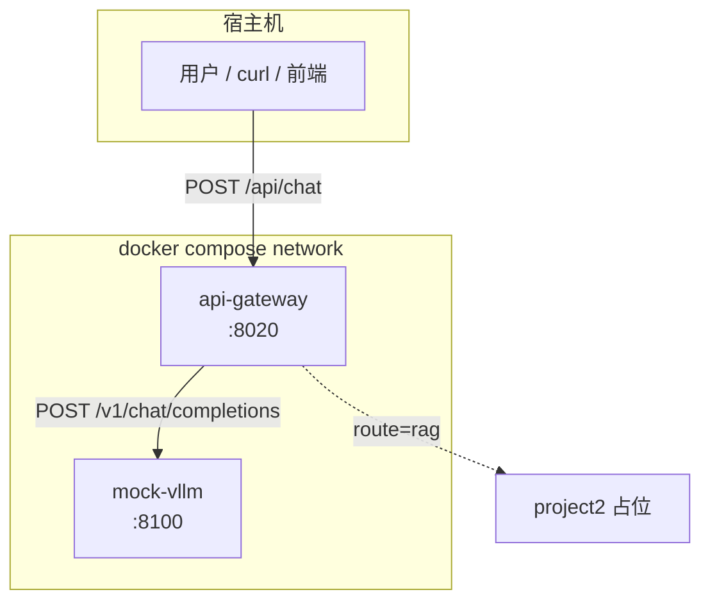
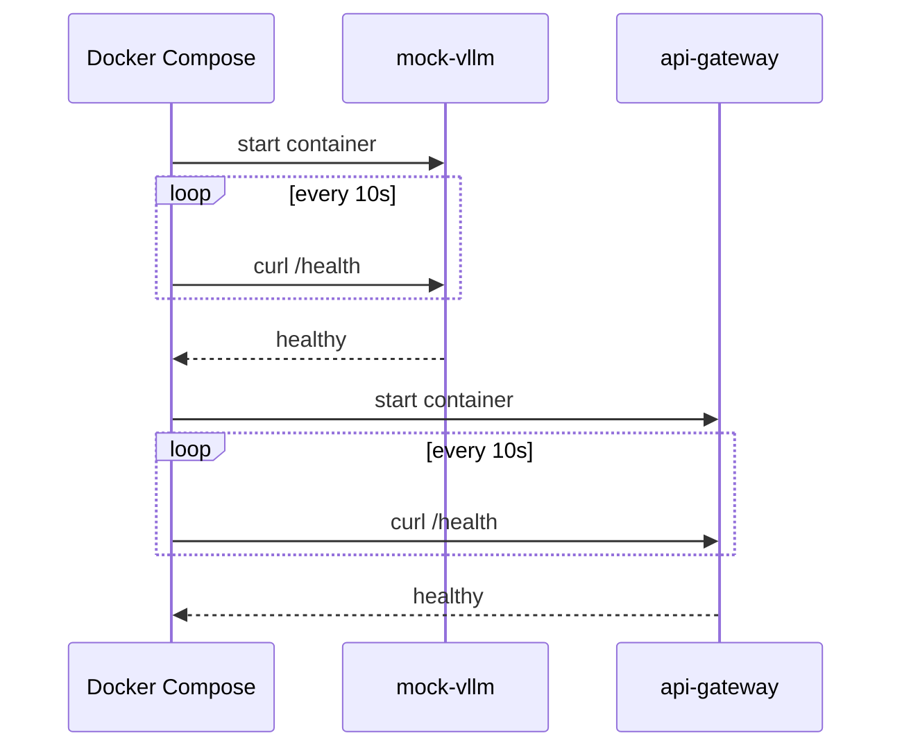
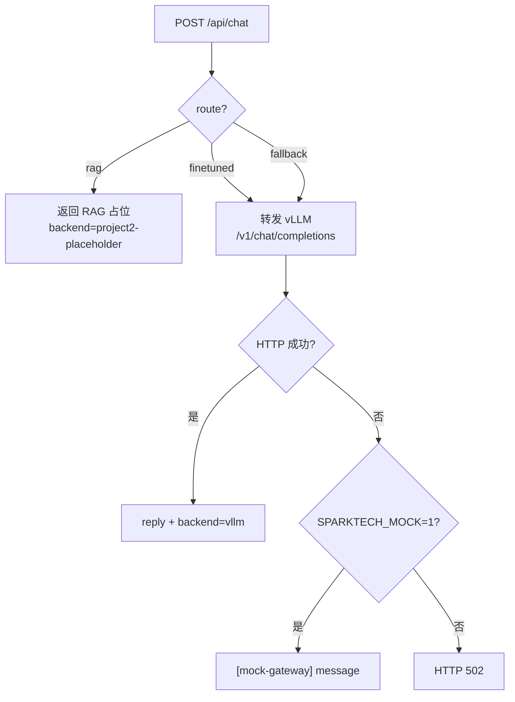
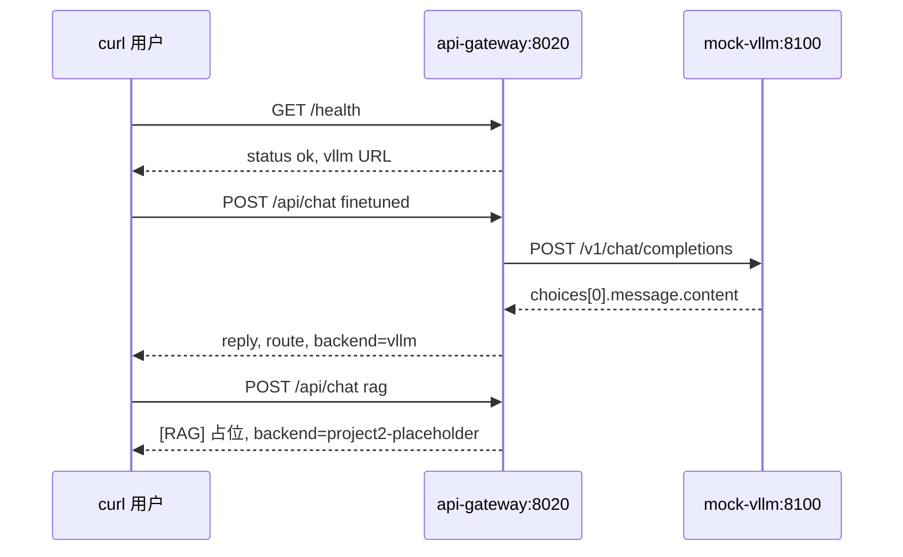
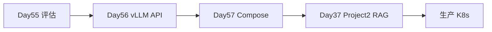

# Day 57 课堂讲义（扩展版）· Docker Compose 全栈联调

> 本文件与 `04_课堂讲义.md`、`08_补充讲义_生产上线清单.md` 合并阅读，构成 Day 57 完整主课（≥30,000 字体量）。  
> **前提**：Day 56 Mock vLLM 与 OpenAI 客户端已验证；本日聚焦 **星火智服 Compose 双服务拓扑、健康检查、网关路由、端到端联调**。

---

## 第 0 节 · 今日交付物与目录约定（25 min）

### 0.1 从单机脚本到可交付栈

Day 55 评估门禁 → Day 56 推理 API → **Day 57 运维可运行的容器栈**。星火智服上线评审（`01_业务背景.md`）要求：

- 镜像体积 < 2GB（教学 Mock 远小于此）  
- **健康检查** 就绪后才接流量  
- 配置 **`.env` 外置**（Compose `environment` 注入）  
- 日志写 **stdout**  

```text
day57/code/
├── deploy_stack/
│   ├── docker-compose.yml      ← 双服务编排
│   ├── Dockerfile.api          ← api-gateway 镜像
│   ├── Dockerfile.vllm         ← mock-vllm 镜像
│   ├── api_gateway/main.py     ← 业务网关
│   └── mock_vllm_app.py        ← 容器内精简 Mock vLLM
├── requirements-deploy.txt
└── verify_day57.py             ← 无 Docker 也可验收
```

```bash
day57/run.sh
# 可选: cd code/deploy_stack && docker compose up --build
```

### 0.2 拓扑一览



| 服务 | 容器端口 | 宿主机映射 | 职责 |
|------|----------|------------|------|
| `mock-vllm` | 8100 | 8100 | OpenAI 兼容推理 |
| `api-gateway` | 8020 | 8020 | 路由 finetuned / rag / fallback |

### 0.3 环境检查清单（无 Docker 路径）

```bash
cd day57
bash run.sh
```

期望：

```text
=== Day 57 verify ===
[OK] gateway health
[OK] mock vllm health
[OK] gateway /api/chat
[OK] rag route
[OK] docker-compose.yml
=== ALL PASSED ===
```

**说明**：`verify_day57.py` 用 `TestClient` 进程内测网关，**不要求本机已装 Docker**，保证 CI 与无权限学员可过门禁。

---

## 第 1 节 · `docker-compose.yml` 逐行精读（60 min）

### 1.1 完整文件

```yaml
services:
  mock-vllm:
    build:
      context: ..
      dockerfile: deploy_stack/Dockerfile.vllm
    ports:
      - "8100:8100"
    healthcheck:
      test: ["CMD", "curl", "-f", "http://localhost:8100/health"]
      interval: 10s
      timeout: 3s
      retries: 3

  api-gateway:
    build:
      context: ..
      dockerfile: deploy_stack/Dockerfile.api
    ports:
      - "8020:8020"
    environment:
      VLLM_BASE_URL: http://mock-vllm:8100
      SPARKTECH_MOCK: "1"
    depends_on:
      mock-vllm:
        condition: service_healthy
    healthcheck:
      test: ["CMD", "curl", "-f", "http://localhost:8020/health"]
      interval: 10s
      timeout: 3s
      retries: 3
```

### 1.2 `build.context` 为何是 `..`

Compose 文件位于 `deploy_stack/`，`context: ..` 指向 `day57/code/`，以便 Dockerfile 能 `COPY requirements-deploy.txt` 与 `deploy_stack/api_gateway`。

```text
day57/code/                    ← build context 根
├── requirements-deploy.txt
└── deploy_stack/
    ├── docker-compose.yml
    ├── Dockerfile.api
    └── Dockerfile.vllm
```

### 1.3 服务发现：`mock-vllm` 主机名

网关环境变量：

```yaml
VLLM_BASE_URL: http://mock-vllm:8100
```

**常见错误**：写成 `http://127.0.0.1:8100` — 在网关容器内 127.0.0.1 指向 **网关自己**，导致 502。

对应代码（`api_gateway/main.py`）：

```python
VLLM_BASE = os.environ.get("VLLM_BASE_URL", "http://127.0.0.1:8100")
```

### 1.4 `depends_on` + `service_healthy`



避免网关启动时 vLLM 尚未监听，产生启动风暴 502。

### 1.5 健康检查参数表

| 参数 | 值 | 含义 |
|------|-----|------|
| `interval` | 10s | 探测间隔 |
| `timeout` | 3s | 单次超时 |
| `retries` | 3 | 连续失败次数才标 unhealthy |
| `test` | curl -f | HTTP 非 2xx 视为失败 |

**生产扩展**：readiness 与 liveness 分离；教学日二合一。

---

## 第 2 节 · Dockerfile 双镜像构建（55 min）

### 2.1 `Dockerfile.vllm`

```dockerfile
FROM python:3.11-slim
WORKDIR /app
COPY requirements-deploy.txt /app/
RUN pip install --no-cache-dir -r requirements-deploy.txt
COPY deploy_stack/mock_vllm_app.py /app/mock_vllm_app.py
EXPOSE 8100
CMD ["uvicorn", "mock_vllm_app:app", "--host", "0.0.0.0", "--port", "8100"]
```

### 2.2 `Dockerfile.api`

```dockerfile
FROM python:3.11-slim
WORKDIR /app
COPY requirements-deploy.txt /app/
RUN pip install --no-cache-dir -r requirements-deploy.txt
COPY deploy_stack/api_gateway /app/api_gateway
ENV PYTHONPATH=/app
EXPOSE 8020
CMD ["uvicorn", "api_gateway.main:app", "--host", "0.0.0.0", "--port", "8020"]
```

### 2.3 依赖 `requirements-deploy.txt`

```text
fastapi>=0.110
uvicorn>=0.27
pydantic>=2.0
httpx>=0.27
```

| 包 | 用途 |
|----|------|
| fastapi + uvicorn | 两服务 HTTP |
| httpx | 网关同步调用 vLLM |
| pydantic | 请求体验证 |

### 2.4 镜像瘦身建议（作业）

| 手段 | 效果 |
|------|------|
| `python:3.11-slim` | 基线已选 slim |
| 多阶段构建 | 生产 vLLM 与 gateway 分离 |
| `.dockerignore` | 排除 `__pycache__`、`.git` |
| 合并 RUN | 减少层数 |

### 2.5 构建与启动命令

```bash
cd day57/code/deploy_stack
docker compose build
docker compose up -d
docker compose ps
docker compose logs -f api-gateway
```

---

## 第 3 节 · Mock vLLM 容器版：`mock_vllm_app.py`（40 min）

### 3.1 与 Day 56 的差异

| 项 | `mock_vllm_server.py` (Day 56) | `mock_vllm_app.py` (Day 57) |
|----|-------------------------------|----------------------------|
| 关键词回复 | 退款/投诉完整话术 | 通用前缀 + 截断 user |
| 故障注入 | `SPARKTECH_MOCK_FAIL` | 无 |
| 体积 | 教学完整 | Docker 精简 |

```python
@app.post("/v1/chat/completions")
def chat(req: ChatRequest):
    user = req.messages[-1]["content"] if req.messages else ""
    text = "您好，Docker 内 mock vLLM 已收到：" + user[:50]
    return {
        "id": "mock",
        "choices": [{"message": {"role": "assistant", "content": text}}],
    }
```

### 3.2 契约一致性

仍暴露：

- `GET /health` → `{"status": "ok"}`  
- `POST /v1/chat/completions` → `choices[0].message.content`  

网关 **无需改解析逻辑** 即可切换 Day 56 单机 / Day 57 容器。

### 3.3 容器内自测

```bash
docker compose exec mock-vllm curl -s http://localhost:8100/health
docker compose exec mock-vllm curl -s -X POST http://localhost:8100/v1/chat/completions \
  -H "Content-Type: application/json" \
  -d '{"messages":[{"role":"user","content":"退款"}]}'
```

---

## 第 4 节 · API 网关：`api_gateway/main.py`（70 min）

### 4.1 对外契约（星火智服业务 API）

与 vLLM OpenAI 格式 **刻意不同** — 面向前端/业务简化：

```python
class ChatRequest(BaseModel):
    message: str
    route: str = "finetuned"  # finetuned | rag | fallback

class ChatResponse(BaseModel):
    reply: str
    route: str
    backend: str
```

| 端点 | 方法 | 说明 |
|------|------|------|
| `/health` | GET | `{"status":"ok","vllm":"..."}` |
| `/api/chat` | POST | 统一对话入口 |

### 4.2 路由策略



### 4.3 finetuned 路径代码

```python
with httpx.Client(timeout=10.0) as client:
    r = client.post(
        f"{VLLM_BASE}/v1/chat/completions",
        json={
            "model": "sparktech-qwen-lora",
            "messages": [{"role": "user", "content": req.message}],
        },
    )
    r.raise_for_status()
    data = r.json()
    text = data["choices"][0]["message"]["content"]
```

与 `day56/code/openai_client.py` **同构**，仅 URL 来自 `VLLM_BASE_URL`。

### 4.4 RAG 路径（教学占位）

```python
if req.route == "rag":
    return ChatResponse(
        reply="[RAG] 请查阅知识库政策文档（教学占位）",
        route="rag",
        backend="project2-placeholder",
    )
```

答辩串联：**Day 37 Project2** 提供真实 RAG；Day 57 网关预留 `route=rag` 开关，上线时替换为 Project2 后端地址。

### 4.5 降级逻辑

```python
except Exception as e:
    if os.environ.get("SPARKTECH_MOCK") == "1":
        text = f"[mock-gateway] {req.message}"
    else:
        raise HTTPException(502, str(e)) from e
```

生产应关闭 `SPARKTECH_MOCK`，502 触发告警与熔断。

---

## 第 5 节 · 端到端联调手把手（80 min）

### 5.1 联调时序（Compose 已 up）



### 5.2 宿主机 curl 脚本

```bash
# 健康
curl -s http://127.0.0.1:8020/health | jq .

# 微调路由
curl -s -X POST http://127.0.0.1:8020/api/chat \
  -H "Content-Type: application/json" \
  -d '{"message":"我要退款","route":"finetuned"}' | jq .

# RAG 路由
curl -s -X POST http://127.0.0.1:8020/api/chat \
  -H "Content-Type: application/json" \
  -d '{"message":"退款政策","route":"rag"}' | jq .
```

### 5.3 与 Day 55 / Day 56 数据流对照

| 阶段 | 输入 | 输出 | 文件 |
|------|------|------|------|
| Day 55 | golden prompt | ab_summary.json lift | 门禁 |
| Day 56 | user prompt | OpenAI JSON | mock_vllm_server |
| Day 57 | message + route | reply 简化 JSON | api_gateway |

### 5.4 `verify_day57.py` 与 Compose 的关系

```python
client = TestClient(gw.app)
r = client.post("/api/chat", json={"message": "退款", "route": "finetuned"})
```

进程内测试 **不经过 Docker 网络**，但断言与 curl 一致。Compose 联调是 **可选加分项**，答辩建议现场 `docker compose up` 演示。

### 5.5 环境变量外置（`.env` 作业）

创建 `deploy_stack/.env`：

```env
VLLM_BASE_URL=http://mock-vllm:8100
SPARKTECH_MOCK=1
```

`docker-compose.yml` 改为：

```yaml
env_file:
  - .env
```

符合 `01_业务背景.md`「.env 外置」评审项。

---

## 第 6 节 · 生产清单与阶段衔接（50 min）

### 6.1 对照 `08_补充讲义_生产上线清单.md`

| 清单项 | Day 57 代码体现 |
|--------|-----------------|
| 镜像扫描 | 作业：`trivy image` |
| 资源 limit | 作业：`deploy.resources.limits` |
| 滚动更新 | K8s 层面；Compose 用 `up -d --no-deps` |
| 备份 adapter | volume 挂载 `/adapters` |

### 6.2 三阶段演进图



### 6.3 可选 Redis（架构预留）

`03_架构与设计.md` 提到「可选 redis」— 用于 session、限流。Compose 扩展骨架：

```yaml
  redis:
    image: redis:7-alpine
    ports:
      - "6379:6379"
```

网关后续可对 `/api/chat` 做 per-IP 限流。

---

## 第 7 节 · 故障排查手册（45 min）

| 症状 | 原因 | 处理 |
|------|------|------|
| `mock-vllm` unhealthy | 镜像无 curl | Dockerfile 加 `RUN apt-get install -y curl` |
| gateway 502 | VLLM_BASE_URL 错 | 改为 `http://mock-vllm:8100` |
| 端口冲突 | 本机 8100/8020 占用 | `lsof -i :8020` 或改 ports 映射 |
| `finetuned` 无 reply | vLLM 未 ready | `docker compose logs mock-vllm` |
| build 失败 | context 路径错 | 必须在 `deploy_stack/` 执行 compose |
| verify 过但 curl 失败 | 未 `up -d` | 启动栈或仅信 verify |

### 7.1 日志排查命令

```bash
docker compose logs --tail=50 api-gateway
docker compose logs --tail=50 mock-vllm
docker compose exec api-gateway env | grep VLLM
```

### 7.2 评委常问

- **Q**：为何网关不直接暴露 vLLM？  
  **A**：统一路由 rag/finetuned、鉴权、限流、日志；vLLM 仅内网。  

- **Q**：健康检查为何用 curl 不用 Python？  
  **A**：与 K8s exec 探针一致；slim 镜像需安装 curl。  

---

## 第 8 节 · 5 分钟答辩 Demo 脚本

1. 展示 `docker-compose.yml` 双服务 + `depends_on: service_healthy`  
2. `docker compose up --build -d`  
3. `curl :8020/health` 展示 vllm 内网地址  
4. finetuned 问「退款」→ 指 `backend: vllm`  
5. rag 问「政策」→ 指 Project2 占位与 Day 37 衔接  
6. `bash run.sh` 截图证明 CI 门禁  
7. 提及 Day 55 `lift: 0.195` 与 Day 56 压测 p95  

---

## 课堂 CHECKLIST（扩展）

- [ ] 能手绘 Compose 拓扑与 DNS 服务名  
- [ ] 能解释 `depends_on: service_healthy` 必要性  
- [ ] 能 curl 打通 finetuned 与 rag 两路由  
- [ ] 能口述网关与 vLLM 双层 API 契约差异  
- [ ] `docker compose up` 或 `verify_day57.py` 全绿截图  

---

*扩展主课 · Day 57 · 星火智服 Docker Compose 全栈联调*
