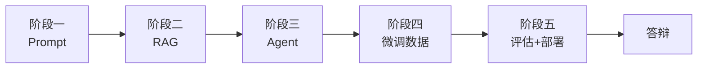

# Day 57 课堂讲义（扩展版）· 阶段五答辩 Checklist

> 本文件与 `09_附录_DockerCompose全栈联调.md` 合并阅读。  
> **目标**：Day 55–57 构成星火智服 **阶段五（微调上线）** 答辩材料；本清单供学员彩排与评委打分。

---

## 第 0 节 · 阶段五在全局课程中的位置（15 min）



| 天数 | 主题 | 必展示产物 |
|------|------|------------|
| Day 55 | 评估门禁 | `reports/ab_summary.json` |
| Day 56 | vLLM 推理 | Mock server + 压测 p95 |
| Day 57 | Compose 联调 | `docker-compose.yml` + 网关 Demo |

---

## 第 1 节 · 答辩前 48 小时 Checklist

### 1.1 代码与验收

- [ ] `cd day55 && bash run.sh` 全绿  
- [ ] `cd day56 && bash run.sh` 全绿  
- [ ] `cd day57 && bash run.sh` 全绿  
- [ ] `ab_summary.json` 中 `lift >= 0.05`（当前 Mock：0.195）  
- [ ] `benchmark_latency.py` 的 `p95_ms < 5000`  
- [ ] `deploy_stack/docker-compose.yml` 存在且可 `docker compose config`  

### 1.2 文档与 Git

- [ ] commit message 规范：`feat(eval|deploy): ...`  
- [ ] 无训练集泄漏黄金集（见 `08_补充讲义_评估陷阱.md`）  
- [ ] README 或答辩 PPT 含架构图（可复用本附录 mermaid）  

### 1.3 环境与备份

- [ ] 笔记本安装 Docker（可选演示用）  
- [ ] 无 Docker 时能口述 `verify_day57.py` 进程内测原理  
- [ ] 准备 `.env.example`（不含密钥）  

---

## 第 2 节 · 现场 Demo 脚本（≤8 分钟）

| 分钟 | 动作 | 话术要点 |
|------|------|----------|
| 0–1 | 业务背景 | 星火智服微调客服，上线前评估+部署 |
| 1–2 | 打开 `ab_summary.json` | lift 19.5%，超 5% 门禁 |
| 2–3 | `llm_judge_mock` Rubric | tone/factuality/overall 权重 |
| 3–4 | 启动/说明 vLLM | `/v1/chat/completions`，model 名一致 |
| 4–5 | `benchmark_latency` | p50/p95 SLA |
| 5–7 | Compose 或网关 curl | finetuned + rag 两路由 |
| 7–8 | 总结 | 与 Day 37 RAG 未来合并 |

**备用**：Compose 失败时改跑 `python3 -m uvicorn api_gateway.main:app --port 8020` + 口述网络差异。

---

## 第 3 节 · 评委提问速查表

| 问题 | 参考答案要点 | 对应代码/文件 |
|------|--------------|---------------|
| 为何不用纯 BLEU？ | 客服同义回复多 | `evaluate_responses.py` keyword |
| Judge 可信吗？ | Mock 教学；生产异模型 Judge | `llm_judge_mock.py` |
| lift 怎么算？ | tuned_avg − base_avg | `ab_test_runner.py` |
| 为何 Mock vLLM？ | 无 GPU 统一协议 | `mock_vllm_server.py` |
| 网关为何 502？ | 服务名非 localhost | `VLLM_BASE_URL` |
| rag 路由是什么？ | Project2 占位 | `api_gateway/main.py` L33 |
| 健康检查作用？ | 避免未就绪接流量 | `docker-compose.yml` |
| 如何回滚？ | 切 adapter / 旧镜像 tag | 口述 + 08 清单 |

---

## 第 4 节 · 评分 Rubric（评委用）

| 维度 | 权重 | 5 分 | 3 分 | 1 分 |
|------|------|------|------|------|
| 评估体系 | 25% | 能讲清金字塔四层 + 泄漏陷阱 | 仅报 lift 数字 | 不知黄金集用途 |
| 推理部署 | 25% | 演示 API + 压测指标 | 仅 README | 协议字段错误 |
| Compose 联调 | 25% |  live curl 双路由 | 仅 verify 截图 | compose 起不来且无解释 |
| 表达与问答 | 25% | <8min 结构清晰 | 超时或跳跃 | 无法答网关/vLLM 区别 |

**通过线**：加权 ≥ 3.5 / 5，且三天 `run.sh` 均可复现。

---

## 第 5 节 · 常见扣分项

| 扣分项 | 说明 |
|--------|------|
| 黄金集仅 2 条且无扩展计划 | 承认教学简化，需说生产 ≥100 |
| 混淆 OpenAI 契约与网关 `/api/chat` | 见 `day56/10_附录_OpenAI兼容API契约.md` |
| Compose 内用 127.0.0.1 调 vLLM | 服务发现错误 |
| 未提 Day 55 门禁与 Day 56 关系 | 阶段五故事线断裂 |
| 答辩现场改代码导致 verify 红 | 应提前冻结 demo 分支 |

---

## 第 6 节 · 提交物清单

```text
答辩包/
├── day55/code/reports/ab_summary.json
├── day55/run.sh 截图
├── day56/run.sh 截图
├── day57/run.sh 截图
├── 架构图.pdf（可选）
└── 演示录屏.mp4（可选）
```

---

## 第 7 节 · 三天代码交叉引用速查

答辩时应能 **一键定位** 关键实现，避免现场翻找超时：

| 能力 | 文件 | 关键符号 |
|------|------|----------|
| 黄金集加载 | `day55/code/evaluate_responses.py` | `load_golden()` |
| Rubric 打分 | `day55/code/llm_judge_mock.py` | `judge()` → `JudgeResult` |
| A/B 报告 | `day55/code/ab_test_runner.py` | `run_ab()` → `lift` |
| 门禁验收 | `day55/code/verify_day55.py` | `tuned_avg > base_avg` |
| Mock vLLM | `day56/code/mock_vllm_server.py` | `POST /v1/chat/completions` |
| 业务客户端 | `day56/code/openai_client.py` | `chat_completion()` |
| 延迟压测 | `day56/code/benchmark_latency.py` | `p50_ms` / `p95_ms` |
| Compose 编排 | `day57/code/deploy_stack/docker-compose.yml` | `service_healthy` |
| 业务网关 | `day57/code/deploy_stack/api_gateway/main.py` | `POST /api/chat` |
| 容器 Mock | `day57/code/deploy_stack/mock_vllm_app.py` | Docker 内 vLLM |

### 7.1 故事线一句话（必背）

> Day 55 用黄金集证明微调优于 base；Day 56 把 adapter 挂成 OpenAI 兼容 API 并压测延迟；Day 57 用 Compose 把网关与 vLLM 编排成运维可交付栈，并预留 RAG 路由对接 Day 37 Project2。

### 7.2 环境与 Mock 标志统一说明

三天均支持 `SPARKTECH_MOCK=1`，**无需 GPU、API Key、Docker** 即可通过 `run.sh`。答辩时主动说明这一点，可消除评委对「环境不可用」的疑虑。

| 天数 | Mock 含义 |
|------|-----------|
| Day 55 | 规则 Judge 代替真实 LLM Judge |
| Day 56 | `mock_vllm_server` 代替真 vLLM |
| Day 57 | 网关异常时 `[mock-gateway]` 降级 + 可选 Compose |

---

## 第 8 节 · 答辩 PPT 页码建议（10 页）

| 页 | 标题 | 素材来源 |
|----|------|----------|
| 1 | 封面：星火智服阶段五 | 课程 logo |
| 2 | 业务痛点：微调不能直接上线 | `day55/01_业务背景.md` |
| 3 | 评估金字塔 + lift 曲线 | 本日 09 附录 mermaid |
| 4 | 黄金集与 Rubric 表 | `golden_eval.jsonl` |
| 5 | ab_summary 截图 | `lift: 0.195` |
| 6 | vLLM 架构与 OpenAI 契约 | day56 09 + 10 附录 |
| 7 | 压测 p50/p95 表 | `benchmark_latency.py` |
| 8 | Compose 拓扑 | day57 09 附录 |
| 9 | 端到端 curl Demo 结果 | finetuned + rag |
| 10 | 总结与后续：接 Project2 RAG | Day 37 衔接 |

---

## 课堂 CHECKLIST（答辩日）

- [ ] Demo 完整练 3 遍 ≤ 8 分钟  
- [ ] 评委表 8 题能答 6 题以上  
- [ ] 三天 verify 截图已上传  
- [ ] Compose 失败有备用方案  
- [ ] 能 30 秒内打开 `ab_summary.json` 并解释三项指标  
- [ ] 能区分 `/api/chat` 与 `/v1/chat/completions` 两层契约  

---

*扩展主课 · Day 57 · 阶段五答辩 Checklist*
