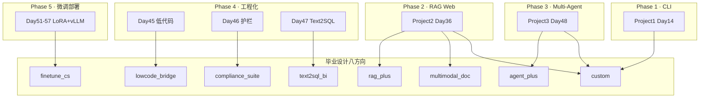
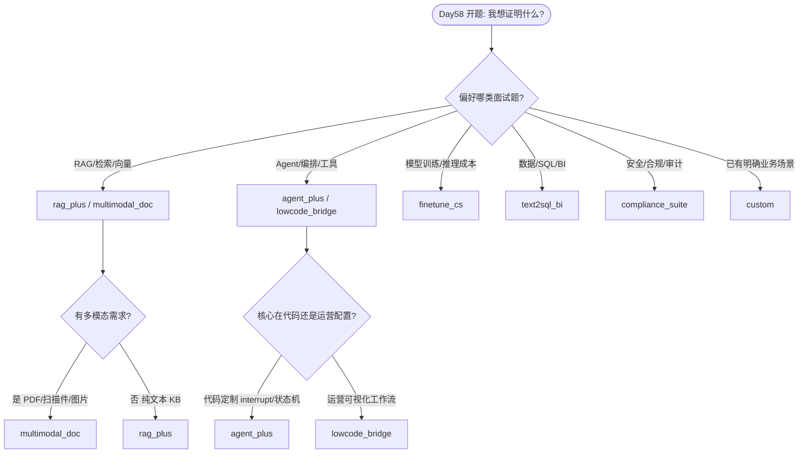

# Day 58 课堂讲义（扩展版）· 八方向选题决策树

> 本文件与 `04_课堂讲义.md`、`02_需求文档.md` 合并阅读，构成 Day 58 完整主课（≥30,000 字体量）。  
> **前提**：Day 57 阶段五答辩已通过；本日聚焦 **毕业设计开题、八方向选型、`scaffold.py` 脚手架落地**——星火智服学员须在 Day 58 结束前锁定方向并生成 `workspace/` 项目骨架。

---

## 第 0 节 · 今日交付物与目录约定（20 min）

### 0.1 为何 Day 58 是「毕业设计分水岭」

星火智服（SparkTech）70 天训练营中，Day 58–65 为 **毕业设计冲刺周**。与 Day 14/36/48 的「指定题目项目」不同，毕业设计要求学员在 **八个官方方向** 中自主选型，并在 `day58/code/graduation_project/workspace/` 下维护 **唯一源码树（Single Source of Truth）**。

```text
day58/code/graduation_project/
├── README.md                    ← 八方向总表
├── scaffold.py                  ← 按方向生成 workspace
├── verify_graduation.py         ← 骨架验收
├── directions/                  ← 各方向 PRD 模板与 MVP 线
│   ├── rag_plus.md
│   ├── agent_plus.md
│   ├── finetune_cs.md
│   ├── text2sql_bi.md
│   ├── lowcode_bridge.md
│   ├── compliance_suite.md
│   ├── multimodal_doc.md
│   └── custom.md
├── templates/
│   └── DEMO_SCRIPT.md
└── workspace/                   ← 学员项目（gitignore，答辩同路径）
    └── <team-name>/
        ├── project_meta.json
        ├── README.md
        ├── docs/PRD.md
        ├── docs/ARCHITECTURE.md
        ├── src/
        └── tests/verify_project.py
```

学员 Git 提交规范：

```bash
cd day58/code/graduation_project
python3 scaffold.py --direction rag_plus --name sparktech-team-alpha
python3 verify_graduation.py
git add day58/code/graduation_project/directions/  # 若补充了方向笔记
git commit -m "docs(graduation): day58 topic selection rag_plus + scaffold"
```

### 0.2 环境检查清单

```bash
cd day58/code
python3 verify_day58.py
cd graduation_project
python3 scaffold.py --direction agent_plus --name demo-verify
python3 verify_graduation.py
```

**期望输出**：

```text
[OK] graduation project structure
```

若 `未知方向` 报错，检查 `--direction` 是否与 `scaffold.py` 中 `DIRECTIONS` 键名完全一致（全小写、下划线分隔）。

---

## 第 1 节 · 八方向总览与基线映射（45 min）

### 1.1 `scaffold.py` 方向注册表

`scaffold.py` 第 10–19 行定义了八方向的 **代号、基线代码路径、中文描述**：

| # | 代号 | 名称 | `base_reference` | 描述 |
|---|------|------|------------------|------|
| 1 | `rag_plus` | RAG 商业化增强 | `day36/code/project2` | 混合检索实验台 / 多租户 |
| 2 | `agent_plus` | 多 Agent 办公增强 | `day48/code/project3` | 持久化 checkpointer + 真实邮件 |
| 3 | `finetune_cs` | 垂直客服微调 | `day57/code/deploy_stack` | 真机 LoRA + vLLM |
| 4 | `text2sql_bi` | Text-to-SQL 分析台 | `day47/code` | 可视化报表 + 护栏 |
| 5 | `lowcode_bridge` | 低代码桥接 | `day45` | Dify/Coze 工作流对接自研 API |
| 6 | `compliance_suite` | 合规护栏平台 | `day46/code` | 护栏全链路接入三项目 |
| 7 | `multimodal_doc` | 多模态文档助手 | `day36/code/project2` | PDF+图片 OCR + RAG |
| 8 | `custom` | 自拟题目 | `None` | 经导师批准的原创方向 |

**关键理解**：`base_reference` 不是「复制粘贴」路径，而是 **能力继承点**。学员应在基线项目上 **增量开发**，答辩时须能画出「基线 vs 毕业设计增量」对比图。

### 1.2 各方向 MVP 验收最低线（来自 `directions/*.md`）

八个方向的 `directions/*.md` 统一约定答辩最低线：

| 检查项 | 说明 | 验收命令 |
|--------|------|----------|
| `verify_project.py` 全绿 | 学员扩展验收脚本 | `python3 tests/verify_project.py` |
| 3 分钟 Demo 脚本 | 见 `templates/DEMO_SCRIPT.md` | 彩排计时 |
| 架构图 + 技术债说明 | `docs/ARCHITECTURE.md` | 导师评审 |
| README 一键启动 | 含 `run.sh` 或等效命令 | 现场演示 |

加分项（非必做，但影响答辩 Rubric）：真实 API、监控/护栏/评估指标、Docker 部署。

### 1.3 三阶段项目与八方向关系



---

## 第 2 节 · 选题决策树（核心，60 min）

### 2.1 一级决策：你想证明什么能力？



### 2.2 二级决策：资源与风险矩阵

| 方向 | 算力需求 | 数据准备难度 | 演示稳定性 | 适合学员画像 |
|------|----------|--------------|------------|--------------|
| `rag_plus` | 低（CPU 可 mock） | 中（需 KB 文档） | 高 | 全栈偏后端、想巩固 Project2 |
| `agent_plus` | 低 | 低 | 中（多步骤易超时） | 喜欢 LangGraph、有耐心调状态 |
| `finetune_cs` | **高**（需 GPU） | **高**（清洗对话集） | 中 | 已跟完 Day51–57、有真机 |
| `text2sql_bi` | 低 | 中（需样例库表） | 高 | 偏数据、想做可视化 |
| `lowcode_bridge` | 低 | 低 | 中（依赖外部 SaaS） | 产品思维强、工程化偏弱 |
| `compliance_suite` | 低 | 低 | **高** | 想走安全岗、擅长横切关注点 |
| `multimodal_doc` | 中（OCR API） | 中 | 中 | 对 CV+LLM 有兴趣 |
| `custom` | 不定 | 不定 | 不定 | 有导师背书、题目已验证可行 |

**导师红线**：

- 无 GPU 且未申请云资源 → 不建议选 `finetune_cs`  
- 无法保证 Demo 网络 → 不建议强依赖 Dify/Coze 的 `lowcode_bridge`  
- `custom` 须开题前提交 **一页纸可行性说明**，否则 Day 59 PRD 评审不通过  

### 2.3 三级决策：与已有作业成绩的匹配

对照你前三阶段项目的 `verify_*.py` 成绩与 CR 评语：

| 若你… | 优先考虑 | 慎选 |
|--------|----------|------|
| Project2 citations 调通、混合检索理解深 | `rag_plus` | `finetune_cs` |
| Project3 interrupt/resume 演示流畅 | `agent_plus` | `lowcode_bridge` |
| Day47 SQL 护栏能默写 | `text2sql_bi` | `multimodal_doc` |
| Day46 trace 能讲清 Input/Output Guard | `compliance_suite` | `agent_plus`（除非做合规 Agent） |
| Day55 Rubric 与 A/B 门禁全绿 | `finetune_cs` | `rag_plus` |
| 三期项目均中等，但表达力强 | `lowcode_bridge` 或 `compliance_suite` | `custom` |

### 2.4 决策树叶子节点：方向一句话定位

**`rag_plus`**：在 Project2 上增加 **混合检索（BM25+向量）实验台**，可演示 α 权重切换对召回的影响，面向「企业知识库 ROI」叙事。

**`agent_plus`**：在 Project3 上把 **SqliteSaver 持久化 + 真实 SMTP 邮件** 做完整，面向「办公自动化可恢复性」叙事。

**`finetune_cs`**：把 Day51–57 的 **LoRA adapter + vLLM 服务** 封装为可切换的客服策略，面向「领域模型成本与质量」叙事。

**`text2sql_bi`**：在 Day47 上增加 **图表 Dashboard + 只读库护栏可视化**，面向「业务人员自助分析」叙事。

**`lowcode_bridge`**：用 Dify/Coze **调用自研 FastAPI**，证明低代码与代码边界，面向「交付速度 vs 可维护性」叙事。

**`compliance_suite`**：把 Day46 护栏 **同时接入 Project1/2/3 的入口**，统一 trace，面向「企业 AI 合规中台」叙事。

**`multimodal_doc`**：在 Project2 RAG 前增加 **PDF/图片 OCR 管线**，面向「非结构化文档入库」叙事。

**`custom`**：自拟但须映射到星火智服 **真实业务域**（客服、工单、知识库、审批），禁止空洞「通用聊天机器人」。

---

## 第 3 节 · 各方向技术增量清单（50 min）

### 3.1 `rag_plus` 建议增量

| 模块 | 基线（Project2） | 毕业设计增量 |
|------|------------------|--------------|
| 检索 | 单向量 top-k | BM25 + 向量 RRF / 权重滑条 |
| 租户 | 单 session | `tenant_id` 隔离索引目录 |
| 评估 | 无 | 10 条 golden query + hit@k |
| 前端 | 双栏 chat | 实验台侧栏：α 参数 + 对比答案 |

```bash
python3 scaffold.py --direction rag_plus --name my-rag-lab
# 从 day36/code/project2 复制 src 后增量修改
```

### 3.2 `agent_plus` 建议增量

| 模块 | 基线（Project3） | 毕业设计增量 |
|------|------------------|--------------|
| Checkpointer | 内存 / 可选 Sqlite | **默认 SqliteSaver**，重启 resume |
| 邮件 | mock log | SMTP `.env` 真发（或 Mailhog） |
| 审计 | steps 数组 | JSONL 审批留痕 |
| API | Task CRUD | 增加 `GET /tasks?status=pending` |

### 3.3 `finetune_cs` 建议增量

| 模块 | 基线（deploy_stack） | 毕业设计增量 |
|------|----------------------|--------------|
| 训练 | 脚本化 | Makefile `train` / `eval` / `serve` |
| 推理 | vLLM mock | OpenAI 兼容 `/v1/chat/completions` |
| 门禁 | Day55 A/B | 毕业设计 README 展示 lift 数字 |
| 前端 | 无 | 简易 chat 对比 base vs tuned |

### 3.4 `text2sql_bi` 建议增量

| 模块 | 基线（Day47） | 毕业设计增量 |
|------|---------------|--------------|
| SQL 生成 | validate_sql | 增加 EXPLAIN 预览 |
| 输出 | 表格 JSON | Chart.js / ECharts 折线&饼图 |
| 护栏 | 关键字黑名单 | UI 展示拦截原因 |
| 数据源 | SQLite 样例 | 星火智服「工单/会话」宽表 |

### 3.5 `lowcode_bridge` 建议增量

| 模块 | 基线（Day45） | 毕业设计增量 |
|------|---------------|--------------|
| 工作流 | Dify 单节点 | 端到端：用户输入 → Dify → 自研 API → 回写 |
| 鉴权 | API Key | HMAC 签名 + 幂等 request_id |
| 文档 | PoC 笔记 | 序列图：低代码 vs 自研职责边界 |

### 3.6 `compliance_suite` 建议增量

| 模块 | 基线（Day46） | 毕业设计增量 |
|------|---------------|--------------|
| 护栏 | 单项目 demo | middleware 接入三项目 HTTP 入口 |
| Trace | MockTracer | 统一 `trace_id` 贯穿 |
| 策略 | 静态词表 | 可配置 YAML 策略包 |
| 演示 | 单条拦截 | 三项目各一条敏感输入对比 |

### 3.7 `multimodal_doc` 建议增量

| 模块 | 基线（Project2） | 毕业设计增量 |
|------|------------------|--------------|
| 上传 | .md/.txt | PDF + png/jpg |
| 解析 | 直读文本 | OCR / pdfplumber 管线 |
| 切块 | 固定 chunk | 按版面块 + 标题层级 |
| citations | 文件名 | 页码 + 截图缩略图（可选） |

### 3.8 `custom` 开题必填项

| 字段 | 要求 |
|------|------|
| 业务域 | 必须对应星火智服组织内场景 |
| 基线引用 | 说明继承自哪天的哪段代码 |
| 风险 | 列出 3 条可能做不完的点与降级方案 |
| 导师签字 | Markdown 或 PDF 确认 |

---

## 第 4 节 · 选题工作坊流程（40 min）

### 4.1 90 分钟现场议程

| 时间 | 环节 | 产出 |
|------|------|------|
| 0:00–0:15 | 讲师讲八方向 + 决策树 | 学员圈定 2 个备选 |
| 0:15–0:35 | 小组讨论 + 两两互评 | 互评表每人 2 份 |
| 0:35–0:55 | 导师站台 5 分钟/组 | 方向锁定 |
| 0:55–1:10 | 运行 `scaffold.py` | `workspace/` 生成 |
| 1:10–1:30 | 填写开题报告（见 `10_附录_开题报告模板.md`） | `docs/开题报告.md` |

### 4.2 互评表（打印或复制到 Issue）

| 评价项 | 1–5 分 | 评语 |
|--------|--------|------|
| 业务价值是否清晰 | | |
| 与基线代码是否可衔接 | | |
| 一周 MVP 是否可完成 | | |
| Demo 是否可稳定复现 | | |
| 答辩故事线是否吸引人 | | |

**规则**：两人互评均分 ≥ 3 且导师不否决，方可 `scaffold`。

### 4.3 常见选题错误与纠正

| 错误 | 后果 | 纠正 |
|------|------|------|
| 同时做 RAG + 微调 + Agent | 全做不完 | 选一个主方向，其余写技术债 |
| 题目过大「企业级 AI 中台」 | PRD 无法冻结 | 收窄到单场景单角色 |
| 与基线无关从零写 | verify 无法复用 | 必须声明 `base_reference` |
| 依赖未验证的第三方 | Demo 翻车 | Day 58 下午就做 spike |
| 组员方向不一致 | 合并冲突 | 当场选定唯一 `direction` |

---

## 第 5 节 · `project_meta.json` 与验收扩展（35 min）

### 5.1 元数据契约

`scaffold.py` 生成的 `project_meta.json` 示例：

```json
{
  "direction": "rag_plus",
  "name": "sparktech-team-alpha",
  "base_reference": "day36/code/project2",
  "description": "RAG 商业化增强"
}
```

Day 59 起 PRD 页眉须引用此文件字段，保证 **文档与代码同源**。

### 5.2 扩展 `verify_project.py` 路线图

| 天数 | 建议增加的 assert |
|------|-------------------|
| Day 58 | `direction` 非空、目录齐全 |
| Day 59 | `docs/PRD.md` 含用户故事表 |
| Day 60 | 至少一个 API 路由可 import |
| Day 61–63 | 核心模块单测 |
| Day 64 | Demo 脚本路径存在 |
| Day 65 | `git tag graduation-v1` 说明在 README |

### 5.3 与 `verify_day58.py` 的关系

```bash
cd day58/code
python3 verify_day58.py          # 当日课程验收
cd graduation_project
python3 verify_graduation.py     # 脚手架验收
```

两者均绿，才视为 Day 58 作业完成。

---

## 第 6 节 · 答辩视角反向选题（25 min）

### 6.1 评委最关心的五句话

1. **你解决了星火智服哪个角色的什么痛点？**  
2. **基线代码上你改了哪三个文件？为什么？**  
3. **mock 与生产差距是什么？上线还缺什么？**  
4. **`verify_project.py` 证明了什么？**  
5. **若再给一周，优先还哪笔技术债？**

选题时就用这五句话 **彩排 30 秒 elevator pitch**；若答不顺，说明方向需调整。

### 6.2 方向 → 答辩亮点速查

| 方向 | 推荐 Demo 高潮 | 必准备追问 |
|------|----------------|------------|
| `rag_plus` | 同一问题改 α 答案变化 | 向量维度、chunk 策略 |
| `agent_plus` | 重启服务后 resume 审批 | checkpointer 存储结构 |
| `finetune_cs` | base vs tuned 同 prompt | 数据清洗、过拟合 |
| `text2sql_bi` | 自然语言出图 | SQL 注入防护 |
| `lowcode_bridge` | Dify 调自研 API 全链路 | 鉴权、超时重试 |
| `compliance_suite` | 三项目同一敏感词拦截 | 性能开销、误杀率 |
| `multimodal_doc` | 扫描 PDF 问答带页码 | OCR 错误传播 |
| `custom` | 导师认可的业务闭环 | 为何不用官方方向 |

---

## 第 7 节 · 上机练习与 Checklist（20 min）

### 7.1 练习 A：跑通决策树

1. 打开本文件 §2.1 决策图，用便签标出你的路径  
2. 阅读对应 `directions/<代号>.md`  
3. 与搭档填写互评表  
4. 执行 `scaffold.py` 并截图 `project_meta.json`  

### 7.2 练习 B：基线 diff 预览

```bash
# 示例：rag_plus 学员
diff -rq day36/code/project2/src day58/code/graduation_project/workspace/my-rag-lab/src || true
```

列出 **计划修改** 的 5 个文件路径，写入开题报告「范围」章节。

### 7.3 Day 58 结业 Checklist

- [ ] 方向代号与 `scaffold.py` 一致  
- [ ] `workspace/<name>/` 已生成且 `verify_graduation.py` 全绿  
- [ ] 开题报告已提交（见 `10_附录_开题报告模板.md`）  
- [ ] 30 秒 pitch 录音 ≤ 35 秒  
- [ ] 全组统一 `project_meta.json` 的 `name`  
- [ ] 已知 Day 59 PRD 冻结截止日期  

---

## 附录 A · 八方向对照速查卡（可打印）

| 代号 | 一句话 | 基线 | 风险 |
|------|--------|------|------|
| `rag_plus` | 检索效果可观测 | Project2 | 评估集建设耗时 |
| `agent_plus` | 办公流可恢复 | Project3 | 步骤多易超时 |
| `finetune_cs` | 领域模型更懂行话 | Day57 | GPU |
| `text2sql_bi` | 业务自助查数 | Day47 | schema 设计 |
| `lowcode_bridge` | 低代码+代码共存 | Day45 | 外网依赖 |
| `compliance_suite` | 护栏一次接入处处生效 | Day46 | 横切改造量大 |
| `multimodal_doc` | 扫描件也能问 | Project2 | OCR 质量 |
| `custom` | 原创但需导师批 | 自选 | 范围失控 |

---

## 附录 B · 参考命令汇总

```bash
# 列出所有方向
python3 -c "from scaffold import DIRECTIONS; print('\n'.join(DIRECTIONS))"

# 生成项目
python3 scaffold.py --direction compliance_suite --name sparktech-guard

# 查看方向说明
cat directions/rag_plus.md

# 当日验收
cd ../../ && python3 verify_day58.py
```

---

*扩展主课 · Day 58 · 星火智服毕业设计八方向选题决策树 · 与 `graduation_project/scaffold.py` 同步*
