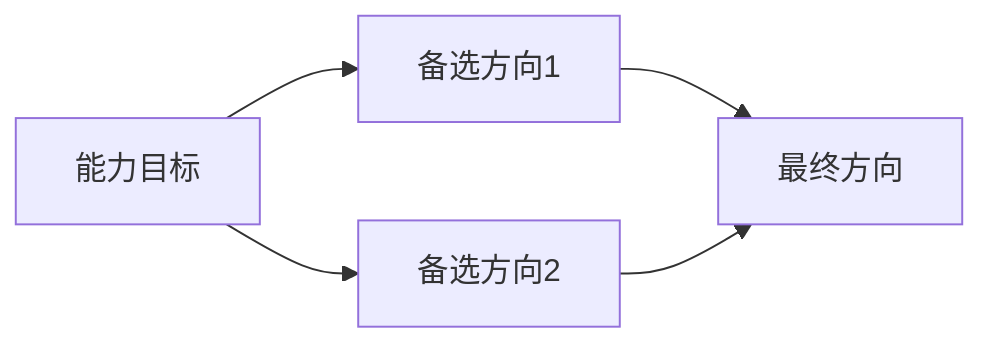
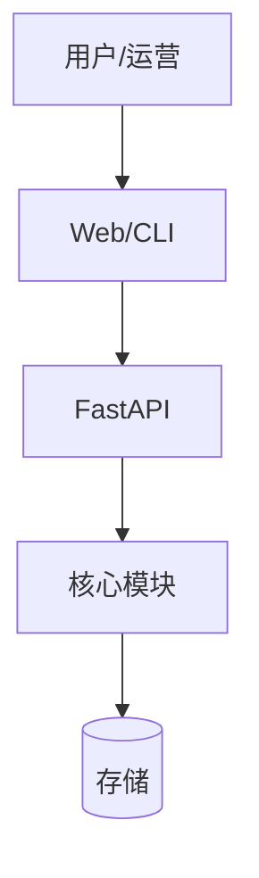
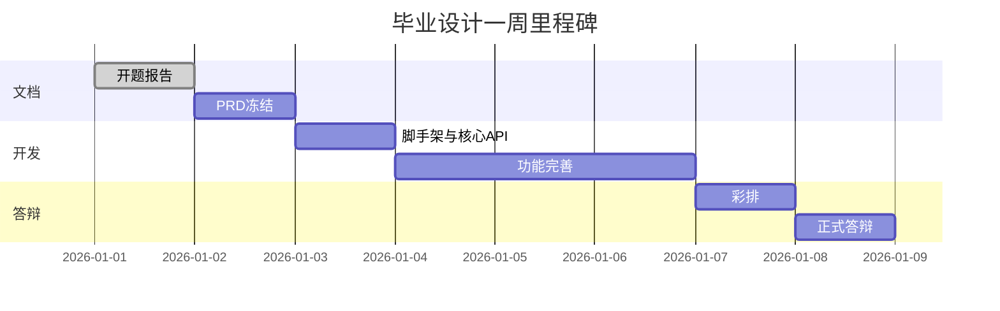

# Day 58 课堂讲义（扩展版）· 开题报告模板

> 本文件与 `09_附录_八方向选题决策树.md`、`04_课堂讲义.md` 合并阅读。  
> **用途**：Day 58 开题答辩现场提交；复制到 `workspace/<team>/docs/开题报告.md` 并填写。  
> **篇幅要求**：正文不少于 1500 字（不含模板说明）。

---

## 使用说明

1. 删除所有 `<!-- 提示 -->` 注释后再提交  
2. 方向代号必须与 `project_meta.json` 的 `direction` 一致  
3. 导师签字栏可扫描手写或电子批注  
4. 文件名建议：`docs/开题报告.md` 或 `docs/PROPOSAL.md`

---

# 星火智服 · 毕业设计开题报告

| 属性 | 内容 |
|------|------|
| 文档编号 | PROPOSAL-XINGHUO-GRAD-<!-- 学号 --> |
| 团队名称 | <!-- 与 scaffold --name 一致 --> |
| 方向代号 | <!-- 如 rag_plus，见 scaffold.py DIRECTIONS --> |
| 基线引用 | <!-- 如 day36/code/project2，见 project_meta.json --> |
| 提交日期 | <!-- YYYY-MM-DD --> |
| 答辩周次 | Day 65 毕业答辩 |

---

## 1. 项目概述

### 1.1 题目（中文）

<!-- 提示：≤ 30 字，体现业务+技术，如「星火智服混合检索实验台」 -->

### 1.2 题目（英文，可选）

<!-- SparkTech Hybrid Retrieval Lab -->

### 1.3 一句话摘要（Elevator Pitch）

<!-- 提示：30 秒内读完，结构：谁 + 痛点 + 方案 + 可验证结果 -->

> 示例（`rag_plus`）：面向星火智服知识库运营，本课题在 Project2 上增加 BM25+向量混合检索实验台，使运营人员可在线调节权重并对比答案质量，验收以 10 条 golden query 的 hit@3 提升为准。

### 1.4 关键词

<!-- 3–5 个，如：RAG、混合检索、RRF、多租户、星火智服 -->

---

## 2. 背景与动机

### 2.1 业务背景

<!-- 提示：联系星火智服客服/工单/知识库场景，勿写空洞「AI 很火」 -->

| 角色 | 现状痛点 | 本课题如何缓解 |
|------|----------|----------------|
| <!-- 如：一线客服 --> | <!-- 检索不准 --> | <!-- 混合检索 --> |
| <!-- 如：知识库运营 --> | <!-- 无法评估 --> | <!-- 实验台 --> |

### 2.2 与训练营项目的衔接

<!-- 提示：对照下表填写「继承」与「新增」 -->

| 来源项目/天数 | 继承能力 | 本课题新增 |
|---------------|----------|------------|
| <!-- Project2 Day36 --> | <!-- SSE chat、citations --> | <!-- BM25、α 滑条 --> |
| <!-- Day46 --> | <!-- 可选：护栏 --> | <!-- --> |

### 2.3 选题依据（决策树路径）

<!-- 提示：简述你在 09_附录 决策树中的选择路径，证明方向经过理性比较而非随机 -->



文字说明：

<!-- 我们曾比较 agent_plus 与 rag_plus，因组内 Project2 成绩更好且缺乏 GPU，故选 rag_plus。 -->

---

## 3. 目标与范围

### 3.1 总目标

<!-- 1 段话，可衡量 -->

### 3.2 MVP 范围（Day 58–65 必须完成）

对照 `directions/<代号>.md` 填写：

| MVP 项 | 验收方式 | 负责人 | 计划完成日 |
|--------|----------|--------|------------|
| `verify_project.py` 全绿 | `python3 tests/verify_project.py` | | Day <!-- --> |
| 3 分钟 Demo | `templates/DEMO_SCRIPT.md` | | Day 64 |
| 架构图 | `docs/ARCHITECTURE.md` | | Day 59 |
| README 一键启动 | `bash run.sh` 或文档命令 | | Day 60 |

### 3.3 非目标（Explicit Non-Goals）

<!-- 提示：写清不做什么，防止范围蔓延 -->

- [ ] <!-- 例：不做真实多租户计费 -->
- [ ] <!-- 例：不做移动端 App -->
- [ ] <!-- 例：不做自研向量数据库 -->

### 3.4 加分项（时间允许再做）

- [ ] 真实 LLM API（非 mock）  
- [ ] Docker Compose 部署  
- [ ] 监控 / 护栏 / 评估指标（参考 Day46、Day55）  

---

## 4. 技术方案摘要

### 4.1 架构图（初稿）

<!-- 提示：可粘贴 scaffold 生成的 ARCHITECTURE.md 并扩展 -->



### 4.2 技术栈

| 层次 | 选型 | 理由 |
|------|------|------|
| 语言 | <!-- Python 3.11+ --> | 与训练营一致 |
| Web | <!-- FastAPI + 静态前端 --> | 继承 Project2 |
| LLM | <!-- mock / OpenAI 兼容 --> | 课堂可离线 |
| 数据 | <!-- SQLite / Chroma --> | 轻量验收 |

### 4.3 核心模块划分

| 模块 | 职责 | 对应路径 |
|------|------|----------|
| <!-- retrieval --> | <!-- 混合检索 --> | `src/...` |
| <!-- api --> | <!-- HTTP 路由 --> | `src/...` |

### 4.4 与 `scaffold.py` 生成结构的对齐

```text
workspace/<team>/
├── project_meta.json    ← direction / base_reference
├── docs/PRD.md          ← Day 59 冻结
├── docs/ARCHITECTURE.md ← 本开题架构深化
├── src/                 ← 自 Day <!-- --> 复制后增量
└── tests/verify_project.py
```

---

## 5. 计划与里程碑

### 5.1 甘特图（Day 58–65）

| 天数 | 主题 | 本组交付物 |
|------|------|------------|
| 58 | 开题 | 本报告 + scaffold |
| 59 | PRD 冻结 | `docs/PRD.md` 评审通过 |
| 60 | 开发冲刺 I | 1 个 API/CLI 可运行 |
| 61–63 | 开发冲刺 II | 核心功能 + verify 扩展 |
| 64 | 彩排 | PPT 10 页 + Demo 录屏 |
| 65 | 答辩 | `graduation-v1` tag |



### 5.2 分工（RACI 简表）

| 任务 | <!-- 成员A --> | <!-- 成员B --> | <!-- 成员C --> |
|------|----------------|----------------|----------------|
| PRD | R | A | C |
| 后端核心 | A | R | I |
| 前端/Demo | C | I | R |
| verify 脚本 | A | C | I |
| 答辩 PPT | I | R | A |

> R=负责 A=批准 C=协商 I=知会

---

## 6. 风险与对策

| 风险 | 概率 | 影响 | 对策 | 触发降级方案 |
|------|------|------|------|--------------|
| Demo 依赖外网 API | 中 | 高 | 默认 `SPARKTECH_MOCK=1` | 录屏备用 |
| 合并基线代码冲突 | 高 | 中 | 首日即复制到 `src/` | 减少改动面 |
| 组员时间冲突 | 中 | 高 | 每日 Standup（见 Day60 附录） | 砍加分项 |
| 方向范围过大 | 中 | 高 | 非目标清单 | 只保 MVP 四条 |

---

## 7. 验收与评估

### 7.1 课程验收命令

```bash
cd day58/code/graduation_project/workspace/<team>
python3 tests/verify_project.py
cd ../../../../day58/code && python3 verify_day58.py
```

### 7.2 成功指标（可量化）

| 指标 | 目标值 | 测量方法 |
|------|--------|----------|
| <!-- 如 hit@3 --> | <!-- ≥ 0.7 --> | <!-- golden 集脚本 --> |
| verify 断言数 | ≥ <!-- 5 --> | 代码计数 |
| Demo 时长 | ≤ 3 min | 彩排计时 |

---

## 8. 参考文献与基线代码

| 类型 | 路径或链接 |
|------|------------|
| 方向说明 | `day58/code/graduation_project/directions/<代号>.md` |
| 基线代码 | `<!-- project_meta.base_reference -->` |
| 课程讲义 | `day<!-- -->/04_课堂讲义.md` |

---

## 9. 审批栏

| 角色 | 姓名 | 意见 | 签字 | 日期 |
|------|------|------|------|------|
| 学员组长 | | 内容属实 | | |
| 导师 | | □ 通过 □ 修改后通过 □ 重选方向 | | |
| 助教 | | 脚手架已生成 | | |

---

## 附录 · 开题陈述提纲（5 分钟口播）

| 分钟 | 内容 |
|------|------|
| 0:00–0:30 | 题目 + 一句话摘要 |
| 0:30–1:30 | 业务痛点与角色 |
| 1:30–2:30 | 技术方案与架构图指读 |
| 2:30–3:30 | MVP 范围 + 非目标 |
| 3:30–4:30 | 计划分工与风险 |
| 4:30–5:00 | 征求导师意见 |

---

*模板 · Day 58 · 星火智服毕业设计开题报告 · 版本 v1.0*
