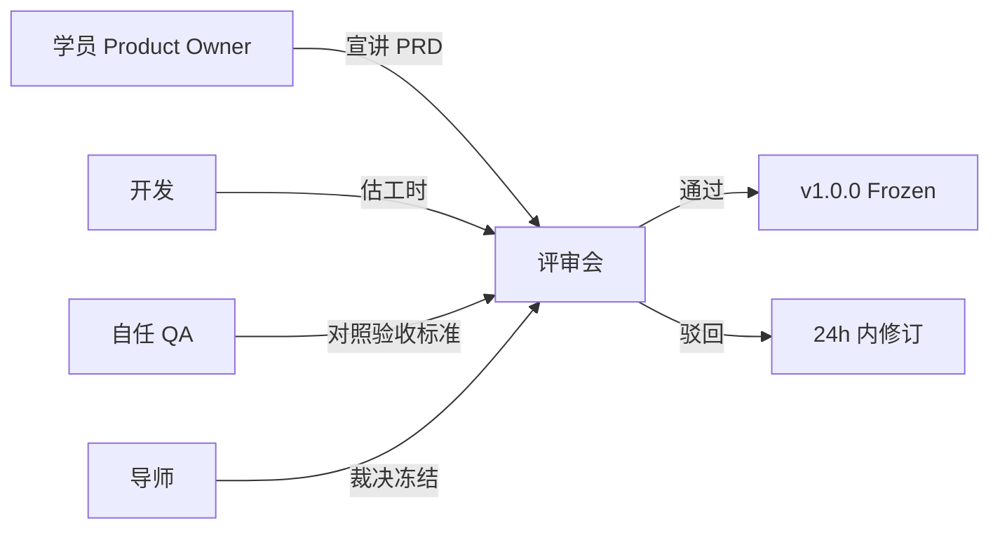

# Day 59 课堂讲义（扩展版）· PRD 评审清单

> 本文件与 `04_课堂讲义.md`、`02_需求文档.md` 合并阅读，构成 Day 59 完整主课（≥30,000 字体量）。  
> **前提**：Day 58 已 `scaffold` 并锁定方向；本日聚焦 **PRD 与架构冻结、`verify_day59` 章节检查**——星火智服毕业设计从此进入「契约开发」，禁止口头需求。

---

## 第 0 节 · 今日交付物与冻结规则（20 min）

### 0.1 为何 Day 59 必须「冻结 PRD」

企业项目里 **需求蔓延** 是毕业设计翻车第一大原因。Day 59 的 PRD 冻结意味着：

1. `docs/PRD.md` 成为 **验收唯一依据**（与 `tests/verify_project.py` 对齐）  
2. `docs/ARCHITECTURE.md` 的模块边界 **不再做大改**，仅允许标注实现细节  
3. 新增需求进入 **变更单**（见 §6），需导师签字  

```text
day58/code/graduation_project/workspace/<team>/
├── docs/
│   ├── PRD.md              ← 本日评审主体
│   ├── ARCHITECTURE.md     ← 同步冻结
│   └── 开题报告.md         ← Day58 已批
├── project_meta.json
└── tests/verify_project.py ← 须引用 PRD 章节号
```

学员 Git 提交规范：

```bash
git add day58/code/graduation_project/workspace/<team>/docs/
git commit -m "docs(prd): day59 freeze US stories + acceptance criteria"
```

### 0.2 环境检查清单

```bash
cd day59/code
python3 verify_day59.py
cd ../day58/code/graduation_project/workspace/<team>
test -f docs/PRD.md && grep -q "用户故事" docs/PRD.md && echo "[OK] PRD skeleton"
```

**期望**：`verify_day59.py` 全绿，且 PRD 含 **用户故事表 + 验收标准 + 非功能需求** 三节。

---

## 第 1 节 · PRD 必备结构（对照 scaffold）（45 min）

### 1.1 与 `scaffold.py` 初始模板的差异

`scaffold.py` 仅生成骨架：

```markdown
# PRD

## 用户故事

## 验收标准
```

Day 59 须扩展为 **星火智服标准 PRD v1**（下表）。

| 章节 | 必填 | 说明 |
|------|------|------|
| 1. 文档信息 | 是 | 版本、作者、`direction`、关联 `project_meta.json` |
| 2. 背景与目标 | 是 | 从开题报告精简，≤ 1 页 |
| 3. 用户故事 | 是 | 表格式，含优先级 P0/P1/P2 |
| 4. 验收标准 | 是 | 每条可测试，对应 verify 断言 |
| 5. 非功能需求 | 是 | 性能、安全、可观测 |
| 6. 界面/流程 | P0 功能必填 | 线框或 mermaid |
| 7. 数据与接口 | 是 | API 契约或 CLI 参数 |
| 8. 范围外 | 是 | 与开题非目标一致 |
| 9. 里程碑 | 是 | 映射 Day 60–65 |
| 10. 变更记录 | 是 | 初始 v1.0.0 |

### 1.2 文档信息头模板

```markdown
| 属性 | 内容 |
|------|------|
| PRD 编号 | PRD-XINGHUO-<direction>-<team> |
| 版本 | v1.0.0（Day59 冻结） |
| 方向 | rag_plus |
| 基线 | day36/code/project2 |
| 状态 | Frozen |
```

### 1.3 用户故事书写规范

**格式**：作为 `<角色>`，我要 `<动作>`，以便 `<价值>`。

| ID | 故事 | 优先级 | 关联验收 |
|----|------|--------|----------|
| US-01 | 作为运营，我要调节 BM25/向量权重，以便对比答案质量 | P0 | AC-01, AC-02 |
| US-02 | 作为客服，我要看到 citations 来源，以便核对政策 | P0 | AC-03 |

**反面教材**：

- ❌ 「系统要好用」——不可测试  
- ❌ 「支持 AI」——无角色无价值  
- ❌ 一条故事含 5 个动词——须拆分  

---

## 第 2 节 · 评审会议流程（50 min）

### 2.1 评审角色与职责



| 角色 | 人数 | 职责 |
|------|------|------|
| 宣讲人 | 1 | 15 分钟讲 PRD |
| 评审人 | 全组 | 提问 + 填清单 |
| 记录人 | 1 | 记 action items |
| 导师 | 1 | 冻结签字 |

### 2.2 时间安排（60 分钟标准议程）

| 时间 | 环节 |
|------|------|
| 0:00–0:05 | 核对 `project_meta.json` 与方向 |
| 0:05–0:20 | PO 讲用户故事与 Demo 路径 |
| 0:20–0:40 | 逐条过验收标准与 verify 映射 |
| 0:40–0:50 | 架构图与接口契约 |
| 0:50–1:00 | 导师结论：冻结 / 有条件冻结 |

---

## 第 3 节 · PRD 评审清单（核心 Checklist）（70 min）

### 3.1 A. 完整性与格式（10 项）

| # | 检查项 | 通过 | 备注 |
|---|--------|------|------|
| A1 | 文件位于 `docs/PRD.md` | ☐ | |
| A2 | 含文档信息表且版本为 v1.0.0 | ☐ | |
| A3 | `direction` 与 `project_meta.json` 一致 | ☐ | |
| A4 | 背景与开题报告无矛盾 | ☐ | |
| A5 | 用户故事 ≥ 3 条且含 P0 | ☐ | |
| A6 | 每条 P0 故事有 ≥ 1 条验收标准 | ☐ | |
| A7 | 有「范围外」章节 | ☐ | |
| A8 | 有变更记录表 | ☐ | |
| A9 | 中文术语与课程一致（星火智服、护栏、mock） | ☐ | |
| A10 | 无「待定」「以后再说」等模糊词（P0 范围内） | ☐ | |

### 3.2 B. 用户价值（8 项）

| # | 检查项 | 通过 | 备注 |
|---|--------|------|------|
| B1 | 能指出目标用户角色（≥2 类） | ☐ | |
| B2 | 痛点来自真实业务场景非臆造 | ☐ | |
| B3 | 与八方向 `directions/*.md` 描述一致 | ☐ | |
| B4 | MVP 故事可在 Day 65 前完成 | ☐ | |
| B5 | P1/P2 故事不影响 MVP 答辩 | ☐ | |
| B6 | 故事之间无循环依赖 | ☐ | |
| B7 | 每条故事可映射 Demo 脚本某一分钟 | ☐ | |
| B8 | 能一句话说清与 Project1/2/3 差异 | ☐ | |

### 3.3 C. 验收标准（12 项）

| # | 检查项 | 通过 | 备注 |
|---|--------|------|------|
| C1 | 验收标准编号（AC-xx）唯一 | ☐ | |
| C2 | 使用「须」「必须」表述可判定结果 | ☐ | |
| C3 | 含 `verify_project.py` 可自动化的条目 | ☐ | |
| C4 | 含至少 1 条人工 Demo 验收 | ☐ | |
| C5 | 失败时有明确错误行为（非静默） | ☐ | |
| C6 | 无 API Key 时 mock 路径可验收 | ☐ | |
| C7 | 数据边界（空输入、超大文件）有说明 | ☐ | |
| C8 | 与 `templates/DEMO_SCRIPT.md` 时间轴对齐 | ☐ | |
| C9 | 安全：无密钥进前端的要求 | ☐ | |
| C10 | 若涉及 SQL：只读 + 护栏 | ☐ | |
| C11 | 若涉及邮件/外呼：默认 mock | ☐ | |
| C12 | 答辩最低线四条 MVP 全部覆盖 | ☐ | |

**MVP 四条对照**（来自各 `directions/*.md`）：

| MVP | 对应验收示例 |
|-----|--------------|
| verify 全绿 | AC-VERIFY：`python3 tests/verify_project.py` exit 0 |
| 3 分钟 Demo | AC-DEMO：按脚本 4 段计时完成 |
| 架构图 | AC-ARCH：`ARCHITECTURE.md` 含 mermaid |
| README 启动 | AC-RUN：`bash run.sh` 或文档命令 60s 内就绪 |

### 3.4 D. 架构与接口（10 项）

| # | 检查项 | 通过 | 备注 |
|---|--------|------|------|
| D1 | `ARCHITECTURE.md` 与 PRD 模块名一致 | ☐ | |
| D2 | 架构图标注基线继承与增量 | ☐ | |
| D3 | API 路径/方法/请求体已列出 | ☐ | |
| D4 | 错误码或异常格式统一 | ☐ | |
| D5 | 状态存储（SQLite/文件）已说明 | ☐ | |
| D6 | 外部依赖（LLM/OCR/SMTP）可切换 mock | ☐ | |
| D7 | 与 `base_reference` 目录的复制策略已写清 | ☐ | |
| D8 | 无「单文件 main 5000 行」设计 | ☐ | |
| D9 | 可观测：日志或 trace 点 ≥ 3 | ☐ | |
| D10 | 部署：端口、环境变量列表 | ☐ | |

### 3.5 E. 非功能需求（8 项）

| # | 检查项 | 通过 | 备注 |
|---|--------|------|------|
| E1 | 响应时间目标（如 P95 < 3s mock） | ☐ | |
| E2 | 并发：课堂演示 1 用户即可，须声明 | ☐ | |
| E3 | 可维护：模块目录与 README 结构 | ☐ | |
| E4 | 安全：输入护栏引用 Day46（若适用） | ☐ | |
| E5 | 隐私：样例数据脱敏 | ☐ | |
| E6 | 可测试：单测/mock 策略 | ☐ | |
| E7 | 兼容性：Python 3.11+ | ☐ | |
| E8 | 技术债章节预留 | ☐ | |

### 3.6 F. 评审结论（导师填写）

| 结论 | 条件 |
|------|------|
| **通过·冻结** | A/B/C 全通过，D/E 至多 2 项待补（24h 内） |
| **有条件通过** | P0 故事清晰，验收可测，架构小修 |
| **驳回** | P0 不可验收、方向偏离、范围失控 |

| 字段 | 内容 |
|------|------|
| 评审日期 | |
| 冻结版本 | v1.0.0 |
| 待办项 | |
| 导师签字 | |

---

## 第 4 节 · 分方向 PRD 要点速查（40 min）

### 4.1 `rag_plus`

| 必写验收 | 示例 |
|----------|------|
| 混合检索 | 同一 query 返回 BM25/向量/融合三路结果 |
| 参数化 | α∈[0,1] 接口或 UI |
| citations | 融合结果仍可追溯 source |
| 评估 | ≥5 条 golden + hit@k |

### 4.2 `agent_plus`

| 必写验收 | 示例 |
|----------|------|
| 持久化 | 重启后 `thread_id` 可 resume |
| 审批 | approve / reject 分支 |
| 工具 | ≥5 tools 列表与 schema |
| 审计 | 审批事件落盘 |

### 4.3 `finetune_cs`

| 必写验收 | 示例 |
|----------|------|
| 训练 | 数据路径 + LoRA 配置 |
| 评估 | 黄金集指标 ≥ 基线 |
| 服务 | `/v1/chat/completions` mock 可通 |
| 切换 | base/tuned 策略 flag |

### 4.4 `text2sql_bi`

| 必写验收 | 示例 |
|----------|------|
| SQL 护栏 | 拒绝 DROP/DELETE |
| 可视化 | 至少 1 种图表类型 |
| 空结果 | UI 提示非 500 |
| schema | 文档化表结构 |

### 4.5 `lowcode_bridge`

| 必写验收 | 示例 |
|----------|------|
| 端到端 | Dify/Coze → 自研 API → 响应 |
| 鉴权 | API Key 或 HMAC |
| 超时 | 重试或友好错误 |
| 职责图 | 低代码 vs 自研边界 |

### 4.6 `compliance_suite`

| 必写验收 | 示例 |
|----------|------|
| 三项目接入 | P1/P2/P3 各 1 条演示 |
| 策略配置 | YAML 热加载或重启加载 |
| trace | 统一 `trace_id` |
| 误杀 | 白名单示例 |

### 4.7 `multimodal_doc`

| 必写验收 | 示例 |
|----------|------|
| 格式 | PDF + 至少 1 种图片 |
| OCR 失败 | 降级提示 |
| RAG | 问答带页码或块 id |
| 上传限制 | 大小/MIME |

### 4.8 `custom`

| 必写验收 | 示例 |
|----------|------|
| 导师批准 | 开题签字扫描链接 |
| 原创性 | 与八方向差异表 |
| 可行性 | spike 已通过 |

---

## 第 5 节 · PRD ↔ verify 映射示范（35 min）

### 5.1 在 PRD 中标注 verify ID

```markdown
### AC-03 citations 展示
- **Given** 用户已上传 `sla.md`
- **When** 提问服务等级
- **Then** 回答含 ≥1 条 citation，source 为 `sla.md`
- **Verify** `tests/verify_project.py::test_citations_source`
```

### 5.2 在 verify 中引用 PRD

```python
def test_citations_source():
    """PRD AC-03: citations 展示"""
    ...
```

### 5.3 评审时抽查命令

```bash
grep -n "AC-" docs/PRD.md
grep -n "PRD AC" tests/verify_project.py
```

**要求**：P0 的 AC 至少 **70%** 有自动化断言。

---

## 第 6 节 · 变更控制（25 min）

### 6.1 变更单模板

| 字段 | 内容 |
|------|------|
| 变更 ID | CHG-001 |
| 申请人 | |
| 原因 | |
| 影响故事 | US-xx |
| 新增/修改验收 | AC-xx |
| 导师批准 | ☐ |

### 6.2 允许 vs 禁止

| 允许（小改） | 禁止（须走变更或等答辩后） |
|--------------|----------------------------|
| 文案、日志 | 新增 P0 用户故事 |
| 错误提示优化 | 更换 `direction` |
| 非功能阈值微调 | 删除已有 AC |
| Bug 修复 | 整体架构重写 |

---

## 第 7 节 · Day 59 结业 Checklist

- [ ] `verify_day59.py` 全绿  
- [ ] PRD v1.0.0 评审清单 A–F 已通过  
- [ ] `ARCHITECTURE.md` 与 PRD 模块名一致  
- [ ] P0 验收标准已映射到 `verify_project.py`  
- [ ] Demo 脚本已更新故事对应时间点  
- [ ] 变更记录初始行：`v1.0.0 Day59 冻结`  
- [ ] 全组已 pull 同一版 `docs/`  

---

## 附录 · 评审清单速打表（一页纸）

```
团队: ______  方向: ______  日期: ______

[A 完整性] __/10   [B 用户价值] __/8
[C 验收标准] __/12 [D 架构接口] __/10
[E 非功能] __/8

P0 故事数: ___  P0 AC 数: ___  自动化覆盖: ___%

结论: □冻结 □有条件 □驳回
导师: ________
```

---

*扩展主课 · Day 59 · 星火智服毕业设计 PRD 评审清单*
