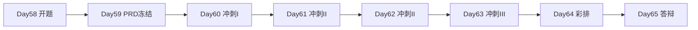
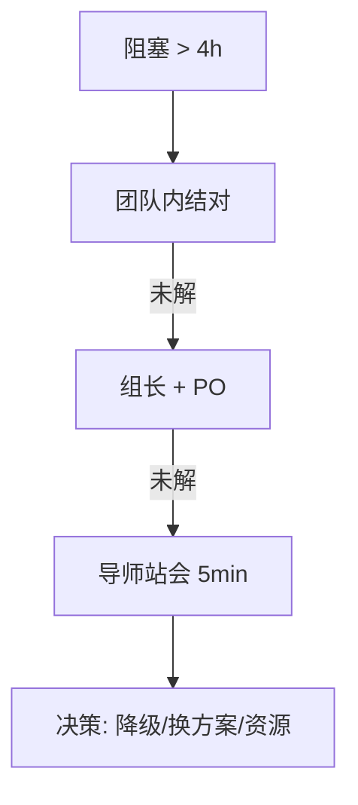

# Day 60 课堂讲义（扩展版）· 开发冲刺 Standup 模板

> 本文件与 `04_课堂讲义.md`、`02_需求文档.md` 合并阅读，构成 Day 60 完整主课（≥30,000 字体量）。  
> **前提**：Day 59 PRD v1.0.0 已冻结；本日聚焦 **开发冲刺 I、至少 1 个 API/CLI 可运行、每日 Standup 节奏**——星火智服毕业设计进入高强度编码周，Standup 是防止「一周过去只有 PPT」的唯一机制。

---

## 第 0 节 · 冲刺周节奏与目录约定（20 min）

### 0.1 Day 60–63 在毕业设计中的位置



| 天数 | 焦点 | 硬交付 |
|------|------|--------|
| 60 | 脚手架落地 + 首个可运行入口 | 1 API/CLI + verify 扩展 |
| 61 | 核心模块 | P0 故事 ≥50% |
| 62 | 联调 + 异常 | Demo 主路径通 |
| 63 | 技术债 + 抛光 | verify 全绿候选 |

### 0.2 源码树约定

```text
day58/code/graduation_project/workspace/<team>/
├── src/                    ← Day60 起每日提交
├── tests/verify_project.py ← 与 PRD AC 同步增长
├── docs/PRD.md             ← 冻结，变更走 CHG
├── run.sh                  ← Day60 晚前应有初版
└── README.md               ← 每日更新「今日进展」
```

学员 Git 提交规范：

```bash
git commit -m "feat(graduation): day60 standup - health API + verify AC-01"
```

### 0.3 Day 60 验收命令

```bash
cd day60/code
python3 verify_day60.py
cd ../day58/code/graduation_project/workspace/<team>
python3 tests/verify_project.py
```

---

## 第 1 节 · Standup 是什么、不是什么（30 min）

### 1.1 定义（星火智服冲刺版）

**每日 Standup** 是 ≤15 分钟的 **同步会议**，目的是暴露阻塞，而非汇报成绩。

| 是 | 不是 |
|----|------|
| 说阻塞、要求帮助 | 技术方案长篇讨论 |
| 对齐今日与 PRD AC | 重做 PRD 范围 |
| 更新看板状态 | 代码 Review 全会 |
| 计时发言 | 无议程闲聊 |

### 1.2 三个标准问题（可扩展为四个）

1. **昨天**我完成了什么？（对应 Git commit / AC）  
2. **今天**我要做什么？（可验收的一条）  
3. **阻塞**是什么？（人/环境/决策）  
4. **Demo 路径**是否仍畅通？（Day 60 起必问）

### 1.3 时间盒

```mermaid
gantt
    title 单日冲刺时间盒（建议）
    dateFormat HH:mm
    axisFormat %H:%M
    Standup           :09:00, 15m
    专注开发          :09:15, 3h
    午休              :12:15, 1h
    专注开发          :13:15, 3h
    verify/local demo :16:15, 45m
    日报提交          :17:00, 15m
```



---

## 第 2 节 · Standup 会议模板（核心）（50 min）

### 2.1 会前准备（各成员 5 分钟）

填写 **个人 Standup 卡**（复制到群公告或 Issue）：

```markdown
## Standup · <!-- 姓名 --> · Day <!-- 60 -->

### 昨日完成
- [ ] <!-- commit hash + 一句话 -->
- [ ] 对应 PRD: AC-<!-- xx -->

### 今日计划（仅 1–2 条）
1. <!-- 可验收产出 -->
2. <!-- 可选第二条 -->

### 阻塞
- <!-- 无 / 描述 + 需要谁 -->

### Demo 路径
- 状态: 🟢畅通 / 🟡风险 / 🔴断裂
- 说明: <!-- 如 API 未起 -->

### 工时预估
- 今日可用: <!-- 6h --> 
```

### 2.2 会议议程模板（主持人用）

| 分钟 | 环节 | 负责人 |
|------|------|--------|
| 0:00–0:02 | 开场：念 PRD 冻结版本 v1.0.0 | 主持人 |
| 0:02–0:12 | 每人 2 分钟（超时摇铃） | 全员 |
| 0:12–0:14 | 汇总阻塞指派 owner | 主持人 |
| 0:14–0:15 | 念今日团队目标（1 条） | PO |

**主持人轮换**：Day60 组长 → Day61 二号 → … 保证人人会主持。

### 2.3 团队 Standup 记录模板

```markdown
# 团队 Standup 日志 · <!-- team name -->

| 日期 | Day | 出席 | 记录人 |
|------|-----|------|--------|
| <!-- 2026- --> | 60 | <!-- 3/3 --> | <!-- --> |

## 团队昨日增量
<!-- 合并各人昨日完成，附 commit 范围 -->

## 团队今日目标（唯一）
> <!-- 例：打通 POST /api/chat 且 verify test_health 绿 -->

## 阻塞看板
| 阻塞 | Owner | 截止 | 状态 |
|------|-------|------|------|
| <!-- 无 GPU --> | <!-- @张三 --> | Day61 | open |

## Demo 路径检查
- [ ] `run.sh` 或等效命令可执行
- [ ] 主路径 API 返回 200
- [ ] mock 模式无需 Key

## 风险信号
- ☐ 有人连续 2 天「今日计划」相同
- ☐ verify 连续红
- ☐ PRD 变更单 >1 且未批

## 散会行动
1. <!-- -->
```

---

## 第 3 节 · 看板与度量（40 min）

### 3.1 极简看板列

```text
Backlog(PRD P0) → In Progress → Verify绿 → Done(Demo可演示)
```

| 卡片规则 | 说明 |
|----------|------|
| 一卡一 AC | 如 `AC-03 citations` |
| WIP 限制 | 每人 In Progress ≤ 2 |
| Done 定义 | verify 断言绿 + 已合并 main |

### 3.2 每日度量（写在 Standup 日志底部）

| 指标 | Day60 目标 | 说明 |
|------|------------|------|
| P0 AC 完成率 | ≥ 15% | 至少 1–2 条 |
| verify 断言数 | ≥ 3 | 较 Day59 增加 |
| 主路径 API | 1 个 | `verify_day60` 要求 |
| 阻塞关闭时长 | < 24h | 超时升级导师 |

### 3.3 燃尽图（手绘即可）

```
P0 AC 剩余
│
│  *
│    *
│      *  ← 期望
│        *
└────────── Day60-65
```

Standup 上若 **实际点高于期望线**，当晚须砍 P1 或申请变更。

---

## 第 4 节 · 分角色发言要点（35 min）

### 4.1 Product Owner（通常 1 人）

- 昨日：PRD 澄清、验收标准答复  
- 今日：准备明日 Demo 脚本分钟级对齐  
- 阻塞：故事验收含糊 → 立刻补 AC  

### 4.2 后端开发

- 昨日：`src/` 模块、路由、单测  
- 今日：**一个** endpoint 或 CLI 子命令到可运行  
- 阻塞：基线代码合并冲突 → 约定目录策略  

### 4.3 前端 / Demo

- 昨日：页面/ curl 脚本  
- 今日：主路径可点击或可复制命令  
- 阻塞：CORS、端口 → 当日必须解  

### 4.4 QA（全员轮流）

- 昨日：补充 `verify_project.py`  
- 今日：为今日开发 AC 写失败断言先红后绿  
- 阻塞：AC 不可测 → 会中要求 PO 改 PRD（走 CHG）  

---

## 第 5 节 · 阻塞升级与导师介入（25 min）

### 5.1 升级路径



### 5.2 常见阻塞 playbook

| 阻塞 | 当日解法 |
|------|----------|
| 基线代码不知如何抄 | 只复制 `src` 子集，README 写清单 |
| LLM 无 Key | `SPARKTECH_MOCK=1` |
| GPU 排队 | 改 CPU mock 或换方向增量 |
| 组员缺席 | WIP 重分，砍 P1 |
| verify 不知写啥 | 从 PRD AC 原句改 assert |

---

## 第 6 节 · Slack/飞书异步 Standup 模板（20 min）

无法同步开会时使用：

```markdown
【异步 Standup · Day60 · @all】

请按线程回复：
1️⃣ 昨日：
2️⃣ 今日：
3️⃣ 阻塞：
4️⃣ Demo：🟢/🟡/🔴

截止回复：今日 10:00
主持人 10:15 发「今日团队目标」
```

**规则**：未回复视为 🔴 风险，组长私信跟进。

---

## 第 7 节 · Day 60 专用 Standup 脚本（30 min）

### 7.1 首次冲刺 Standup 额外议题

| # | 议题 | 产出 |
|---|------|------|
| 1 | 确认每人已 pull 最新 `docs/PRD.md` | 版本号一致 |
| 2 | 确认 `src/` 从 `base_reference` 复制完成 | 文件列表 |
| 3 | 认领今日唯一团队目标 | 写入日志 |
| 4 | 指定 `run.sh` owner | 姓名 |
| 5 | 预约晚间 15min「主路径联调」 | 时间 |

### 7.2 示例发言（`rag_plus` 方向）

> **张三**：昨天把 Project2 的 `retrieval.py` 拷到 `src/` 并加了 `test_direction_meta` 断言绿，对应 AC-VERIFY。今天做 `POST /api/search/hybrid` 返回 BM25+向量 JSON，预计 4 小时。阻塞是没有样例 query 集，需要 PO 下午前给 5 条。Demo 🟡，health 可通但 search 未接。

> **李四（PO）**：昨天整理了 10 条 golden query 进 `tests/data/`。今天对 AC-01 权重参数写清文档并帮张三过验收。阻塞无。Demo 🟡。

### 7.3 散会今日目标示例

> **团队目标**：`curl localhost:8000/health` 与 `POST /api/search/hybrid?q=退款` 均 200，且 `verify_project.py` 新增 2 条断言通过。

---

## 第 8 节 · 反模式与教练话术（20 min）

| 反模式 | 教练话术 |
|--------|----------|
| Standup 变代码评审 | 「细节会后用 PR，现在只报阻塞」 |
| 连续三天计划相同 | 「这是 P0 风险，今晚导师 5 分钟」 |
| 只报「在做 RAG」 | 「请念 AC 编号和预计几点绿」 |
| 无人记阻塞 | 「阻塞 owner 是谁？不写等于无」 |
| Demo 路径从不更新 | 「每天必须 🟢🟡🔴 选一」 |

---

## 第 9 节 · Day 60 结业 Checklist

- [ ] 本日 Standup 日志已存档（Markdown 或 Issue）  
- [ ] 团队今日目标已达成或已记录未达成原因  
- [ ] 至少 1 个 API/CLI 可运行（`verify_day60`）  
- [ ] `verify_project.py` 较 Day59 有新增断言  
- [ ] 阻塞看板无超过 24h 的 open 项（或已升级）  
- [ ] README「今日进展」已更新  
- [ ] 明日 Standup 主持人已指定  

---

## 附录 A · Standup 计时器话术

```
「2 分钟到，请收尾阻塞项」
「最后一位，请 30 秒内说 Demo 路径」
「散会，今日目标念一遍：……」
```

## 附录 B · 与 verify_day60 的映射

| verify_day60 检查 | Standup 问法 |
|-------------------|--------------|
| 项目结构存在 | 昨日是否都 pull scaffold |
| 可运行入口 | Demo 路径是否 🟢 |
| commit 规范 | 昨日完成是否附 hash |

---

*扩展主课 · Day 60 · 星火智服毕业设计开发冲刺 Standup 模板*
