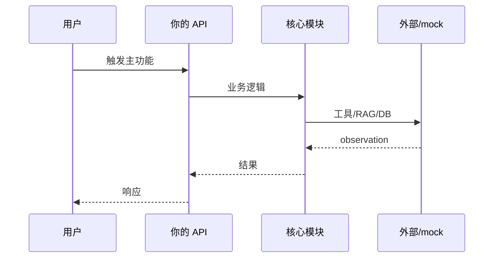

# Day 61 附录 · 核心链路联调剧本

> 与 `04_课堂讲义.md` 合并阅读。Day 61 目标：**主路径 mock 可端到端演示**。

---

## 第 1 节 · 主路径定义（30 min）

以所选 `direction` 为准，在 `workspace/<name>/` 画出 **一条用户旅程**：



| 方向 | 建议主路径 |
|------|------------|
| rag_plus | 上传文档 → 提问 → 带 citations 回答 |
| agent_plus | 创建任务 → 审批 → 执行写操作 |
| finetune_cs | 网关 `/api/chat` → mock vLLM 客服口吻 |
| text2sql_bi | 自然语言 → SQL → 表格结果 |

---

## 第 2 节 · 联调检查清单

- [ ] `src/` 至少一个入口（`main.py` 或 FastAPI `app`）
- [ ] 环境变量与 Day12/46 一致（`SPARKTECH_MOCK=1`）
- [ ] 错误时返回 JSON 而非 500 裸栈
- [ ] 日志打印 `request_id` 便于答辩排错

---

## 第 3 节 · 今日 commit 规范

```bash
git commit -m "feat(graduation): day61 wire main user journey"
```

---

*附录 · Day 61*
