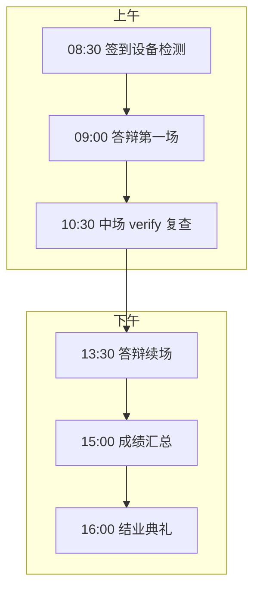
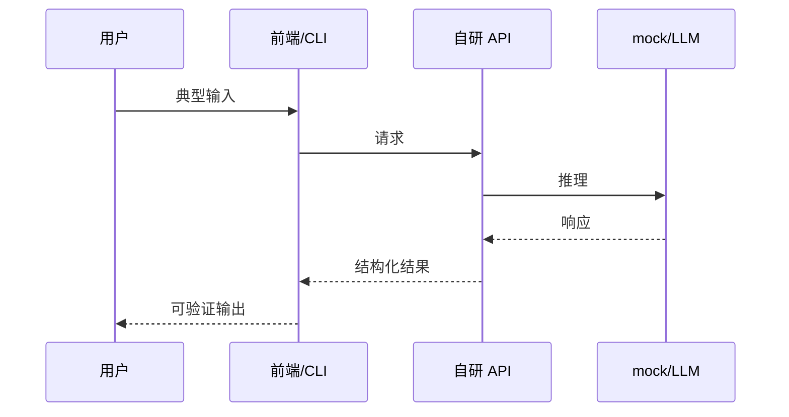
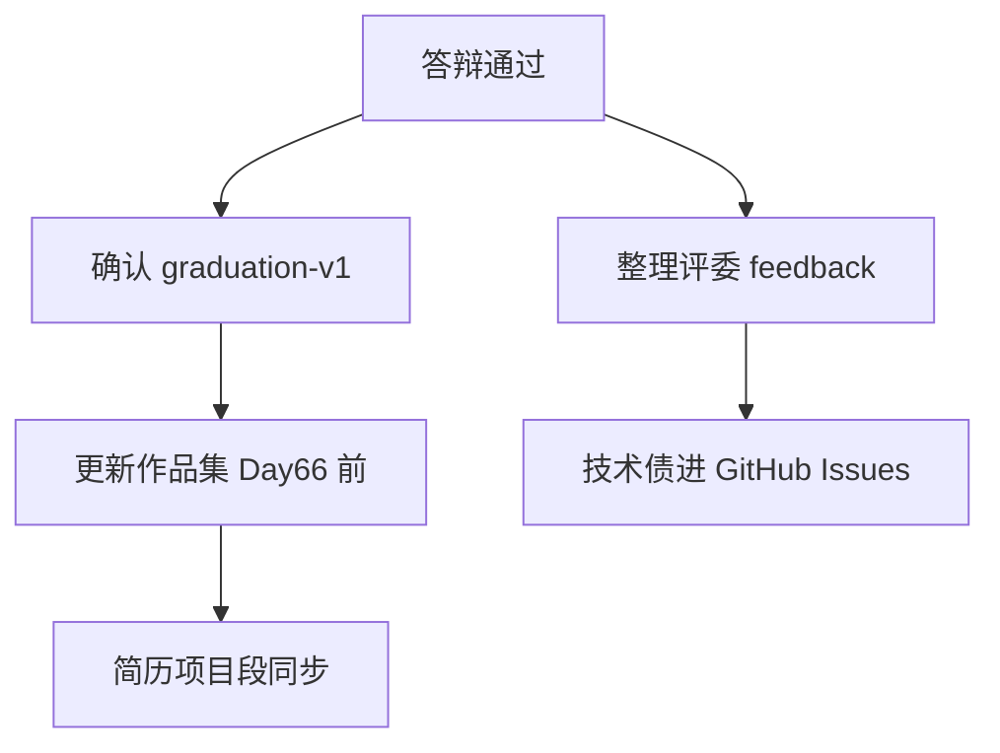

# Day 65 课堂讲义（扩展版）· 毕业答辩完整指南

> 本文件与 `04_课堂讲义.md`、`day64/09_附录_答辩评分标准与评委30题.md`、`10_附录_结业证书与作品集规范.md` 合并阅读，构成 Day 65 完整主课（≥30,000 字体量）。  
> **前提**：Day 64 彩排反馈已关闭；本日 **正式毕业答辩 + 提交 Git tag `graduation-v1`**——星火智服 70 天训练营的里程碑终点。

---

## 第 0 节 · 答辩日时间线与交付物（25 min）

### 0.1 当日目标

| 序号 | 交付物 | 验收 |
|------|--------|------|
| 1 | 10 分钟现场答辩 | 评委 Rubric |
| 2 | `verify_project.py` 现场全绿 | 或备录屏+当场解释 |
| 3 | Git tag `graduation-v1` | `verify_day65.py` |
| 4 | 作品集条目更新 | 见 `10_附录` |
| 5 | 结业材料登记 | 姓名/方向/仓库链接 |

### 0.2 时间线（示例）



### 0.3 目录与 tag 约定

```text
day58/code/graduation_project/workspace/<team>/   ← 答辩演示路径
day65/code/verify_day65.py                        ← 检查 tag 与文档
```

```bash
git tag -a graduation-v1 -m "SparkTech graduation: <team> <direction>"
git push origin graduation-v1
```

**tag 应指向**：包含 `project_meta.json`、`docs/PRD.md`、`tests/verify_project.py` 的提交。

---

## 第 1 节 · 答辩前 24 小时 Checklist（40 min）

### 1.1 环境与仓库

| # | 项 | 命令/标准 |
|---|-----|-----------|
| 1 | 干净工作区 | `git status` 无未提交关键文件 |
| 2 | verify 绿 | `python3 tests/verify_project.py` |
| 3 | day65 验收 | `cd day65/code && python3 verify_day65.py` |
| 4 | mock 默认 | `export SPARKTECH_MOCK=1` 文档写明 |
| 5 | 依赖锁定 | `requirements.txt` 或等效 |
| 6 | 无密钥 | `git log -p` 无 sk- |
| 7 | tag 预演 | 本地打 test tag 再删 |

### 1.2 Demo 资产

| # | 项 | 说明 |
|---|-----|------|
| 1 | PPT 10 页定稿 | PDF 备份 U 盘 |
| 2 | 录屏 mp4 | 主路径 3 min，无配音也可 |
| 3 | 样例数据 | `tests/data/` 脱敏 |
| 4 | 浏览器缓存 | 清缓存或无痕模式 |
| 5 | 端口冲突 | 仅 8000/8080 或文档端口 |

### 1.3 个人准备

- 30 秒 elevator pitch 背诵 **≤35 秒**  
- 评委 30 题自测 ≥60%（见 Day64 附录）  
- 正装或商务休闲（星火智服统一要求）  
- 双人组：**主讲 Demo + 副讲架构/Q&A** 角色分工  

---

## 第 2 节 · 10 分钟答辩脚本（逐分钟）（50 min）

### 2.1 分钟级讲稿模板

| 时间 | 动作 | 话术要点 |
|------|------|----------|
| 0:00–0:30 | 封面 | 「各位老师好，我们是 ___ 组，方向 `___`，题目 ___」 |
| 0:30–1:30 | 痛点 | 星火智服 **角色** + **场景** + 不解决的成本 |
| 1:30–3:30 | 架构 | 指 mermaid：User→API→Core→Store；强调 **基线继承** |
| 3:30–7:30 | Demo | 按 `DEMO_SCRIPT.md`；**勿回溯修 bug** |
| 7:30–8:30 | verify/指标 | 现场或截图：`verify_project.py` 输出 |
| 8:30–9:30 | 技术债 | mock、并发、监控；一周计划 |
| 9:30–10:00 | 致谢 | 「请老师提问」 |

### 2.2 Demo 主路径设计原则



**原则**：

1. **一条主路径** 必须成功，禁赌边缘功能  
2. **一个亮点** 30 秒内可见（如 α 滑条、resume 按钮）  
3. **一个诚实失败** 可选（护栏拦截），体现健壮性  

### 2.3 分方向 Demo 高潮建议

| 方向 | 建议高潮时刻 | 避免 |
|------|--------------|------|
| `rag_plus` | 调 α 答案变化 | 现场重建索引 |
| `agent_plus` | 审批后 resume | 真发垃圾邮件 |
| `finetune_cs` | 同 prompt 对比 | 现场训练 |
| `text2sql_bi` | 出图 | 复杂 join 超时 |
| `lowcode_bridge` | Dify 触发 API | 外网登录翻车 |
| `compliance_suite` | 敏感词拦截 | 三项目全演示超时 |
| `multimodal_doc` | 扫描 PDF 问答 | 大文件上传 |
| `custom` | 创新点一步 | 未验证功能 |

---

## 第 3 节 · 现场操作手册（45 min）

### 3.1 上台前 5 分钟

```bash
cd day58/code/graduation_project/workspace/<team>
export SPARKTECH_MOCK=1
python3 tests/verify_project.py    # 后台先跑一遍
bash run.sh &                    # 若有，确认 PID
curl -s localhost:8000/health | head
```

### 3.2 投影分辨率

- 浏览器 **125%** 字号；终端 **18pt**  
- 深色 IDE 改浅色主题  
- 关闭通知、微信、自动更新  

### 3.3 现场 verify 策略

| 策略 | 何时用 |
|------|--------|
| A 现场跑 | 网络稳定、<30s |
| B 录屏 + 口述 | 依赖 GPU/外网 |
| C 晨跑截图 | 仅当 A/B 均不可 |

**评委质疑失败**：不辩解，说「根因 + 已绿时间点 + tag 可复现」。

### 3.4 Q&A 应答框架（STAR-技）

| 字母 | 含义 |
|------|------|
| S | 场景一句话 |
| T | 技术点直接答 |
| A | 你项目里怎么做 |
| R | 风险与改进 |

示例：「混合检索为何用 RRF？——短查询 BM25 召回专名词；我们用 RRF 融合，实验台 hit@3 从 0.6→0.75；生产还会加缓存。」

---

## 第 4 节 · 评分标准速查与自评（35 min）

### 4.1 权重（Day64 Rubric 摘要）

| 维度 | 权重 |
|------|------|
| 功能完成度 | 30% |
| 代码与架构 | 25% |
| 工程化 | 20% |
| 演示与表达 | 15% |
| 创新与业务 | 10% |

### 4.2 自评表（答辩前填写）

| 维度 | 自评 / 满分 | 证据 |
|------|-------------|------|
| 功能 | /30 | PRD P0 列表 |
| 代码 | /25 | ARCHITECTURE |
| 工程 | /20 | verify 输出 |
| 演示 | /15 | 彩排计时 |
| 创新 | /10 | 增量说明 |
| **合计** | /100 | |

自评 &lt;70 时：砍 Q&A 扩展，保 Demo 完整。

### 4.3 一票否决清单（务必避免）

- verify 红且无解释  
- 方向与 `project_meta.json` 不符  
- 答辩无法说明与基线关系  
- 泄露 API Key  
- Demo 完全偏离 PRD P0  

---

## 第 5 节 · Git tag 与 verify_day65（30 min）

### 5.1 打 tag 标准流程

```bash
cd /path/to/repo
git checkout main
git pull
cd day58/code/graduation_project/workspace/<team>
python3 tests/verify_project.py
cd ../../../../..
git add day58/code/graduation_project/workspace/<team>   # 若 workspace 未 gitignore
# 或仅 add docs/ 快照策略见项目组规定
git commit -m "chore(graduation): final deliverable <team>"
git tag -a graduation-v1 -m "team=<team> direction=<dir> date=Day65"
git push origin main --tags
```

### 5.2 `verify_day65.py` 期望

- 检测到 `graduation-v1` 或文档声明的 tag  
- README 含作品集链接占位  
- 无阻塞性 lint（若课程要求）  

### 5.3 tag 消息规范

```
graduation-v1
team: sparktech-alpha
direction: rag_plus
verify: pass@2026-xx-xx
contact: leader@email
```

---

## 第 6 节 · 答辩后流程（25 min）

### 6.1 成绩与反馈

| 时间 | 事项 |
|------|------|
| 答辩后 10 min | 评委填 Rubric |
| 当日傍晚 | 公布是否通过 |
| 3 日内 | 书面反馈 action items |

### 6.2 未通过补答

- D 级：一周补 verify + 15 min 补答  
- 仅演示不及格：可只重 Demo 不重 PPT  

### 6.3 通过后

- 更新作品集（`10_附录`）  
- 领取结业证书  
- Day66+ 就业冲刺课衔接  

---

## 第 7 节 · 常见翻车与急救（30 min）

| 现象 | 急救 |
|------|------|
| 端口占用 | 改 `.env` 备用端口，PPT 注明 |
| 依赖缺失 | `pip install -r requirements.txt` 话术备 U 盘 |
| 白屏 | 切换录屏；口述 API curl 成功 |
| 评委追问不会 | 「本课题未覆盖，技术债在第 9 页」 |
| 超时 | 跳过技术债页，直接 Q&A |
| 双人组抢话 | 主讲伸手势，副讲记题 |

---

## 第 8 节 · 心理与礼仪（15 min）

- 目光接触评委中间位，语速略慢于日常  
- 指屏幕用激光笔或鼠标，勿挡投影  
- 质疑时先点头「感谢老师指出」再答  
- 不贬损队友、不贬损基线课程项目  

---

## 第 9 节 · Day 65 终极 Checklist

- [ ] `graduation-v1` 已 push  
- [ ] `verify_day65.py` 全绿  
- [ ] 答辩 10 min 计时达标  
- [ ] 评委 Rubric 自评 ≥75  
- [ ] 作品集首页已链到 `workspace/<team>/`  
- [ ] 结业登记完成  
- [ ] 团队合影 / 仓库 README 致谢（可选）  

---

## 附录 A · 话术语录（可背诵）

**开场**：  
「我们基于 `day36/code/project2` 做了混合检索实验台，解决星火智服知识库运营无法量化检索策略的问题。」

**技术债**：  
「当前默认 `SPARKTECH_MOCK=1`；生产需接入公司网关、鉴权与 LangSmith 全链路 trace。」

**结束**：  
「以上是我们毕业设计的全部内容，感谢各位老师，请批评指正。」

## 附录 B · 关联文件索引

| 文件 | 用途 |
|------|------|
| `day58/09_附录_八方向选题决策树.md` | 方向背景 |
| `day59/09_附录_PRD评审清单.md` | PRD 依据 |
| `day60/09_附录_开发冲刺Standup模板.md` | 冲刺节奏复盘 |
| `day64/09_附录_答辩评分标准与评委30题.md` | 评分与题库 |
| `day65/10_附录_结业证书与作品集规范.md` | 结业与作品集 |
| `graduation_project/templates/DEMO_SCRIPT.md` | Demo 时间轴 |
| `graduation_project/scaffold.py` | 方向与基线元数据 |
| `graduation_project/directions/*.md` | 各方向 MVP 线 |

---

## 第 10 节 · 分方向最后 24 小时冲刺表（30 min）

| 方向 | 必做 | 可砍 |
|------|------|------|
| `rag_plus` | 固定 α 演示 + 1 条 golden | 多租户 UI |
| `agent_plus` | approve 主路径 + resume 说明 | 真实 SMTP |
| `finetune_cs` | 对比截图 + 指标数字 | 现场训练 |
| `text2sql_bi` | 1 张图 + 护栏拦截 | 复杂 schema |
| `lowcode_bridge` | 序列图 + 一次成功调用 | 多工作流 |
| `compliance_suite` | 2 项目拦截对比 | 三项目全演示 |
| `multimodal_doc` | 1 份 PDF 问答 | 缩略图 |
| `custom` | 导师签字页 + 创新点 | P1 故事 |

---

## 第 11 节 · 答辩室设备与账号清单（20 min）

| 项 | 检查 | 负责人 |
|----|------|--------|
| 笔记本电源 + HDMI | 提前 10 min 接投影 | 组长 |
| 手机热点 | 备用网络 | 全员 |
| GitHub 登录 | tag 可见 | 组长 |
| Dify/Coze 账号 | lowcode 方向 | 对应组员 |
| Mailhog/SMTP | agent 方向 mock | 后端 |
| 录屏 U 盘 | mp4 双份 | 副讲 |
| 纸质 Rubric 自评 | 入场交评委 | PO |

---

## 第 12 节 · 答辩后 48 小时行动（15 min）



1. **24h 内**：邮件感谢评委（班主任模板）  
2. **48h 内**：作品集 PR merge；简历贴链接  
3. **1 周内**：择一项技术债开 Issue，展示持续维护意愿  

---

## 附录 C · 紧急联系与升级

| 情况 | 联系人 | 动作 |
|------|--------|------|
| 设备故障 | 现场助教 | 换备用机/改录屏 |
| verify 环境差异 | 导师 | 允许备录屏+tag 复现 |
| 成绩异议 | 班主任 | 24h 书面申诉 |

---

## 附录 D · 一分钟自检口诀

**「方基验演债」**：方向代号 → 基线路径 → verify 绿 → 演示主路径 → 技术债诚实。上台前默念一遍，漏一项则回滚到对应附录补课。

**「三不」**：不现场改代码、不指责基线课程、不超出 PRD P0 承诺。

---

*扩展主课 · Day 65 · 星火智服毕业答辩完整指南*
