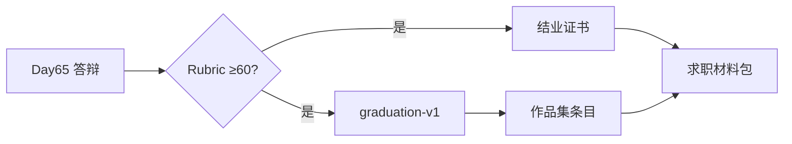

# Day 65 课堂讲义（扩展版）· 结业证书与作品集规范

> 本文件与 `09_附录_毕业答辩完整指南.md`、`day66/code/portfolio_template.md` 合并阅读。  
> **用途**：答辩通过后，统一 **结业证书领取标准** 与 **作品集/GitHub 首页** 呈现规范——让星火智服学员在求职时一眼可展示 70 天全链路能力。

---

## 第 0 节 · 结业与作品集关系（15 min）



| 产出 | 责任人 | 截止 |
|------|--------|------|
| 答辩通过 | 学员 + 评委 | Day 65 当日 |
| `graduation-v1` tag | 学员组长 | Day 65 18:00 |
| 作品集 PR | 学员 | Day 66 前 |
| 证书信息核对 | 班主任 | Day 65 现场 |

---

## 第 1 节 · 结业证书规范

### 1.1 颁发条件（须全部满足）

| # | 条件 | 验证方式 |
|---|------|----------|
| 1 | 出勤达纲（班主任记录） | 系统 |
| 2 | Project1/2/3 历史 verify 已通过 | 档案 |
| 3 | 毕业设计答辩 Rubric **≥60 分** | 评委表 |
| 4 | `graduation-v1` tag 已推送 | `verify_day65.py` |
| 5 | 无学术不端（抄袭、代做） | 导师 |

### 1.2 证书信息字段

| 字段 | 规范 | 示例 |
|------|------|------|
| 姓名 | 与身份证一致 | 张三 |
| 学号 | 训练营编号 | XH-2026-0128 |
| 课程 | 固定文案 | 星火智服 · 70 天 LLM 工程实战训练营 |
| 方向 | `project_meta.direction` | rag_plus |
| 课题名 | 开题报告题目 | 混合检索实验台 |
| 结业日期 | Day 65 日期 | 2026 年 x 月 x 日 |
| 证书编号 | 唯一 | XH-CERT-2026-00128 |

### 1.3 等级标注（可选印章）

| Rubric 分数 | 证书标注 |
|-------------|----------|
| 90–100 | 优秀 |
| 75–89 | 良好 |
| 60–74 | 合格 |

&lt;60 不颁发，补答通过后发 **合格** 档，不标注优秀。

### 1.4 领取流程

1. 答辩结束 → 评委签字表交班主任  
2. 现场扫码核对姓名、方向、仓库链接  
3. 电子证书 24h 内邮件；纸质证书邮寄（若适用）  
4. 信息错误 7 日内可申请勘误一次  

---

## 第 2 节 · 作品集总规范

### 2.1 首页结构（基于 `portfolio_template.md`）

```markdown
# <!-- 姓名 --> · 星火智服 LLM 工程作品集

> 70 天训练营结业 · 方向：`<!-- direction -->` · tag `graduation-v1`

## 核心项目
| 阶段 | 项目 | 链接 | 一句话 |
|------|------|------|--------|
| Phase1 | CLI 助手 | day14/project1 | … |
| Phase2 | RAG Web | day36/code/project2 | … |
| Phase3 | 多 Agent | day48/code/project3 | … |
| 毕业设计 | <!-- 课题名 --> | workspace/<team> | … |

## 一键验收
\`\`\`bash
cd day58/code/graduation_project/workspace/<team>
python3 tests/verify_project.py
\`\`\`

## 联系方式
- Email / GitHub / 博客
```

### 2.2 每个项目卡片必填五要素

| 要素 | 说明 |
|------|------|
| 业务场景 | 星火智服哪类用户 |
| 你的职责 | 尤其团队项目 |
| 技术栈 | 3–6 个关键词 |
| 可运行命令 | copy-paste 即可 |
| 截图或录屏 | GIF/mp4 链接 |

### 2.3 毕业设计条目增强

相对 Project1/2/3，毕业设计卡片 **额外必填**：

- `project_meta.json` 截图或代码块  
- PRD 用户故事表摘录（≤5 行）  
- 架构 mermaid 图  
- Rubric 自评分数（可选）  
- **技术债** 三条（体现诚实）  

### 2.4 仓库卫生

| 规则 | 要求 |
|------|------|
| README | 根目录 + 毕业设计目录各一份 |
| 密钥 | 0 泄露；用 `.env.example` |
| 大文件 | 模型权重不进 Git；用链接说明 |
| LICENSE | 课程默认 MIT 或组织规定 |
| 语言 | 中文为主，关键命令英文 |

---

## 第 3 节 · GitHub / 博客呈现

### 3.1 Profile Pin 建议（4 repos）

1. `graduation_project` 或单体仓库  
2. `project2` RAG  
3. `project3` Agent  
4. 微调/部署专题（Day57）或 compliance  

### 3.2 README Badge（可选）

```markdown


```

### 3.3 演示媒体

| 类型 | 规格 |
|------|------|
| 录屏 | mp4 ≤50MB，1080p |
| 截图 | png，打码敏感信息 |
| 架构图 | 导出 SVG 或 mermaid 源文件同库 |

---

## 第 4 节 · 求职材料对齐

### 4.1 简历一条（毕业设计）

> **星火智服毕业设计 · 混合检索实验台**（`rag_plus`）  
> 基于 Project2 实现 BM25+向量 RRF 融合与运营实验台；黄金集 hit@3 提升 xx%；Python/FastAPI/Chroma；`verify` 自动化验收。

### 4.2 与证书一致性

简历课题名、证书课题名、`project_meta.name` **须一致**；方向代号可括号注明。

### 4.3 面试 30 秒版

作品集首页第一段 = 面试自我介绍项目段落的缩写。

---

## 第 5 节 · 提交与验收 Checklist

- [ ] Rubric ≥60，证书信息已登记  
- [ ] `graduation-v1` 在远程仓库可访问  
- [ ] 作品集首页含四阶段项目链接  
- [ ] 毕业设计卡片含五要素 + 增强四项  
- [ ] 录屏/截图已上传 Releases 或图床  
- [ ] `.env.example` 齐全，无密钥  
- [ ] `day66/code/portfolio_template.md` 已 fork 并个性化  

---

## 附录 · 信息登记表示例

| 姓名 | 学号 | direction | 课题 | 仓库 URL | tag |
|------|------|-----------|------|----------|-----|
| | | | | | graduation-v1 |

---

*扩展主课 · Day 65 · 星火智服结业证书与作品集规范 · 与 `day66/code/portfolio_template.md` 同步*
