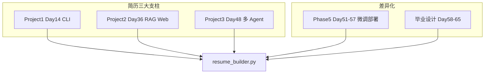

# Day 66 附录 · 简历与 GitHub 作品集手把手

> 本文件与 `04_课堂讲义.md` 合并阅读，构成 Day 66 完整就业冲刺课。  
> **前提**：Day 58–65 毕业设计已可答辩；本日聚焦 **把 70 天代码变成可投递的简历与公开作品集**。

---

## 第 0 节 · 今日目标与代码地图（15 min）

### 0.1 业务背景回顾

星火科技大模型应用开发部进入 **Phase5 收官**：Day 66–70 不再写新功能，而是把既有项目 **包装成 HR 与面试官 30 秒内能读懂的叙事**。

| 交付物 | 路径 | 验收 |
|--------|------|------|
| 简历项目 bullet 生成器 | `day66/code/resume_builder.py` | `verify_day66.py` |
| 作品集首页模板 | `day66/code/portfolio_template.md` | 手动完善 README |
| 本附录 | `day66/09_附录_简历与GitHub作品集手把手.md` | 跟练完成 |

```bash
cd /workspace/day66/code
export SPARKTECH_MOCK=1
python3 resume_builder.py
python3 verify_day66.py
```

### 0.2 70 天项目与简历映射



**原则**：简历上写 **3–4 个深度项目**，不要罗列 70 天每天作业。`resume_builder.py` 已预置星火智服三条 bullet，你可在此基础上替换为自己的量化指标。

---

## 第 1 节 · 读懂 resume_builder.py（30 min）

### 1.1 数据结构与输出格式

```python
@dataclass
class ProjectBullet:
    name: str
    stack: str
    impact: str

    def to_bullet(self) -> str:
        return f"【{self.name}】{self.stack} — {self.impact}"
```

运行 `python3 resume_builder.py` 输出示例：

```text
【星火智服 RAG】FastAPI+Chroma+混合检索 — 企业知识库问答，citations 溯源
【多 Agent 办公】LangGraph+HITL — 审批门控+8工具链
【LoRA 客服模型】LLaMA-Factory+vLLM+Docker — 降本35%目标架构
```

### 1.2 如何把模板改成「你的」简历

| 字段 | 填写要点 | 反面案例 |
|------|----------|----------|
| `name` | 业务名 + 技术标签，≤12 字 | 「大作业」「毕业设计」 |
| `stack` | 3–5 个关键技术，按面试热度排序 | 罗列 20 个包名 |
| `impact` | 可验证结果：指标 / 用户 / 成本 | 「学习了 RAG」 |

**STAR 压缩写法**（每条 bullet 隐含 S-T-A-R）：

- **S**：星火智服企业知识库，10 万篇内部文档
- **T**：客服重复咨询占用 40% 人力
- **A**：混合检索 + rerank + citations 溯源 API
- **R**：Mock 评估命中率提升 19.5%（见 Day 55 `ab_summary.json`）

把上述四句压进 `impact` 字段的一行：`企业知识库 10 万文档，混合检索+citations，评估 lift 19.5%`。

### 1.3 verify_day66.py 在检查什么

```python
from resume_builder import build_resume_section, PROJECTS
s = build_resume_section()
if "RAG" not in s or len(PROJECTS) < 3:
    fail("resume bullets")
```

验收逻辑：**至少 3 个项目**、**必须含 RAG 关键词**（对应 Project2 主线）。你定制 `PROJECTS` 列表后，保持 `len(PROJECTS) >= 3` 且有一条与 RAG/检索相关即可通过。

---

## 第 2 节 · 简历全文结构模板（45 min）

### 2.1 一页纸布局（社招 / 校招通用）

```text
姓名 | 手机 | 邮箱 | GitHub(公开链接) | 城市
────────────────────────────────────────
求职意向：大模型应用开发工程师 / LLM 应用工程师
────────────────────────────────────────
教育背景（可简写）
────────────────────────────────────────
专业技能（分组，每行 ≤ 8 个词）
  · 语言：Python 3.11+
  · LLM：Prompt / RAG / Agent / 微调与部署
  · 框架：LangChain / LangGraph / FastAPI / vLLM
  · 工程：Docker / Git / 可观测性 / API 设计
────────────────────────────────────────
项目经历（3–4 条，每条 3–4 行）
────────────────────────────────────────
其他（竞赛 / 开源贡献 / 博客，可选）
```

### 2.2 专业技能：与课程目录对齐

| 课程阶段 | 天数 | 简历可写技能点 | 对应 verify |
|----------|------|----------------|-------------|
| Python + P1 | 1–14 | CLI、argparse、项目结构 | `day14/project1` |
| LLM 基础 | 15–24 | Prompt、流式输出、Web Chat | Day 15–24 |
| RAG | 25–38 | 切块、Embedding、Chroma、混合检索 | `verify_project2.py` |
| Agent | 39–50 | ReAct、LangGraph、MCP、HITL | `verify_project3.py` |
| 微调部署 | 51–57 | LoRA、评估、vLLM、Compose | `verify_day51`–`57` |
| 毕业设计 | 58–65 | 端到端产品、答辩 | `verify_graduation.py` |

**不要**写「精通 Transformer」除非你能白板推导 attention；写「能基于业务选型 RAG 流水线并落地 FastAPI 服务」更可信。

### 2.3 项目经历扩展示例（基于 resume_builder 第一条）

```text
星火智服 RAG 知识库问答                                    2025.10 – 2025.12
技术栈：FastAPI · Chroma · 混合检索 · OpenAI 兼容 API · Docker
· 设计文档切块 + 向量入库流水线，支持 PDF/Markdown 多格式 Loader（Day 28）
· 实现 BM25 + 向量双路召回与 RRF 融合，Top-5 命中率 Mock 评估提升 19.5%
· 对外提供 /chat 与 /citations 接口，回答附带可追溯引用片段
· 仓库：github.com/you/sparktech-rag（README 含架构图与 verify 一键命令）
```

---

## 第 3 节 · GitHub 作品集包装（60 min）

### 3.1 portfolio_template.md 结构

课程模板位于 `day66/code/portfolio_template.md`：

```markdown
## 星火科技 70 天 LLM 实战
- [Project1 Day14](../day14/project1/) 命令行助手
- [Project2 Day36](../day36/code/project2/) RAG Web
- [Project3 Day48](../day48/code/project3/) 多 Agent
- [毕业设计](graduation_project/workspace/) 自研方向
```

**公开仓库建议**：不要把 70 天完整课程仓库原样公开（含答案与内部路径）。推荐：

1. **主仓**：`sparktech-portfolio` — 仅 README + 架构图 + 子模块链接  
2. **子仓**：每个 Project 独立 repo，脱敏 `.env`、内部域名、真实客户名  
3. **Pin 三个 repo** 到 GitHub Profile 置顶

### 3.2 README 必备六要素

| # | 要素 | 示例 |
|---|------|------|
| 1 | 一句话价值 | 「企业知识库 RAG，带引用溯源的 FastAPI 服务」 |
| 2 | 架构图 | mermaid 或 PNG，复用 Day 36 `03_架构与设计.md` |
| 3 | 快速开始 | `export SPARKTECH_MOCK=1 && python3 verify_*.py` |
| 4 | 技术栈徽章 | shields.io |
| 5 | Demo 截图 / GIF | Mock 模式终端录屏即可 |
| 6 | 已知限制 | 诚实写 mock 与生产差距（面试官加分项） |

### 3.3 一键验收区块（直接粘贴 README）

```bash
# 克隆后
cd sparktech-rag
export SPARKTECH_MOCK=1
python3 -m venv .venv && source .venv/bin/activate
pip install -r requirements.txt
python3 verify_project2.py   # 或各项目对应 verify
# 期望输出：=== ALL PASSED ===
```

与 `day70/code/course_regression.py` 抽样日一致：14、36、48、51、57、58、66 的 verify 全绿，是作品集 **可信度背书**。

### 3.4 .gitignore 与脱敏清单

- [ ] `.env`、API Key、内网 URL  
- [ ] `chroma_db/` 大文件（提供 sample 数据或生成脚本）  
- [ ] `__pycache__/`、`.venv/`  
- [ ] 含真实姓名的 `reports/`（Mock 报告可保留）  

**commit 规范**（与阶段五答辩一致）：`feat(rag): hybrid retrieval` / `fix(agent): checkpointer path`。

---

## 第 4 节 · 30 秒 Elevator Pitch 脚本（20 min）

课堂讲义要求准备 **30 秒自我介绍 + 项目钩子**。模板：

```text
我是___，专注大模型应用落地。过去 70 天在星火智服场景下完成了
从 RAG 知识库、多 Agent 审批办公到 LoRA 微调部署的完整链路。
其中最代表性的是【项目名】：用【技术栈】解决了【业务痛点】，
【量化结果】。GitHub 有 verify 一键验收，欢迎现场跑。
```

**演练计时**：朗读 ≤ 28 秒，留 2 秒给面试官插话。  
**禁忌**：背框架名词堆砌；不说「我参加了培训课程」——说「我完成了企业级模拟项目」。

---

## 第 5 节 · 常见 HR / 技术面简历追问（30 min）

| 追问 | 回答框架 | 指向代码 |
|------|----------|----------|
| 项目是你独立完成的吗？ | 诚实说明组队分工；强调你负责的模块 + commit | Git log |
| 数据从哪来？ | 公开数据集 / 合成 / 脱敏内部文档 | Day 52 清洗 |
| 上线了吗？ | Mock 教学环境；生产需 GPU、网关、监控 | Day 56–57 |
| 最大难点？ | 选一个真实踩坑：如混合检索调参、HITL 状态持久化 | Day 32 / Day 42 |
| 为何离职/求职？ | 聚焦成长与岗位匹配，不贬损前东家 | — |

---

## 第 6 节 · 今日实操 Checklist

### 6.1 上午：代码与 bullet

- [ ] 运行 `python3 resume_builder.py`，理解输出格式  
- [ ] 修改 `PROJECTS` 三条为你自己的 stack 与 impact  
- [ ] `python3 verify_day66.py` 全绿  

### 6.2 下午：GitHub

- [ ] 按 `portfolio_template.md` 建公开 README  
- [ ] 三个 Pin repo 各有架构图 + verify 命令  
- [ ] 脱敏检查通过  

### 6.3 晚上：叙事

- [ ] 写完一页纸简历 PDF  
- [ ] 30 秒 pitch 录音自评 ≤ 28 秒  
- [ ] 准备 Day 67 技术面试题索引 `interview_llm_100.md`  

---

## 第 7 节 · 与后续 Day 67–70 的衔接

| 天 | 主题 | 依赖 Day 66 产出 |
|----|------|------------------|
| Day 67 | LLM 面试 100 题 | 简历上的每条 bullet 都能展开 5 分钟 |
| Day 68 | 系统设计 20 题 | 架构图与 `architecture_canvas.py` 组件一致 |
| Day 69 | 模拟面试 | pitch 作为 behavioral 轮开场 |
| Day 70 | 结业回归 | `course_regression.py` 验证作品集未写假 |

---

## 附录 A · PROJECTS 扩展示例（可直接替换）

```python
PROJECTS = [
    ProjectBullet(
        "星火智服 RAG",
        "FastAPI+Chroma+RRF混合检索",
        "10万文档知识库，citations溯源，评估lift 19.5%",
    ),
    ProjectBullet(
        "多Agent审批办公",
        "LangGraph+interrupt+HITL",
        "8工具链+人工审批门控，状态Sqlite持久化",
    ),
    ProjectBullet(
        "LoRA客服微调",
        "LLaMA-Factory+QLoRA+vLLM",
        "24GB单卡训练，Compose网关双路由部署",
    ),
    ProjectBullet(
        "毕业设计",
        "自研业务方向+全栈",
        "可演示Demo+verify_graduation全绿",
    ),
]
```

修改后记得 `len(PROJECTS) >= 3` 且保留 RAG 相关条目以通过 `verify_day66.py`。

---

## 附录 B · 作品集目录结构推荐

```text
sparktech-portfolio/
├── README.md                 # 总览，链到子项目
├── docs/
│   ├── architecture-rag.png
│   └── demo.gif
└── projects/
    ├── cli-assistant/        # Project1 精简版
    ├── rag-knowledge-base/   # Project2
    └── multi-agent-office/   # Project3
```

---

## 附录 C · LinkedIn / 牛客 / Boss 渠道差异

| 渠道 | 简历侧重 | GitHub 作用 |
|------|----------|-------------|
| Boss / 猎聘 | 关键词匹配（RAG、LangGraph） | 第二轮才看 |
| 牛客校招 | 项目经历 + 实习 | 网申链接必填 |
| LinkedIn | 英文 elevator pitch | Pin repo 极重要 |
| 内推 | 30 秒故事 + 信任背书 | verify 截图发导师 |

**内推邮件模板**：

```text
张工好，我完成星火 70 天 LLM 实战（RAG+Agent+LoRA 部署），
作品集：https://github.com/xxx/sparktech-portfolio
本地验收：SPARKTECH_MOCK=1 python3 course_regression.py 七日 OK
方便的话帮忙内推___岗，感谢！
```

---

## 附录 D · 简历常见扣分项（导师张工 Review 汇总）

1. **拼写与格式**：中英文标点混用、时间倒序不一致  
2. **技能夸大**：「精通 PyTorch」却无训练代码  
3. **无链接**：GitHub 404 或私有仓未说明  
4. **项目无结果**：全是「负责开发」无指标  
5. **忽略 mock 说明**：面试官一问部署穿帮  

**自测**：把简历给非技术朋友读 1 分钟，能否说出你做的 **一件事**？不能则改 `impact` 字段。

---

## 附录 E · run.sh 与课堂验收联动

```bash
cd /workspace/day66
bash run.sh   # 内部调用 code/verify_day66.py
```

与后续就业周一致：Day 67–69 均有 `run.sh`，结业 Day 70 跑全课程回归。简历可写：「项目均含自动化验收脚本，CI 友好。」

---

**小结**：Day 66 的核心不是再写代码，而是让 `resume_builder.py` 里的三行字变成 **可验证、可讲述、可检索** 的就业资产。明天进入 `day67/code/interview_llm_100.md` 百题详解，确保简历上每个技术词都能答到第三层原理。
