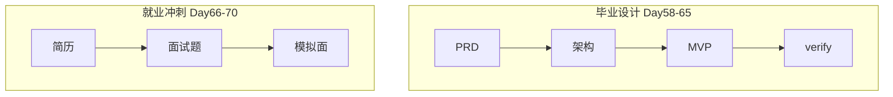

# Day 67 架构与设计 · 模块划分

## 模块

```mermaid
flowchart TB
    subgraph Grad[毕业设计 Day58-65]
        P[PRD] --> A[架构]
        A --> M[MVP]
        M --> V[verify]
    end
    subgraph Job[就业冲刺 Day66-70]
        R[简历] --> I[面试题]
        I --> M2[模拟面]
    end
```

## 数据流

学员选题 → scaffold → workspace 开发 → 答辩 → 简历包装
