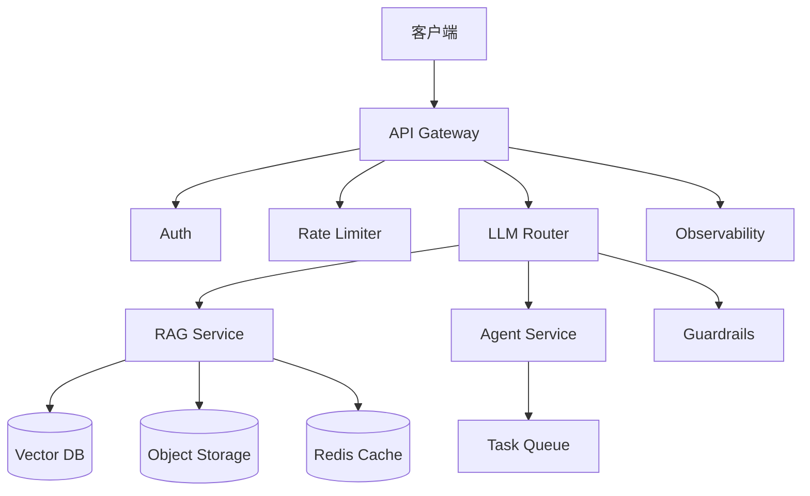
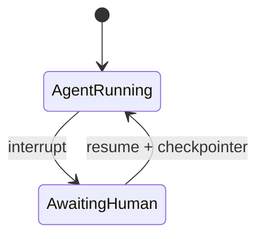

# Day 68 附录 · 系统设计 20 题详解

> 本文件扩展 `day68/code/system_design_20.md`，与 `architecture_canvas.py` 对照学习。  
> **面试方法**：每题按 **需求澄清 → 容量估算 → 高层架构 → 核心数据流 → 瓶颈与扩展 → MVP 裁剪** 六步作答（每步 2–3 分钟，总 15–20 分钟）。

---

## 第 0 节 · 工具链与组件清单

### 0.1 architecture_canvas.py

```python
COMPONENTS = [
    "API Gateway", "Auth", "Rate Limiter", "LLM Router",
    "Vector DB", "Object Storage", "Cache", "Queue",
    "Observability", "Guardrails",
]

def checklist(selected: list[str]) -> dict:
    missing = [c for c in ("API Gateway", "Auth", "Observability") if c not in selected]
    return {"selected": selected, "missing_critical": missing, "ready": len(missing) == 0}
```

**关键结论**：`API Gateway`、`Auth`、`Observability` 是 **missing_critical**——系统设计面试漏任一项，`ready=False`，对标真实评审不通过。

```bash
cd /workspace/day68/code
python3 architecture_canvas.py
python3 verify_day68.py
```

`verify_day68.py` 用 `checklist(["API Gateway", "Auth", "Observability"])` 验证 `ready=True`。

### 0.2 通用架构图模板



---

## 题 1 · 企业知识库问答（10 万文档）

**需求澄清**：内部员工查询，非对外；只读文档；延迟 p95 < 5s；日活 5000，峰值 QPS 20。

**架构要点**：
- **Ingest**：Object Storage 存原文 → 切块（512 token overlap 64）→ Embedding 批处理 → Vector DB（Chroma/Milvus）
- **Query**：混合检索 BM25+向量 → rerank Top-20 → Top-5 进 LLM → citations 返回
- **组件**：Gateway、Auth（SSO）、Observability（trace_id 贯穿检索与生成）

**瓶颈**：Embedding 重建索引；用 Queue 异步 ingest。  
**MVP**：单租户、无 Agent，仅 `/chat` + `/citations`（对标 Project2）。

**课程对照**：`day36/code/project2/`、`day55` 评估 lift。

---

## 题 2 · 多租户 RAG SaaS

**需求澄清**：1000 租户，数据隔离，每租户 1 万文档上限，按 token 计费。

**架构要点**：
- **隔离**：`tenant_id` 分区键；Vector DB namespace per tenant；Object Storage 路径前缀
- **Auth**：JWT 含 `tenant_id`；Gateway 校验租户配额
- **Rate Limiter**：每租户 QPS + 每日 token 上限
- **LLM Router**：按套餐路由不同模型（小模型免费档 / GPT-4 付费档）

**瓶颈**：热点租户邻居干扰 → 物理隔离大租户。  
**MVP**：共享集群 + 逻辑隔离，后期 VIP 独立 Milvus collection。

---

## 题 3 · 客服 Agent + 人工坐席协同

**需求要点**：
- Agent 处理 80% 标准问；复杂单 `interrupt` 转人工
- **LangGraph checkpointer** 持久化会话状态（Day 42）
- 坐席台读取同 thread_id 历史

**组件**：Agent Service、Queue（工单）、Guardrails（PII 过滤）、Observability（人工接管率）

**课程对照**：`day48/code/project3/` 多 Agent + HITL。

---

## 题 4 · 实时文档协作问答（Notion 类）

文档秒级更新，问答需近实时索引。

- **增量索引**：Webhook/CDN 事件 → Queue → 小批次 re-embed 变更块
- **Cache**：热门文档块 embedding 缓存
- **一致性**：最终一致；回答注明「索引时间戳」

---

## 题 5 · 代码仓库智能问答（GitHub Copilot 类）

- 代码 AST 切块 + 符号表增强 metadata
- 混合检索：语义 + 关键字（函数名、路径）
- Guardrails：不泄露 secret 文件（`.env` 规则过滤）

---

## 题 6 · 多模态客服（图 + 文）

- 图片 → OCR / 视觉模型 → 文本进 RAG
- Object Storage 存原图；Vector 仅存文本描述向量（降本）
- LLM Router：视觉请求走多模态 endpoint

---

## 题 7 · 合规审计型问答（金融 / 医疗）

- **Auth**：RBAC 文档级权限，检索前 filter
- **Guardrails**：回答必须带 citation；无依据拒答
- **Observability**：全量审计日志不可删

---

## 题 8 · 高 QPS 只读 FAQ（1000 QPS）

- Cache：常见问句 embedding → 答案 Redis（TTL）
- Vector DB 读副本；LLM 仅 cache miss 调用
- Rate Limiter 全局限流 + 降级返回静态 FAQ

---

## 题 9 · 离线批量报告生成

- Queue 积压万级任务；Worker 拉取 → RAG 聚合 → 写 Object Storage
- 与在线 Query 分集群，避免争抢 GPU
- Observability：任务状态 API

---

## 题 10 · 跨境多语言知识库

- 查询语言检测 → 跨语言 embedding 模型
- 文档原语言保留；回答语言跟随用户 locale
- LLM Router 按区域选合规数据中心模型

---

## 题 11 · 微调模型 + RAG 双路由客服

**课程强相关**：Day 57 网关 `finetuned` + `rag` 双路由。

- Router 规则：账单类走微调小模型；政策类走 RAG
- 评估：`ab_summary.json` lift 门禁
- 部署：vLLM + Compose（Day 56–57）

---

## 题 12 · Agent 工具链调用外部 SaaS

- 工具 OAuth 令牌保险库；Agent 不持明文 key
- Rate Limiter per tool；失败重试 + 死信 Queue
- Guardrails：工具参数 schema 校验

---

## 题 13 · 私有化部署（无外网）

- 本地 vLLM + 本地 Embedding；模型制品 Object Storage 内网分发
- Observability 仍要：日志、指标、trace 本地 ELK

---

## 题 14 · 日志智能排障（Ops Copilot）

- 日志流 → 切块入 Vector；时间范围 metadata 强过滤
- 高基数字段不进向量，用结构化查询先缩范围

---

## 题 15 · 教育场景作业批改 Agent

- HITL：低置信度进教师审核队列
- Guardrails：禁止直接给完整标准答案（政策可配置）

---

## 题 16 · 电商商品导购 RAG

- 商品 catalog 结构化字段 + 描述文本混合索引
- Cache 爆款 SKU；库存实时 API 工具调用（Agent）

---

## 题 17 · 视频会议实时字幕 + 纪要

- 流式 ASR → 段落缓冲 → 会后批量 RAG 索引
- 实时与离线两套路径，Queue 解耦

---

## 题 18 · 研发效能：PR Review Bot

- Git webhook → 拉 diff → 代码切块检索历史规范
- Agent 评论发回 GitHub API；Rate Limiter 防 API 封禁

---

## 题 19 · 灾难恢复与多活

- Vector DB 跨区异步复制；RPO/RTO 明确
- LLM Router 健康检查失败切备用区
- Object Storage 版本化

---

## 题 20 · 成本优化架构（降本 35%）

对标 `resume_builder.py` 第三条「降本35%目标架构」。

| 手段 | 说明 |
|------|------|
| 小模型 + RAG | 减少大模型调用次数 |
| Cache | 重复问句命中 Redis |
| 批处理 Embedding | 离线低价算力 |
| QLoRA 微调 | Day 53，24GB 单卡 |
| 量化推理 | vLLM AWQ/GPTQ |

**面试收尾**：给 ROI 估算——月调用 1M token，缓存命中率 30% 省多少。

---

## 第 8 节 · 系统设计面试话术清单

### 8.1 开场 30 秒

「我先确认几个约束：用户规模、延迟、一致性、预算、是否多租户。默认先做只读 RAG MVP，再迭代 Agent。」

### 8.2 必须主动提的三件事

1. **Auth + 租户隔离**（若 SaaS）  
2. **Observability**（trace、成本、质量指标）  
3. **mock 与生产差距**（课程用 `SPARKTECH_MOCK=1`）

### 8.3 白板自检命令

```python
from architecture_canvas import checklist, COMPONENTS
# 画出架构后
checklist(["API Gateway", "Auth", "Rate Limiter", "Vector DB", "Observability", "Guardrails"])
```

---

## 第 9 节 · 与 Day 69 模拟面试衔接

Day 69 Mock 系统轮 notes：**「未提 checkpointer 持久化」**——答 Agent 类设计题（题 3、12、15）时务必画：



---

## 今日 Checklist

- [ ] 精练题 1、2、3、11、20（与课程最强相关）  
- [ ] 每题能画通用架构图并跑 `checklist()`  
- [ ] `python3 verify_day68.py` 全绿  
- [ ] 将系统轮弱项写入 Day 69 反馈模板  

## 第 10 节 · 容量估算速算练习

### 10.1 题 1 知识库 Back-of-envelope

| 假设 | 数值 |
|------|------|
| 文档数 | 100,000 |
| 平均每文档 chunks | 20 |
| 总向量条数 | 2,000,000 |
| 向量维数 | 1536 |
| 单向量存储 | ~6 KB（float32） |
| 向量总存储 | ~12 GB（未含 HNSW 索引开销） |

**QPS 20、每请求检索 Top-20**：向量库 QPS 压力不大，瓶颈常在 **LLM 生成**（2–5s）。面试要主动说：「检索不是首优优化点，除非文档上亿。」

### 10.2 Token 成本粗算

日活 5000，人均 10 问，每问 2k input + 500 output token：

- 日 token ≈ 5000 × 10 × 2500 = 125M token  
- 按 $0.5/1M input 粗算 → 数十美元级/日（量级感知即可）

**降本**：缓存、小模型、RAG 减 input 长度——呼应题 20 与 Day 55 评估。

---

## 第 11 节 · 白板绘图顺序（避免漏组件）

```text
1. 画用户与边界
2. 画 API Gateway（唯一入口）
3. 画 Auth + Rate Limiter（Gateway 后）
4. 画应用服务（RAG / Agent 分框）
5. 画数据层（Vector DB、Object Storage、Cache）
6. 画异步（Queue）若涉及 ingest
7. 画 Observability 旁路（虚线连各服务）
8. 画 Guardrails（贴 LLM Router 出口）
9. 口述数据流箭头方向
10. 跑 checklist() 自检 missing_critical
```

**模拟面试扣分点回顾**（Day 69 `mock_interview.json` 系统轮）：未提 **checkpointer** → 在 Agent 框旁补「Sqlite Checkpointer」方框，箭头连 `AwaitingHuman`。

---

## 第 12 节 · 与 Project 代码文件对照表

| 系统设计概念 | 课程文件 |
|--------------|----------|
| RAG ingest | `day28` Loader、`day36/project2` |
| 混合检索 | Day 32 实验 |
| citations API | Project2 routes |
| LangGraph 图 | `day48/project3` |
| interrupt/HITL | Day 42 `graph_hitl` |
| vLLM 推理 | `day56/mock_vllm_server.py` |
| API Gateway | `day57/api_gateway/main.py` |
| Docker Compose | `day57/deploy_stack/docker-compose.yml` |
| 评估门禁 | `day55/reports/ab_summary.json` |
| 组件清单 | `architecture_canvas.py` COMPONENTS |

答辩或系统设计时 **指到具体路径**，可信度远高于纯口述。

---

## 第 13 节 · 15 分钟模拟计时（题 1 完整演练）

| 分钟 | 动作 |
|------|------|
| 0–2 | 澄清：内部员工、10 万 PDF、延迟 5s、峰值 QPS 20 |
| 2–4 | 估算：§10.1 表 |
| 4–8 | 画架构：§0.2 模板 + ingest 异步 Queue |
| 8–12 | 深潜：混合检索 + citations + Auth |
| 12–14 | 瓶颈：LLM 延迟、索引更新 |
| 14–15 | MVP：先只读 RAG，Phase2 Agent |

录音自评：是否提到 **Observability** 与 **Guardrails**？

---

## 第 14 节 · 面试反问环节（系统设计轮）

当面试官问「还有什么问题」时，可展示架构视野：

1. 「贵司向量库是自托管还是托管服务？十亿级有无分片实践？」  
2. 「在线推理与离线 ingest 是否分集群？」  
3. 「Agent 高风险操作审批流是统一平台还是各业务自建？」  
4. 「LLM 成本是否有 FinOps 看板？」  

避免问薪资福利（留 HR 轮）；避免问「用什么语言」（显得未做功课）。

---

## 第 15 节 · 错题本模板（绑定题号）

```markdown
| 题号 | 我漏说的点 | 标准组件/文件 | 复习日期 |
|------|------------|---------------|----------|
| 3 | checkpointer | Day42 | |
| 2 | tenant_id 分区 | Day68题2 | |
| 11 | 双路由 finetuned/rag | day57 gateway | |
```

每错题 **24h 内** 补画一张小架构图，存档到作品集 `docs/design-notes/`。

---

**小结**：系统设计不是堆组件，而是用 `architecture_canvas.py` 的十件套讲清 **数据怎么流、瓶颈在哪、MVP 先砍什么**。漏掉 Auth 或 Observability，技术再深也会被判 `ready=False`。
