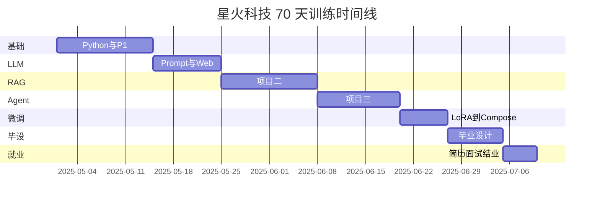
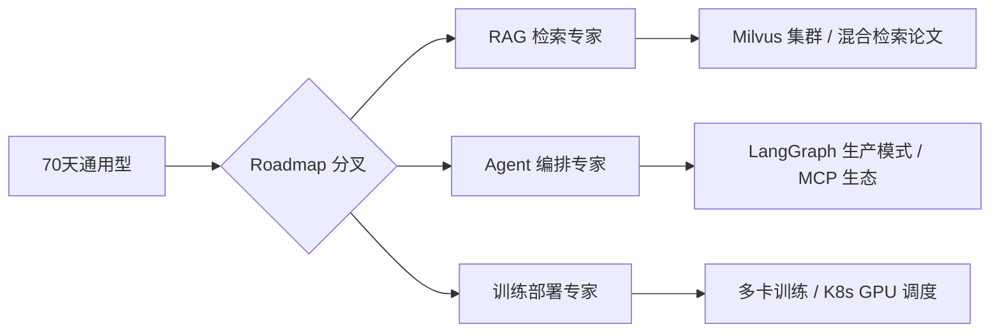
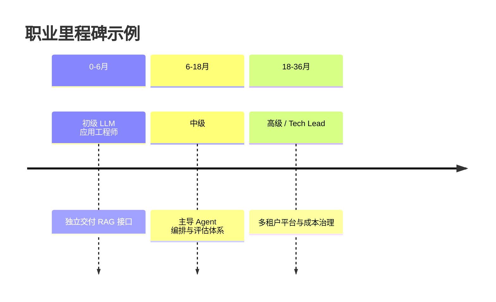

# Day 70 附录 · 70 天复盘与职业路线图

> 本文件与 `day70/code/70天能力地图.md`、`course_regression.py` 合并阅读，构成结业复盘与上岗规划。

---

## 第 0 节 · 结业标准与验收

### 0.1 能力地图原文

`day70/code/70天能力地图.md` 定义七阶段：

| 阶段 | 天数 | 能力 |
|------|------|------|
| Python | 1–14 | 编程 + 项目一 |
| LLM 基础 | 15–24 | Prompt + Web Chat |
| RAG | 25–38 | 项目二 |
| Agent | 39–50 | 项目三 |
| 微调部署 | 51–57 | LoRA + vLLM + Docker |
| 毕业设计 | 58–65 | 完整产品 |
| 就业 | 66–70 | 简历 + 面试 |

**结业标准**（同文件）：
- 3 阶段项目 verify 全绿  
- 毕业设计答辩通过  
- GitHub 作品集公开（可脱敏）

### 0.2 verify_day70.py

```bash
cd /workspace/day70/code
export SPARKTECH_MOCK=1
python3 verify_day70.py
```

检查项：
1. `70天能力地图.md` 存在且含「毕业设计」  
2. 关键日 verify 脚本存在：day51、57、58（`verify_graduation.py`）、66  

### 0.3 course_regression.py 抽样回归

```python
SAMPLE_DAYS = [14, 36, 48, 51, 57, 58, 66]
```

对每个 day 子进程跑 verify（`SPARKTECH_MOCK=1`，超时 120s）。**结业前应 `all(results.values())` 为 True**。

```bash
python3 course_regression.py
# day14: OK
# day36: OK
# ...
```

---

## 第 1 节 · 70 天能力复盘矩阵

### 1.1 我掌握了什么（自评表）

复制下表，诚实填 1–5 分（5=能独立交付生产级）：

| 能力域 | 代表日 | 自评 | 证据（verify / repo） |
|--------|--------|------|------------------------|
| Python 工程 | Day 14 | | `project1.main --demo-once` |
| Prompt / Chat | Day 20 | | Web 流式 Demo |
| RAG 流水线 | Day 36 | | `verify_project2.py` |
| 混合检索 | Day 32 | | RRF / rerank 实验 |
| Agent / ReAct | Day 40 | | tool_calls |
| LangGraph | Day 41–42 | | checkpointer |
| MCP / 多 Agent | Day 43–48 | | `verify_project3.py` |
| 微调 LoRA | Day 53 | | `lora_math_demo.py` |
| 评估门禁 | Day 55 | | `ab_summary.json` |
| 推理部署 | Day 56–57 | | vLLM + Compose |
| 毕业设计 | Day 58–65 | | `verify_graduation.py` |
| 就业包装 | Day 66–69 | | 简历 + 模拟面试 JSON |

### 1.2 三条「能讲 15 分钟」的叙事

基于 `day66/code/resume_builder.py` 的三条 bullet，各准备：

1. **业务背景**（谁、什么痛点）  
2. **你的职责**（具体模块 + commit）  
3. **技术决策与权衡**（为何 Chroma、为何 LangGraph）  
4. **量化结果**（评估、延迟、成本）  
5. **若重做会改进什么**（展示成长思维）

---

## 第 2 节 · 阶段里程碑时间线



**复盘问题**（写在笔记里）：
- 哪两周最累？为什么？  
- 哪个项目愿意放进作品集置顶？  
- 如果只有 30 天，会保留哪 40% 内容？

---

## 第 3 节 · 岗位地图与匹配度

### 3.1 目标岗位光谱

| 岗位 | 日常 | 70 天覆盖度 | 缺口补强 |
|------|------|-------------|----------|
| LLM 应用工程师 | RAG/Agent 服务化 | ★★★★★ | 大规模向量库运维 |
| Prompt 工程师 | 模板、评估 | ★★★★☆ | 多语言、安全红队 |
| AI 平台 / MLOps | 训练部署流水线 | ★★★☆☆ | K8s、多卡训练 |
| 算法工程师（NLP） | 模型结构、训练 | ★★☆☆☆ | 论文复现、数学推导 |
| 解决方案架构师 | 售前方案 | ★★★★☆ | 行业案例、商务沟通 |

**建议**：本课程毕业生优先投 **LLM 应用工程师 / AI 应用开发**，与 Project2+3+Phase5 画像一致。

### 3.2 JD 关键词 ↔ 课程日映射

| JD 关键词 | 回答素材 |
|-----------|----------|
| RAG | Day 25–38，Project2 |
| LangChain / LangGraph | Day 39–48 |
| Fine-tuning / LoRA | Day 51–54 |
| vLLM / 推理优化 | Day 56 |
| Docker / 微服务 | Day 57 |
| FastAPI | 贯穿 Project2/3 |
| 向量数据库 | Chroma Day 29 |

---

## 第 4 节 · 毕业后 90 天职业路线图

### 4.1 第 1–30 天：求职冲刺

| 周 | 目标 | 动作 |
|----|------|------|
| W1 | 简历 + 作品集 | Day 66 附录 checklist |
| W2 | 技术面试 | Day 67 百题过两遍 |
| W3 | 系统设计 | Day 68 题 1/2/3/11/20 |
| W4 | 模拟 + 投递 | Day 69 三轮马拉松；每日 5 投递 |

**指标**：约面率 > 10%，或每周 ≥ 2 场面试反馈。

### 4.2 第 31–60 天：上岗适应（若已入职）

- 熟悉公司基建：真实 Gateway、IAM、日志平台  
- 把课程 mock 换成 staging API Key（小流量）  
- 找 mentor 对齐 **首月可交付**（通常是一个小 RAG 接口）

### 4.3 第 61–90 天：深度专精（选一个方向）



**不要三线并行**：面试时可以广度，入职后选一条扎下去。

---

## 第 5 节 · 持续学习资源（与课程衔接）

| 主题 | 课程入口 | 延伸 |
|------|----------|------|
| RAG 论文 | Day 32 附录 | HyDE、Self-RAG |
| Agent | Day 39 ReAct 附录 | LangGraph 官方 cookbook |
| 微调 | Day 53 LoRA 附录 | LLaMA-Factory 文档 |
| 部署 | Day 56 vLLM 附录 | TensorRT-LLM、量化 |
| 安全 | Day 47 Text2SQL 附录 | OWASP LLM Top 10 |

---

## 第 6 节 · 作品集长期维护

1. **每季度**跑一遍 `course_regression.py`，更新 README 徽章  
2. **每个新项目**保持 `verify_*.py` 传统（面试官信任感）  
3. **写一篇技术博客**：「从 0 到 1 搭企业 RAG」——复用 Day 66 架构图  
4. **开源贡献**：LangChain / Chroma 文档 PR 也是简历亮点  

---

## 第 7 节 · 结业典礼自述模板（3 分钟）

```text
各位导师好，我是___。70 天里我完成了星火智服场景的完整链路：
【项目二 RAG】解决知识库问答；【项目三 Agent】解决审批协同；
【Phase5】完成 LoRA 微调与 Compose 部署。结业验收上，
course_regression 抽样七日 verify 全绿，毕业设计通过答辩。
接下来我希望在___类型的岗位上继续深化___方向。
感谢张工、Lisa 与队友___。
```

---

## 第 8 节 · 常见结业后困惑 FAQ

**Q：没有 GPU 简历是否吃亏？**  
A：诚实写 Mock 与课程约束；强调 **协议兼容**（OpenAI API）与 **架构可切换真机**（Day 56 mock_vllm）。

**Q：要不要考研 / 转算法？**  
A：若喜爱工程落地，应用岗更匹配本课程；算法岗需补数学与论文，至少 6 个月专项。

**Q：薪资谈判用什么筹码？**  
A：完整作品集 + 评估量化 + 系统设计能力（Day 68），避免只比「会不会调 API」。

**Q：团队里我用 LangGraph，同事用 Dify 怎么办？**  
A：Day 45 已有对照思维——讲清 **编排边界**：何时低代码，何时代码图。

---

## 第 9 节 · Day 70 今日 Checklist

- [ ] 填写 §1.1 自评表  
- [ ] 跑通 `verify_day70.py`  
- [ ] 跑通 `course_regression.py`（可选全量，至少抽样）  
- [ ] 完成 3 分钟结业自述草稿  
- [ ] 写下 90 天路线图选一个专精分叉  
- [ ] 阅读 `10_附录_全课程verify回归清单.md` 做最终签字  

---

## 第 10 节 · 技能雷达图（自绘）

在纸上画五轴雷达，每轴 1–5 分：

```text
        Prompt/Chat
              5
              |
    部署 ----+---- RAG
              |
         Agent ---- 工程
              |
           Python
```

**规则**：没有 verify 证据的轴最高 3 分；有 `course_regression` OK 的轴可到 4 分；有生产或实习经历才标 5 分。

当前课程目标：**RAG、Agent、工程** 三角应 ≥ 4；**部署** 因 Mock 宜诚实标 3–4 并准备口述真机方案。

---

## 第 11 节 · 校友常见上岗第一周任务

| 任务类型 | 与课程映射 | 预计难度 |
|----------|------------|----------|
| 接一个内部文档 RAG PoC | Project2 | 低 |
| 给现有 Bot 加 citations | Day 36 routes | 低 |
| 调混合检索参数 | Day 32 | 中 |
| 把 Dify 流程迁 LangGraph | Day 45 对照 | 中高 |
| 上线 vLLM staging | Day 56–57 | 中高 |
| 多租户隔离改造 | Day 68 题 2 | 高 |

用此表对齐期望：首周不会让你训练 70B 预训练，更常是 **RAG 服务化小需求**。

---

## 第 12 节 · 个人知识库（Obsidian / Notion）结构建议

```text
星火70天/
├── 每日笔记/ day01 … day70
├── 项目/
│   ├── project1/
│   ├── project2/
│   └── project3/
├── 面试/
│   ├── llm100 错题
│   ├── system20 提纲
│   └── mock_interview.json 摘要
└── 代码片段/
    └── top_k_similar.py
```

**原则**：面试前 30 分钟只翻「面试」文件夹，不翻 70 天全笔记。

---

## 第 13 节 · 结业证书要素（自制）

```markdown
# 星火科技大模型应用开发 · 70 天结业

学员：___
周期：___ 至 ___
能力地图：Python → RAG → Agent → 微调部署 → 毕设 → 就业
验收：course_regression.py 抽样全绿 / verify_graduation 通过
导师：张工
```

打印贴墙或放作品集 `docs/certificate.md`（非官方校招认可，但是 **自我约束里程碑**）。

---

## 第 14 节 · 与 Day 66–69 就业周闭环

| Day | 产出 | 在路线图中的位置 |
|-----|------|------------------|
| 66 | 简历 + GitHub | 求职材料层 |
| 67 | 100 题掌握度 | 技术深度层 |
| 68 | 20 系统设计 | 架构视野层 |
| 69 | mock_interview.json | 反馈迭代层 |
| 70 | 本附录 + verify 清单 | 里程碑确认层 |

**闭环检验**：随机抽简历一条 bullet → 能答 67 中 5 题 → 能画 68 中 1 题 → 模拟面试 notes 无重复弱项。

---

## 第 15 节 · 长期职业里程碑（1–3 年）



每阶段各需 **1 个可公开案例**（博客、演讲、开源），避免技能停在「跟课水平」。

---

## 第 16 节 · 70 天每日代表产出速查（复习用）

| 区间 | 代表日 | 核心产出 | verify |
|------|--------|----------|--------|
| 1–14 | 14 | CLI 项目一 | `project1.main` |
| 15–24 | 20 | Web Chat | 流式 Demo |
| 25–38 | 36 | RAG 项目二 | `verify_project2.py` |
| 39–50 | 48 | 多 Agent 项目三 | `verify_project3.py` |
| 51–57 | 55/57 | 评估+部署 | `ab_summary` / Compose |
| 58–65 | 58 | 毕业设计 | `verify_graduation.py` |
| 66–70 | 66–70 | 就业+结业 | `resume_builder` / 本清单 |

**复盘作业**：用一段话串起上表每一行，录音 3 分钟，作为 behavioral 轮素材。

---

## 第 17 节 · 结业后第一季度 OKR 示例

**Objective**：从「课程项目」过渡到「岗位可交付」

| Key Result | 度量 |
|------------|------|
| KR1 入职或拿到 offer | 1 份 |
| KR2 维护绿色 verify | `course_regression` 月更 |
| KR3 技术输出 | 1 篇博客或 1 次内部分享 |
| KR4 深度专精 | 完成路线图分叉中 1 门进阶课 |

OKR 写入 Notion，每两周自查；与 Day 69 `action_items` 字段格式兼容。

---

## 第 18 节 · 致谢与社群维系

- **导师张工**：代码 Review 与答辩 — 结业后保持联系，重大跳槽可求推荐  
- **产品经理 Lisa**：业务场景对齐 — 面试讲故事用星火智服语境  
- **队友**：毕设分工 — LinkedIn 互评背书  

建议建 **校友群**：共享面经、内推、registry 镜像；规则：内推前先 `verify` 作品集。

---

**结语**：70 天不是终点，而是 **可验证技能栈的起点**。能力地图上的每一格，都应对应一个绿色 verify 和一段你能讲清的 STAR 故事。祝结业顺利，上岗可期。
